# AWS DynamoDB - Complete Deep Dive

## What is DynamoDB?

**Amazon DynamoDB** is a fully managed, serverless NoSQL database service that enables:
- **Automatic scaling**: Capacity adjusts to traffic automatically
- **High performance**: Single-digit millisecond latency
- **Fully managed**: No servers, patches, or backups to manage
- **Multi-region**: Built-in global tables and replication
- **Pay-per-request or provisioned**: Flexible pricing models
- **ACID transactions**: Single and multi-item transactions

### Core Characteristics

| Aspect | Benefit |
|--------|---------|
| **Serverless** | No infrastructure to manage |
| **Auto-scaling** | Capacity adjusts to demand |
| **High performance** | < 10ms latency at any scale |
| **Managed backup** | Built-in backup and point-in-time recovery |
| **Global tables** | Multi-region replication with millisecond latency |
| **ACID transactions** | Single & multi-item transactional support |
| **Security** | Encryption, IAM, VPC integration |

---

## DynamoDB Architecture Overview



<details>
<summary>Click to view code</summary>

```
AWS Region (US-East-1)
  ├─ DynamoDB Partition 0
  │  └─ Replica 1, Replica 2, Replica 3 (3-way replication)
  ├─ DynamoDB Partition 1
  │  └─ Replica 1, Replica 2, Replica 3
  └─ DynamoDB Partition N
     └─ Replica 1, Replica 2, Replica 3
       ↓
  Global Tables (Multi-region)
  ├─ Region 2 (EU-West-1)
  └─ Region 3 (AP-Southeast-1)
```

</details>

**Key concepts:**
- **Table**: Collection of items (like a database table)
- **Item**: Single record (like a row in SQL)
- **Attribute**: Field in an item (like a column)
- **Partition**: Logical unit containing items (distributed across nodes)
- **Partition Key**: Determines which partition stores item
- **Replica**: Copy of partition (for HA and read scaling)

---

## Core Components

### 1. Tables and Items

**Table**: Collection of items with defined schema (partially)

<details>
<summary>Click to view code (python)</summary>

```python
import boto3

dynamodb = boto3.resource('dynamodb', region_name='us-east-1')

# Create table
table = dynamodb.create_table(
    TableName='users',
    KeySchema=[
        {'AttributeName': 'user_id', 'KeyType': 'HASH'},      # Partition key
        {'AttributeName': 'created_at', 'KeyType': 'RANGE'}   # Sort key
    ],
    AttributeDefinitions=[
        {'AttributeName': 'user_id', 'AttributeType': 'S'},   # String
        {'AttributeName': 'created_at', 'AttributeType': 'S'} # String
    ],
    BillingMode='PAY_PER_REQUEST'  # Auto-scaling
)
```

</details>

**Item**: Single record in table

<details>
<summary>Click to view code (python)</summary>

```python
# Put item
table.put_item(
    Item={
        'user_id': 'user123',
        'created_at': '2024-01-05T10:00:00Z',
        'email': 'user@example.com',
        'name': 'John Doe',
        'profile': {
            'age': 30,
            'location': 'NYC'
        },
        'tags': ['vip', 'verified']
    }
)

# Get item
response = table.get_item(
    Key={
        'user_id': 'user123',
        'created_at': '2024-01-05T10:00:00Z'
    }
)
```

</details>

---

### 2. Primary Keys

**Partition Key (HASH)**: Determines which partition stores item

<details>
<summary>Click to view code</summary>

```
Partition key: user_id
- Values: user1, user2, user3, ...
- Hash function: hash(user_id) % num_partitions
- All items with same user_id in same partition
- Enables equality queries fast
```

</details>

**Sort Key (RANGE)**: Enables range queries within partition

<details>
<summary>Click to view code (cql)</summary>

```cql
KeySchema:
  HASH: user_id
  RANGE: created_at

Query patterns:
  - user_id = 'user1' AND created_at = '2024-01-05'  (exact)
  - user_id = 'user1' AND created_at > '2024-01-01'  (range)
  - user_id = 'user1' AND created_at BETWEEN ... AND ...
```

</details>

**Attribute types:**

<details>
<summary>Click to view code (python)</summary>

```python
# String (S)
'user_id': 'user123'

# Number (N)
'age': 30

# Binary (B)
'image': b'binary_data'

# Boolean (BOOL)
'is_active': True

# Null (NULL)
'phone': None

# Map (M)
'profile': {'age': 30, 'location': 'NYC'}

# List (L)
'tags': ['vip', 'verified']

# String Set (SS)
'colors': {'red', 'blue', 'green'}

# Number Set (NS)
'scores': {100, 200, 300}
```

</details>

---

### 3. Secondary Indexes

**Global Secondary Index (GSI)**: Query on different attributes

<details>
<summary>Click to view code (python)</summary>

```python
# Create GSI on email
table = dynamodb.create_table(
    TableName='users',
    KeySchema=[
        {'AttributeName': 'user_id', 'KeyType': 'HASH'},
    ],
    GlobalSecondaryIndexes=[
        {
            'IndexName': 'email-index',
            'KeySchema': [
                {'AttributeName': 'email', 'KeyType': 'HASH'}
            ],
            'Projection': {'ProjectionType': 'ALL'},
            'BillingMode': 'PAY_PER_REQUEST'
        }
    ],
    AttributeDefinitions=[
        {'AttributeName': 'user_id', 'AttributeType': 'S'},
        {'AttributeName': 'email', 'AttributeType': 'S'}
    ],
    BillingMode='PAY_PER_REQUEST'
)

# Query by email
response = table.query(
    IndexName='email-index',
    KeyConditionExpression='email = :email',
    ExpressionAttributeValues={
        ':email': 'user@example.com'
    }
)
```

</details>

**Local Secondary Index (LSI)**: Range key on same partition key

<details>
<summary>Click to view code (python)</summary>

```python
# Create LSI with different sort key
table = dynamodb.create_table(
    TableName='user_activity',
    KeySchema=[
        {'AttributeName': 'user_id', 'KeyType': 'HASH'},
        {'AttributeName': 'timestamp', 'KeyType': 'RANGE'}
    ],
    LocalSecondaryIndexes=[
        {
            'IndexName': 'activity-type-index',
            'KeySchema': [
                {'AttributeName': 'user_id', 'KeyType': 'HASH'},
                {'AttributeName': 'activity_type', 'KeyType': 'RANGE'}
            ],
            'Projection': {'ProjectionType': 'ALL'}
        }
    ]
)

# Query activities of type 'login'
response = table.query(
    IndexName='activity-type-index',
    KeyConditionExpression='user_id = :id AND activity_type = :type',
    ExpressionAttributeValues={
        ':id': 'user123',
        ':type': 'login'
    }
)
```

</details>

**GSI vs LSI:**

| Aspect | GSI | LSI |
|--------|-----|-----|
| **Partition Key** | Can be different | Must be same |
| **Size Limit** | 10GB per partition | 10GB total per partition key |
| **Throughput** | Separate from table | Shared with table |
| **Consistency** | Eventually consistent | Strongly consistent option |
| **Sparse Index** | Recommended | Not efficient |

---

### 4. Write Operations

**Put Item** (insert or replace):

<details>
<summary>Click to view code (python)</summary>

```python
table.put_item(
    Item={'user_id': 'user123', 'email': 'new@example.com'},
    ConditionExpression='attribute_not_exists(user_id)'  # Only if not exists
)
```

</details>

**Update Item** (modify attributes):

<details>
<summary>Click to view code (python)</summary>

```python
table.update_item(
    Key={'user_id': 'user123'},
    UpdateExpression='SET #email = :email, updated_at = :now',
    ExpressionAttributeNames={'#email': 'email'},
    ExpressionAttributeValues={
        ':email': 'newemail@example.com',
        ':now': '2024-01-05T11:00:00Z'
    },
    ReturnValues='ALL_NEW'
)
```

</details>

**Delete Item**:

<details>
<summary>Click to view code (python)</summary>

```python
table.delete_item(
    Key={'user_id': 'user123'},
    ConditionExpression='attribute_exists(user_id)'
)
```

</details>

**Batch Write** (high throughput):

<details>
<summary>Click to view code (python)</summary>

```python
with table.batch_writer(batch_size=25) as batch:
    for i in range(1000):
        batch.put_item(
            Item={'user_id': f'user{i}', 'email': f'user{i}@example.com'}
        )
```

</details>

---

### 5. Read Operations

**Get Item** (single item, fast):

<details>
<summary>Click to view code (python)</summary>

```python
response = table.get_item(
    Key={'user_id': 'user123'},
    ConsistentRead=True  # Strong consistency
)
item = response.get('Item')
```

</details>

**Query** (partition key + optional sort key):

<details>
<summary>Click to view code (python)</summary>

```python
response = table.query(
    KeyConditionExpression='user_id = :id AND created_at > :date',
    ExpressionAttributeValues={
        ':id': 'user123',
        ':date': '2024-01-01'
    },
    Limit=10
)
```

</details>

**Scan** (full table scan, slow):

<details>
<summary>Click to view code (python)</summary>

```python
response = table.scan(
    FilterExpression='email = :email',
    ExpressionAttributeValues={
        ':email': 'user@example.com'
    }
)
# Avoid in production (scans entire table)
```

</details>

**Batch Get** (get multiple items):

<details>
<summary>Click to view code (python)</summary>

```python
response = dynamodb.batch_get_item(
    RequestItems={
        'users': {
            'Keys': [
                {'user_id': 'user1'},
                {'user_id': 'user2'},
                {'user_id': 'user3'}
            ]
        }
    }
)
```

</details>

---

## Throughput and Capacity Planning

### Billing Modes

**Provisioned Capacity** (pay for reserved capacity):

<details>
<summary>Click to view code (python)</summary>

```python
table = dynamodb.create_table(
    TableName='users',
    BillingMode='PROVISIONED',
    ProvisionedThroughput={
        'ReadCapacityUnits': 100,    # 100 strong consistent reads/sec
        'WriteCapacityUnits': 50     # 50 writes/sec
    }
)

# Cost calculation:
# Read: 100 RCU × $0.00013 per RCU-hour = $1.30/hour
# Write: 50 WCU × $0.00065 per WCU-hour = $3.25/hour
# Total: ~$4.55/hour = ~$3,276/month
```

</details>

**On-Demand Capacity** (pay per request):

<details>
<summary>Click to view code (python)</summary>

```python
table = dynamodb.create_table(
    TableName='users',
    BillingMode='PAY_PER_REQUEST'
)

# Cost calculation:
# Read: $0.25 per 1M requests
# Write: $1.25 per 1M requests

# Example: 100M reads + 10M writes/month
# Cost: (100M × $0.25) + (10M × $1.25) / 1M = $25 + $12.50 = $37.50
```

</details>

**When to use:**

| Mode | Best For |
|------|----------|
| **Provisioned** | Predictable traffic, cost-conscious |
| **On-Demand** | Unpredictable spikes, rapid scaling |

### Capacity Units

**Read Capacity Unit (RCU)**:

<details>
<summary>Click to view code</summary>

```
1 RCU = 1 strong consistent read/sec (4KB item)
      = 2 eventually consistent reads/sec (4KB item)

Example:
  Item size: 4KB
  Strong consistent: 100 reads/sec → 100 RCU
  Eventually consistent: 100 reads/sec → 50 RCU
  
  Item size: 12KB (>4KB)
  RCU needed: ceil(12KB / 4KB) = 3 RCU per read
  100 reads/sec → 300 RCU
```

</details>

**Write Capacity Unit (WCU)**:

<details>
<summary>Click to view code</summary>

```
1 WCU = 1 write/sec (1KB item)

Example:
  Item size: 1KB
  100 writes/sec → 100 WCU
  
  Item size: 5KB (>1KB)
  WCU needed: ceil(5KB / 1KB) = 5 WCU per write
  100 writes/sec → 500 WCU
```

</details>

### Capacity Estimation

<details>
<summary>Click to view code</summary>

```
Requirement: 10K reads/sec, 1K writes/sec, 5KB items

Read capacity:
  Strong consistent: ceil(5KB / 4KB) × 10K = 2 × 10K = 20K RCU
  Eventually consistent: 20K ÷ 2 = 10K RCU
  
Write capacity:
  ceil(5KB / 1KB) × 1K = 5 × 1K = 5K WCU
  
Total: 20K RCU + 5K WCU (provisioned mode)
  Cost: (20K × $0.00013) + (5K × $0.00065) ≈ $5.63/hour
```

</details>

---

## Consistency Models

### Strong Consistency vs Eventually Consistent

<details>
<summary>Click to view code (python)</summary>

```python
# Eventually consistent (default, faster)
response = table.get_item(
    Key={'user_id': 'user123'},
    ConsistentRead=False  # Default
)
# Reads from any replica (might be stale)

# Strongly consistent (slower, latest data)
response = table.get_item(
    Key={'user_id': 'user123'},
    ConsistentRead=True
)
# Reads from primary replica only
```

</details>

**Consistency model:**

<details>
<summary>Click to view code</summary>

```
Write to DynamoDB:
  1. Write to primary partition
  2. Asynchronously replicate to 2 other replicas
  3. Return success to client

Immediately after write:
  Strong consistent read: See new value (from primary)
  Eventually consistent read: Might see old value (if reading replica)
  
After ~1ms:
  Both reads see new value (replication caught up)
```

</details>

---

## Transactions

**Single Item Transactions** (update with conditions):

<details>
<summary>Click to view code (python)</summary>

```python
table.update_item(
    Key={'user_id': 'user123'},
    UpdateExpression='SET balance = balance - :amount',
    ConditionExpression='balance >= :amount',
    ExpressionAttributeValues={
        ':amount': 100
    }
)
```

</details>

**Multi-Item Transactions** (ACID across items/tables):

<details>
<summary>Click to view code (python)</summary>

```python
dynamodb.transact_write_items(
    TransactItems=[
        {
            'Put': {
                'TableName': 'accounts',
                'Item': {
                    'account_id': 'acc1',
                    'balance': 900
                }
            }
        },
        {
            'Put': {
                'TableName': 'accounts',
                'Item': {
                    'account_id': 'acc2',
                    'balance': 1100
                }
            }
        },
        {
            'Put': {
                'TableName': 'transactions',
                'Item': {
                    'transaction_id': 'txn1',
                    'from': 'acc1',
                    'to': 'acc2',
                    'amount': 100
                }
            }
        }
    ]
)
# All succeed or all fail (atomic)
```

</details>

---

## Performance Optimization

### Hot Partitions

**Problem**: Uneven distribution of traffic

<details>
<summary>Click to view code</summary>

```
Partition Key: user_id
Users: 1M
Requests/sec: 100K

If distribution is even:
  100K / 1M users = 100 requests per user on average
  
If one user is celebrity with 90K requests:
  Celebrity partition: 90K requests → HIGH LOAD
  Other partitions: 10K requests → LOW LOAD
  
Result: Single partition is bottleneck
```

</details>

**Solution: Write Sharding**

<details>
<summary>Click to view code (python)</summary>

```python
# Before (hot partition)
user_id = 'celebrity'
# All writes go to same partition

# After (distribute across shards)
num_shards = 100
shard_id = random.randint(0, num_shards - 1)
partition_key = f'{user_id}#{shard_id}'

# Put item
table.put_item(
    Item={
        'user_id': partition_key,  # 'celebrity#42'
        'timestamp': '2024-01-05T10:00:00Z',
        'action': 'view'
    }
)

# Query all shards for followers
responses = []
for shard in range(num_shards):
    response = table.query(
        KeyConditionExpression='user_id = :id',
        ExpressionAttributeValues={
            ':id': f'celebrity#{shard}'
        }
    )
    responses.extend(response['Items'])
```

</details>

### Query Optimization

<details>
<summary>Click to view code (python)</summary>

```python
# ❌ SLOW: Full table scan
response = table.scan(
    FilterExpression='email = :email',
    ExpressionAttributeValues={':email': 'user@example.com'}
)

# ✅ FAST: Use GSI on email
response = table.query(
    IndexName='email-index',
    KeyConditionExpression='email = :email',
    ExpressionAttributeValues={':email': 'user@example.com'}
)

# ❌ SLOW: Fetch all attributes
response = table.query(
    KeyConditionExpression='user_id = :id',
    ExpressionAttributeValues={':id': 'user123'}
)

# ✅ FAST: Project only needed attributes
response = table.query(
    KeyConditionExpression='user_id = :id',
    ProjectionExpression='user_id,email,name',
    ExpressionAttributeValues={':id': 'user123'}
)
```

</details>

### Batch Operations

<details>
<summary>Click to view code (python)</summary>

```python
# ❌ SLOW: Individual writes (sequential)
for item in items:
    table.put_item(Item=item)
    # Each write = network round trip

# ✅ FAST: Batch write (25 items per request)
with table.batch_writer(batch_size=25) as batch:
    for item in items:
        batch.put_item(Item=item)

# ❌ SLOW: Individual reads
for user_id in user_ids:
    response = table.get_item(Key={'user_id': user_id})

# ✅ FAST: Batch get (up to 100 items per request)
response = dynamodb.batch_get_item(
    RequestItems={
        'users': {
            'Keys': [{'user_id': uid} for uid in user_ids]
        }
    }
)
```

</details>

---

## Scalability and High Availability

### Auto-Scaling (Provisioned Mode)

<details>
<summary>Click to view code (python)</summary>

```python
autoscaling = boto3.client('application-autoscaling')

# Register DynamoDB table for auto-scaling
autoscaling.register_scalable_target(
    ServiceNamespace='dynamodb',
    ResourceId='table/users',
    ScalableDimension='dynamodb:table:WriteCapacityUnits',
    MinCapacity=10,
    MaxCapacity=10000
)

# Create scaling policy
autoscaling.put_scaling_policy(
    PolicyName='users-scaling',
    ServiceNamespace='dynamodb',
    ResourceId='table/users',
    ScalableDimension='dynamodb:table:WriteCapacityUnits',
    PolicyType='TargetTrackingScaling',
    TargetTrackingScalingPolicyConfiguration={
        'TargetValue': 70.0,  # Keep utilization at 70%
        'PredefinedMetricSpecification': {
            'PredefinedMetricType': 'DynamoDBWriteCapacityUtilization'
        }
    }
)
```

</details>

### Global Tables (Multi-Region)

<details>
<summary>Click to view code (python)</summary>

```python
# Create table in US-East
us_table = dynamodb.create_table(
    TableName='users',
    KeySchema=[{'AttributeName': 'user_id', 'KeyType': 'HASH'}],
    AttributeDefinitions=[{'AttributeName': 'user_id', 'AttributeType': 'S'}],
    BillingMode='PAY_PER_REQUEST',
    StreamSpecification={'StreamViewType': 'NEW_AND_OLD_IMAGES'}
)

# Add EU-West replica
dynamodb = boto3.client('dynamodb')
dynamodb.create_global_table(
    GlobalTableName='users',
    ReplicationGroup=[
        {'RegionName': 'us-east-1'},
        {'RegionName': 'eu-west-1'},
        {'RegionName': 'ap-southeast-1'}
    ]
)

# Benefits:
# - Local reads (< 10ms latency in each region)
# - Local writes (replicate asynchronously)
# - Automatic failover
# - Multi-region writes (last-write-wins)
```

</details>

---

## Use Cases

### 1. User Sessions (High Read/Write)

<details>
<summary>Click to view code (python)</summary>

```python
table = dynamodb.create_table(
    TableName='sessions',
    KeySchema=[
        {'AttributeName': 'session_id', 'KeyType': 'HASH'},
        {'AttributeName': 'created_at', 'KeyType': 'RANGE'}
    ],
    BillingMode='PAY_PER_REQUEST'
)

# Write session (fast, volatile data)
table.put_item(
    Item={
        'session_id': 'sess-abc123',
        'created_at': '2024-01-05T10:00:00Z',
        'user_id': 'user123',
        'data': {'cart': ['item1', 'item2']},
        'ttl': int(time.time()) + 3600  # Auto-expire
    }
)

# Read session (fast lookup)
response = table.get_item(Key={'session_id': 'sess-abc123'})
```

</details>

### 2. Real-time Analytics (Time-series)

<details>
<summary>Click to view code (python)</summary>

```python
table = dynamodb.create_table(
    TableName='metrics',
    KeySchema=[
        {'AttributeName': 'metric_name', 'KeyType': 'HASH'},
        {'AttributeName': 'timestamp', 'KeyType': 'RANGE'}
    ],
    BillingMode='PAY_PER_REQUEST'
)

# Write metric
table.put_item(
    Item={
        'metric_name': 'cpu-usage#server1',
        'timestamp': '2024-01-05T10:00:00Z',
        'value': 85.5
    }
)

# Query metrics (range)
response = table.query(
    KeyConditionExpression='metric_name = :name AND #ts BETWEEN :start AND :end',
    ExpressionAttributeNames={'#ts': 'timestamp'},
    ExpressionAttributeValues={
        ':name': 'cpu-usage#server1',
        ':start': '2024-01-05T09:00:00Z',
        ':end': '2024-01-05T10:00:00Z'
    }
)
```

</details>

### 3. Document Store (Flexible Schema)

<details>
<summary>Click to view code (python)</summary>

```python
table = dynamodb.create_table(
    TableName='documents',
    KeySchema=[
        {'AttributeName': 'doc_id', 'KeyType': 'HASH'}
    ],
    BillingMode='PAY_PER_REQUEST'
)

# Store flexible document
table.put_item(
    Item={
        'doc_id': 'doc-123',
        'title': 'Article',
        'content': 'Lorem ipsum...',
        'metadata': {
            'author': 'John',
            'tags': ['python', 'dynamodb'],
            'ratings': [5, 4, 5]
        }
    }
)

# Document can have any shape
table.put_item(
    Item={
        'doc_id': 'doc-456',
        'type': 'video',
        'url': 'https://example.com/video.mp4',
        'duration': 3600,
        'transcodes': ['360p', '720p', '1080p']
    }
)
```

</details>

---

## Interview Questions & Answers

### Q1: Design a ride-sharing backend for 1M daily active users, 100K concurrent rides

**Requirements:**
- Real-time ride tracking
- Driver and rider matching
- Trip history
- Payments
- 99.99% uptime

**Solution Architecture:**

<details>
<summary>Click to view code (python)</summary>

```python
# Rides table (current/active rides)
rides_table = dynamodb.create_table(
    TableName='rides',
    KeySchema=[
        {'AttributeName': 'ride_id', 'KeyType': 'HASH'},
        {'AttributeName': 'status', 'KeyType': 'RANGE'}
    ],
    GlobalSecondaryIndexes=[
        {
            'IndexName': 'driver-rides-index',
            'KeySchema': [
                {'AttributeName': 'driver_id', 'KeyType': 'HASH'},
                {'AttributeName': 'created_at', 'KeyType': 'RANGE'}
            ],
            'Projection': {'ProjectionType': 'ALL'}
        },
        {
            'IndexName': 'rider-rides-index',
            'KeySchema': [
                {'AttributeName': 'rider_id', 'KeyType': 'HASH'},
                {'AttributeName': 'created_at', 'KeyType': 'RANGE'}
            ],
            'Projection': {'ProjectionType': 'ALL'}
        }
    ],
    BillingMode='PAY_PER_REQUEST'
)

# Driver location (hot writes, use write sharding)
drivers_table = dynamodb.create_table(
    TableName='drivers',
    KeySchema=[
        {'AttributeName': 'driver_id#shard', 'KeyType': 'HASH'},
        {'AttributeName': 'timestamp', 'KeyType': 'RANGE'}
    ],
    BillingMode='PAY_PER_REQUEST'
)

# Trip history (archived)
history_table = dynamodb.create_table(
    TableName='trip_history',
    KeySchema=[
        {'AttributeName': 'user_id', 'KeyType': 'HASH'},
        {'AttributeName': 'trip_date', 'KeyType': 'RANGE'}
    ],
    BillingMode='PAY_PER_REQUEST'
)
```

</details>

**Write path:**

<details>
<summary>Click to view code (python)</summary>

```python
# Update ride status (strong consistency)
rides_table.update_item(
    Key={'ride_id': 'ride-123', 'status': 'ACTIVE'},
    UpdateExpression='SET #loc = :loc, #ts = :ts',
    ExpressionAttributeNames={'#loc': 'location', '#ts': 'updated_at'},
    ExpressionAttributeValues={
        ':loc': {'lat': 40.7128, 'lng': -74.0060},
        ':ts': int(time.time())
    }
)

# Update driver location (write sharding for hot partition)
shard_id = random.randint(0, 99)
drivers_table.put_item(
    Item={
        'driver_id#shard': f'driver-123#{shard_id}',
        'timestamp': int(time.time()),
        'location': {'lat': 40.7128, 'lng': -74.0060},
        'status': 'available'
    }
)
```

</details>

**Read path:**

<details>
<summary>Click to view code (python)</summary>

```python
# Get active ride
ride = rides_table.get_item(
    Key={'ride_id': 'ride-123', 'status': 'ACTIVE'},
    ConsistentRead=True
)

# Get driver's rides (via GSI)
driver_rides = rides_table.query(
    IndexName='driver-rides-index',
    KeyConditionExpression='driver_id = :id AND created_at > :date',
    ExpressionAttributeValues={
        ':id': 'driver-123',
        ':date': '2024-01-05T00:00:00Z'
    }
)

# Get driver location (query all shards)
locations = []
for shard in range(100):
    response = drivers_table.query(
        KeyConditionExpression=f'driver_id#shard = :id AND #ts = :ts',
        ExpressionAttributeNames={'#ts': 'timestamp'},
        ExpressionAttributeValues={
            ':id': f'driver-123#{shard}',
            ':ts': int(time.time())
        },
        Limit=1
    )
    if response['Items']:
        locations.append(response['Items'][0])
```

</details>

**Capacity planning:**

<details>
<summary>Click to view code</summary>

```
Active rides: 100K
Reads/write: 
  - Ride updates: 100K writes/sec (status changes)
  - Location updates: 1M writes/sec (every second)
  - Trip history reads: 100K reads/sec (riders checking history)

Writes: 
  Rides: 100K × 1KB = 100K WCU
  Location: 1M × 0.5KB = 500K WCU (use write sharding)
  
Total: ~600K WCU (on-demand pricing)
```

</details>

---

### Q2: Hot partition bottleneck. How to scale writes?

**Answer:**

**Diagnosis:**

<details>
<summary>Click to view code (bash)</summary>

```bash
# Monitor write throttling
aws cloudwatch get-metric-statistics \
  --namespace AWS/DynamoDB \
  --metric-name UserErrors \
  --statistics Sum \
  --start-time 2024-01-05T00:00:00Z \
  --end-time 2024-01-05T01:00:00Z
```

</details>

**Solution 1: Write Sharding**

<details>
<summary>Click to view code (python)</summary>

```python
# Before (hot key)
partition_key = 'celebrity'  # All writes here

# After (distribute across 100 shards)
num_shards = 100
shard_id = hash(user_id) % num_shards  # Deterministic
partition_key = f'celebrity#{shard_id:03d}'

# Write distributed across 100 partitions
table.put_item(Item={'user_id': partition_key, 'action': 'view'})

# Read from all shards
results = []
for shard in range(num_shards):
    response = table.query(
        KeyConditionExpression='user_id = :id',
        ExpressionAttributeValues={':id': f'celebrity#{shard:03d}'}
    )
    results.extend(response['Items'])
```

</details>

**Solution 2: DynamoDB Accelerator (DAX)**

<details>
<summary>Click to view code (python)</summary>

```python
from amazondax.client import AmazonDaxClient

cluster_endpoint = 'dax-cluster.xxxxx.dax.amazonaws.com:8111'
client = AmazonDaxClient.resource(endpoint_url=cluster_endpoint)
table = client.Table('users')

# Writes bypass DAX (go to DynamoDB)
# Reads hit DAX cache first (100x faster)
```

</details>

**Solution 3: Multiple Tables with Sharding**

<details>
<summary>Click to view code</summary>

```
# Instead of sharding within table
tables = [
    'users-shard-0',
    'users-shard-1',
    ...
    'users-shard-99'
]

shard_id = hash(user_id) % 100
table = dynamodb.Table(f'users-shard-{shard_id}')
table.put_item(Item=item)

# Each table has separate throughput allocation
```

</details>

**Key takeaway**: "Use write sharding for hot partitions. Distribute writes across N shards (typically 100), query all shards on read."

---

### Q3: Transaction across 3 tables fails midway. How to ensure consistency?

**Answer:**

**Problem**: Multi-item transaction needs ACID guarantees

<details>
<summary>Click to view code (python)</summary>

```python
# Scenario: Transfer money between accounts + record transaction + update ledger
# If any step fails, all must roll back

def transfer_money(from_id, to_id, amount):
    try:
        dynamodb.transact_write_items(
            TransactItems=[
                {
                    'Update': {
                        'TableName': 'accounts',
                        'Key': {'account_id': from_id},
                        'UpdateExpression': 'SET balance = balance - :amt',
                        'ExpressionAttributeValues': {':amt': amount},
                        'ConditionExpression': 'balance >= :amt'
                    }
                },
                {
                    'Update': {
                        'TableName': 'accounts',
                        'Key': {'account_id': to_id},
                        'UpdateExpression': 'SET balance = balance + :amt',
                        'ExpressionAttributeValues': {':amt': amount}
                    }
                },
                {
                    'Put': {
                        'TableName': 'transactions',
                        'Item': {
                            'transaction_id': str(uuid4()),
                            'from': from_id,
                            'to': to_id,
                            'amount': amount,
                            'status': 'completed'
                        }
                    }
                }
            ]
        )
        return True
    except Exception as e:
        # Transaction failed → all rolled back automatically
        print(f"Transaction failed: {e}")
        return False
```

</details>

**DynamoDB Transactions Guarantees:**

<details>
<summary>Click to view code</summary>

```
✓ ACID (Atomicity, Consistency, Isolation, Durability)
✓ Atomicity: All or nothing (no partial updates)
✓ Consistency: Balance >= 0 always (condition checked)
✓ Isolation: No dirty reads (transaction locked until commit)
✓ Durability: Written to disk + replicated before returning

✗ Limitations:
  - Max 25 items per transaction
  - Max 4MB total size
  - No nested transactions
  - No automatic retry on conflict
```

</details>

**Manual retry strategy:**

<details>
<summary>Click to view code (python)</summary>

```python
import time
import random

def transfer_with_retry(from_id, to_id, amount, max_retries=3):
    for attempt in range(max_retries):
        try:
            dynamodb.transact_write_items(TransactItems=[...])
            return True
        except ClientError as e:
            if e.response['Error']['Code'] == 'ValidationException':
                # Condition failed (balance < amount)
                return False
            elif e.response['Error']['Code'] == 'TransactionConflictException':
                # Retry with exponential backoff
                wait_time = (2 ** attempt) + random.uniform(0, 1)
                time.sleep(wait_time)
            else:
                raise
    
    raise Exception("Transaction failed after max retries")
```

</details>

**Key takeaway**: "DynamoDB transactions provide ACID guarantees across items. Use condition expressions to enforce business rules. Retry on conflict with exponential backoff."

---

### Q4: Designing for 10 billion items. How to manage?

**Answer:**

**Challenge**: DynamoDB table size

<details>
<summary>Click to view code</summary>

```
10 billion items × 1KB average = 10TB storage
Query latency increases with partition count

Single table:
  10B items / 10GB per partition = 1M partitions
  Lookup involves: hash(key) → partition → seek
```

</details>

**Solution: Table Sharding by Date**

<details>
<summary>Click to view code (python)</summary>

```python
# Time-series data: partition by month
table_name = f'events-{year}-{month:02d}'

# Write to current month's table
current_month = '2024-01'
table = dynamodb.Table(f'events-{current_month}')
table.put_item(Item={
    'event_id': str(uuid4()),
    'timestamp': '2024-01-05T10:00:00Z',
    'data': {...}
})

# Query specific month
response = dynamodb.Table('events-2024-01').query(
    KeyConditionExpression='event_type = :type AND #ts > :date',
    ExpressionAttributeNames={'#ts': 'timestamp'},
    ExpressionAttributeValues={
        ':type': 'purchase',
        ':date': '2024-01-01T00:00:00Z'
    }
)

# Query across months (if needed)
def query_events(event_type, start_date, end_date):
    all_items = []
    current = start_date
    
    while current <= end_date:
        table_name = f'events-{current:%Y-%m}'
        try:
            response = dynamodb.Table(table_name).query(
                KeyConditionExpression='event_type = :type AND #ts >= :start',
                ExpressionAttributeNames={'#ts': 'timestamp'},
                ExpressionAttributeValues={
                    ':type': event_type,
                    ':start': current
                }
            )
            all_items.extend(response['Items'])
        except:
            pass  # Table doesn't exist
        
        current += timedelta(months=1)
    
    return all_items
```

</details>

**TTL for automatic cleanup:**

<details>
<summary>Click to view code (python)</summary>

```python
# Automatically delete old data
table.put_item(
    Item={
        'event_id': str(uuid4()),
        'timestamp': '2024-01-05T10:00:00Z',
        'ttl': int(time.time()) + (90 * 24 * 3600)  # Delete after 90 days
    }
)

# Enable TTL on table
dynamodb.update_time_to_live(
    TableName='events-2024-01',
    TimeToLiveSpecification={
        'AttributeName': 'ttl',
        'Enabled': True
    }
)
```

</details>

**Archive strategy:**

<details>
<summary>Click to view code</summary>

```
Hot data (current month):
  - Full throughput
  - On-Demand billing
  
Warm data (last 3 months):
  - Reduced throughput
  - Provisioned billing
  
Cold data (older):
  - Archive to S3
  - Use Athena for queries
  - Restore if needed
```

</details>

---

### Q5: Global table has latency spike in EU. Diagnose and fix.

**Answer:**

**Monitoring:**

<details>
<summary>Click to view code (python)</summary>

```python
import boto3

cloudwatch = boto3.client('cloudwatch')

# Get latency metrics per region
response = cloudwatch.get_metric_statistics(
    Namespace='AWS/DynamoDB',
    MetricName='UserErrors',
    Dimensions=[
        {'Name': 'TableName', 'Value': 'users'},
        {'Name': 'GlobalSecondaryIndexName', 'Value': 'ALL'}
    ],
    StartTime=datetime.utcnow() - timedelta(hours=1),
    EndTime=datetime.utcnow(),
    Period=60,
    Statistics=['Sum']
)
```

</details>

**Diagnosis checklist:**

<details>
<summary>Click to view code</summary>

```
1. Check replication lag
   - Primary region writes → Replica region lag
   - Normal: < 1 second
   - Issue: > 10 seconds → network/replication problem

2. Check throttling
   - EU table hitting capacity limit
   - Check ConsumedWriteCapacityUnits metric

3. Check cross-region network
   - High latency between regions
   - Check AWS Direct Connect health

4. Check item size
   - Large items take longer to replicate
   - Check average item size in metrics

5. Check hot partitions
   - Single key receiving all traffic
   - Use CloudWatch dimensions to identify
```

</details>

**Solutions:**

**1. Increase capacity in EU region:**

<details>
<summary>Click to view code (python)</summary>

```python
# If using provisioned capacity
dynamodb = boto3.client('dynamodb')
dynamodb.update_table(
    TableName='users',
    ProvisionedThroughput={
        'ReadCapacityUnits': 500,
        'WriteCapacityUnits': 500
    }
)

# If using on-demand, nothing needed (auto-scales)
```

</details>

**2. Add local index to reduce cross-region traffic:**

<details>
<summary>Click to view code (python)</summary>

```python
# Instead of global query (hits primary + replicas)
response = table.query(
    KeyConditionExpression='user_id = :id'
)

# Add local cache in EU region
eu_cache = redis_cluster_eu.get(f'user:{user_id}')
if not eu_cache:
    eu_cache = eu_dynamodb_table.get_item(Key={'user_id': user_id})
    redis_cluster_eu.set(f'user:{user_id}', eu_cache, ttl=3600)
```

</details>

**3. Monitor replication lag:**

<details>
<summary>Click to view code (bash)</summary>

```bash
# Check replication lag metric
aws cloudwatch get-metric-statistics \
  --namespace AWS/DynamoDB \
  --metric-name ReplicationLatency \
  --dimensions Name=TableName,Value=users \
             Name=Region,Value=eu-west-1 \
  --start-time 2024-01-05T00:00:00Z \
  --end-time 2024-01-05T01:00:00Z \
  --period 60 \
  --statistics Maximum,Average
```

</details>

**4. Optimize write patterns:**

<details>
<summary>Click to view code (python)</summary>

```python
# Batch writes to reduce round trips
with eu_table.batch_writer(batch_size=25) as batch:
    for item in items:
        batch.put_item(Item=item)

# Use eventually consistent reads where possible
eu_table.get_item(
    Key={'user_id': 'user123'},
    ConsistentRead=False  # Eventually consistent (faster)
)
```

</details>

**Key takeaway**: "Monitor replication lag and capacity metrics. Add caching for frequently accessed data. Use eventually consistent reads to reduce latency."

---

## DynamoDB vs Alternatives

| System | Throughput | Latency | Best For | Trade-off |
|--------|-----------|---------|----------|-----------|
| **DynamoDB** | 100K+/sec | 5-10ms | Managed NoSQL, high scale | Eventual consistency, cost at scale |
| **Cassandra** | 1M+/sec | 10-20ms | High write, distributed | Operational complexity |
| **MongoDB** | 100K+/sec | 5-20ms | Document flexibility, ACID | Self-managed, operational overhead |
| **RDS (PostgreSQL)** | 10K/sec | 1-5ms | Relational, transactions | Scaling limitations |
| **Redis** | 1M+/sec | 1-5ms | Cache, fast access | No persistence (volatile) |

---

## Best Practices

### Design Best Practices

✓ **Design tables around queries** (not entities)
✓ **Use partition and sort keys wisely** (avoid hot partitions)
✓ **Prefer read-heavy designs** (use secondary indexes)
✓ **Normalize strategically** (some denormalization OK)
✓ **Plan for growth** (estimate capacity accurately)
✓ **Use TTL for auto-cleanup** (time-series data)
✓ **Separate hot/cold data** (different tables/sharding)

### Operational Best Practices

✓ **Use on-demand for unpredictable traffic** (simplifies planning)
✓ **Monitor auto-scaling** (set reasonable max capacity)
✓ **Enable point-in-time recovery** (disaster recovery)
✓ **Use VPC endpoints** (security, performance)
✓ **Enable DynamoDB Streams** (for change capture)
✓ **Implement exponential backoff** (for retries)
✓ **Use DAX for caching** (100x faster reads)

### Cost Optimization

✓ **On-demand for bursty traffic** (pay per request)
✓ **Provisioned for predictable traffic** (reserved capacity)
✓ **Compress large items** (reduce WCU usage)
✓ **Delete old data via TTL** (reduce storage costs)
✓ **Use projection expressions** (avoid fetching unneeded attributes)
✓ **Batch operations** (reduce API calls)

---

## Disaster Recovery & Backup

### Backup Options

<details>
<summary>Click to view code (python)</summary>

```python
# Automated backups (point-in-time recovery)
dynamodb.update_continuous_backups(
    TableName='users',
    PointInTimeRecoverySpecification={
        'PointInTimeRecoveryEnabled': True
    }
)

# Manual snapshot
dynamodb.create_backup(
    TableName='users',
    BackupName='users-backup-2024-01-05'
)

# Restore from snapshot
dynamodb.restore_table_from_backup(
    TargetTableName='users-restored',
    BackupArn='arn:aws:dynamodb:...'
)
```

</details>

### Multi-Region Strategy

<details>
<summary>Click to view code</summary>

```
Primary Region (US-East):
  ✓ Handles all writes
  ✓ Low latency for US users
  
Replica Regions (EU, AP):
  ✓ Eventually consistent reads
  ✓ Low latency for local users
  ✓ Automatic failover on primary failure
  
Failover:
  1. Monitor primary region health
  2. Detect failure (CloudWatch alarm)
  3. Switch writes to replica region
  4. Client redirects to replica
  5. RPO: < 1 second (replication lag)
```

</details>

---

## Summary & Key Takeaways

**DynamoDB excels at:**
- ✓ Fully managed database (no ops overhead)
- ✓ High throughput (100K+/sec per table)
- ✓ Low latency (single-digit milliseconds)
- ✓ Auto-scaling (handle traffic spikes)
- ✓ Multi-region (global tables)
- ✓ ACID transactions (single/multi-item)

**Key challenges:**
- ✗ Eventual consistency (not strong by default)
- ✗ Cost at massive scale (pay per request)
- ✗ Limited query flexibility (design tables per query)
- ✗ Hot partition bottlenecks (need write sharding)
- ✗ Vendor lock-in (AWS-specific)

**Critical design questions:**
1. What's my throughput requirement (ops/sec)?
2. Do I need strong consistency or eventually consistent is OK?
3. What's my query pattern (design tables around it)?
4. Will I have hot partitions (plan sharding)?
5. Do I need multi-region (global tables)?
6. What's my data retention (TTL auto-cleanup)?
7. Cost: provisioned vs on-demand?

---

## DynamoDB — Practical Guide & Deep Dive

DynamoDB is a **fully-managed, highly scalable, key-value** service provided by AWS.

- **Fully-Managed** — AWS handles hardware provisioning, configuration, patching, and scaling
- **Highly Scalable** — automatically scales up/down without downtime
- **Key-value** — NoSQL database with flexible data storage and retrieval

DynamoDB supports transactions (neutralizing a past criticism), has just about everything you'd need from a database for system design interviews, and is incredibly easy to use.

> **"Can I use DynamoDB in an interview?"** — Simply ask your interviewer. Many say yes; others prefer open-source alternatives to avoid vendor lock-in.

---

### The Data Model

| Concept | Description |
|---|---|
| **Tables** | Top-level structure. Defined by mandatory primary key. Support secondary indexes |
| **Items** | Rows in the table. Must have primary key. Up to 400KB including all attributes |
| **Attributes** | Key-value pairs. Scalar types (strings, numbers, booleans), set types, nested objects |

DynamoDB is **schema-less** — items in the same table can have different sets of attributes. New attributes can be added at any point without affecting existing items.

```json
{
  "PersonID": 101,
  "LastName": "Smith",
  "FirstName": "Fred",
  "Phone": "555-4321"
},
{
  "PersonID": 102,
  "LastName": "Jones",
  "FirstName": "Mary",
  "Address": { "Street": "123 Main", "City": "Anytown", "State": "OH", "ZIPCode": 12345 }
},
{
  "PersonID": 103,
  "LastName": "Stephens",
  "FirstName": "Howard",
  "FavoriteColor": "Blue"
}
```

> Notice how `FavoriteColor` exists only on one item — DynamoDB's flexibility in action.

#### Partition Key and Sort Key

| Component | Description |
|---|---|
| **Partition Key** | Hashed to determine physical storage location. Required |
| **Sort Key** (optional) | Combined with partition key for composite primary key. Enables range queries and sorting within a partition |

**Example:** Group chat app → `chat_id` as partition key, `message_id` as sort key. Efficiently query all messages for a chat, sorted chronologically.

> Use **monotonically increasing IDs** (Snowflake, UUID v7, ULID) rather than timestamps for sort keys — timestamps don't guarantee uniqueness.

**Under the hood:**
1. **Hash partitioning** — partition key is hashed; a partition metadata service maps it to the correct storage node
2. **B-trees for sort keys** — within each partition, items are organized in a B-tree indexed by sort key
3. **Composite key operations** — find the node via partition key hash, then traverse B-tree via sort key

### Secondary Indexes

| Feature | Global Secondary Index (GSI) | Local Secondary Index (LSI) |
|---|---|---|
| **Definition** | Different partition key than main table | Same partition key, different sort key |
| **When to use** | Query on non-primary-key attributes | Additional sort keys within same partition |
| **Size limit** | No restrictions | 10 GB per partition key |
| **Throughput** | Separate read/write capacity | Shares base table capacity |
| **Consistency** | Eventually consistent only | Supports strong consistency |
| **Creation** | Can be added/removed anytime | Must be defined at table creation |
| **Max count** | 20 per table | 5 per table |

**GSI example:** Chat table with `chat_id` partition key. Need "show all messages a user sent across all chats" → create GSI with `user_id` as partition key, `message_id` as sort key.

**LSI example:** Within a chat, find messages with most attachments → create LSI on `num_attachments`.

**Under the hood:**
- GSIs are **separate internal tables** with their own partition scheme, updated **asynchronously**
- LSIs are **co-located** with the base table, maintaining a separate B-tree within each partition, updated **synchronously**

---

### Accessing Data

| Operation | Description | When to Use |
|---|---|---|
| **Query** | Retrieves items by primary key or secondary index. Efficient | Always prefer this |
| **Scan** | Reads every item in a table. Paginated | Avoid if possible (expensive) |

```javascript
// Query (efficient)
const params = {
  TableName: 'users',
  KeyConditionExpression: 'user_id = :id',
  ExpressionAttributeValues: { ':id': 101 }
};
dynamodb.query(params);

// Scan (avoid for large tables)
dynamodb.scan({ TableName: 'users' });
```

> **Important:** DynamoDB reads the entire item from storage even with `ProjectionExpression` — you're charged full RCU based on item size. Normalize data appropriately to avoid reading more than necessary.

**Example:** Designing Yelp — don't store reviews inside the business item. Separate `reviews` table with `business_id` as partition key. Otherwise, every business read pulls all reviews.

---

### CAP Theorem & Consistency

DynamoDB supports **per-request** consistency choice (not table-level):

| Mode | Behavior | Cost | Supported On |
|---|---|---|---|
| **Eventually Consistent** (default) | Might not see most recent write | 0.5 RCU per 4KB | Base table, GSI, LSI |
| **Strongly Consistent** (`ConsistentRead=true`) | Reflects all prior writes | 1 RCU per 4KB | Base table, LSI only |

DynamoDB also supports **ACID transactions** via `TransactWriteItems` and `TransactGetItems` — serializable isolation across up to 100 items spanning multiple tables.

**Under the hood:**
- Each partition has 3 replicas (1 leader + 2 followers) using **Multi-Paxos consensus**
- Writes go through leader → WAL entry → quorum (2 of 3) → acknowledged
- Strongly consistent reads are routed to the leader
- Eventually consistent reads can be served by any replica

---

### Architecture and Scalability

**Auto-sharding:** When a partition reaches capacity (size or throughput), DynamoDB automatically splits and redistributes data.

**Partition limits:**
- Up to **3,000 RCU** and **1,000 WCU** per partition
- 3,000 RCU = 12 MB/sec reads; 1,000 WCU = 1 MB/sec writes

**Global Tables** — real-time replication across AWS regions for local read/write operations worldwide. Simply mention this in your interview for cross-region replication.

**Fault tolerance:** Data automatically replicated across 3 Availability Zones within a region (not user-configurable). Encryption at rest by default, TLS enforced for all API calls.

---

### Pricing Model

| Unit | Cost | Details |
|---|---|---|
| **RCU** | ~$1.12 per million reads (4KB each) | 1 strongly consistent or 2 eventually consistent reads/sec |
| **WCU** | ~$5.62 per million writes (1KB each) | 1 write/sec for items up to 1KB |

**Back-of-envelope example:** YouTube views at 10M writes/sec:
- Each write ≥ 1 WCU (minimum 1KB)
- Need ~10,000 partitions (1,000 WCU each)
- Provisioned: ~$156,000/day. On-demand: significantly higher.

> Understanding pricing helps gut-check whether your design is cost-feasible.

---

### Advanced Features

#### DAX (DynamoDB Accelerator)

Purpose-built **in-memory cache** — microsecond response times for read-heavy workloads. No need for separate Redis/Memcached.

- **Read-through and write-through** cache
- Two caches: **item cache** (GetItem/BatchGetItem) and **query cache** (Query/Scan)
- Does **not** cache strongly consistent reads (passes through to DynamoDB)
- Only auto-invalidates for writes that go through DAX itself

> **Caveat:** Direct DynamoDB writes bypassing DAX leave stale cache entries until TTL/eviction.

#### DynamoDB Streams (CDC)

Built-in **Change Data Capture** — captures inserts, updates, deletes as stream records.

| Use Case | How |
|---|---|
| **Elasticsearch sync** | Stream changes to keep search index consistent |
| **Real-time analytics** | Enable Kinesis Data Streams → Firehose → S3/Redshift |
| **Change notifications** | Trigger Lambda functions on data changes |

---

### DynamoDB in an Interview

**When to use:**
- Almost any persistence layer (highly scalable, durable, supports transactions)
- Single-digit millisecond latencies (microsecond with DAX)
- Simple key-value or document storage patterns
- When your interviewer allows AWS services

**When NOT to use:**
- **Cost** — high-volume workloads (hundreds of thousands of writes/sec) get expensive fast
- **Complex queries** — no JOINs, limited ad-hoc aggregation
- **Data modeling constraints** — if you need many GSIs/LSIs, consider PostgreSQL
- **Vendor lock-in** — some interviewers require vendor-neutral solutions

---

## Additional Interview Questions & Answers

### Q6: Explain the difference between partition key and sort key. How do they affect data distribution and query patterns?

**Answer:**

**Partition key:**
- Hashed to determine which physical partition stores the item
- All items with the same partition key are stored together on the same node
- Must be specified in every query — you cannot query without the partition key (except via scan)

**Sort key:**
- Orders items within a partition (B-tree index)
- Enables range queries: `begins_with`, `between`, `>`, `<`, `>=`, `<=`
- Combined with partition key forms a composite primary key

**Data distribution impact:**
- High-cardinality partition keys → even distribution (good)
- Low-cardinality partition keys → hot partitions (bad)
- Sort key doesn't affect distribution — it only affects ordering within a partition

**Query pattern examples:**

```
# Partition key only: exact lookup
PK = "user_123"

# Composite key: range query
PK = "user_123" AND SK begins_with("order#2026")

# Composite key: between query
PK = "chat_456" AND SK BETWEEN "msg#1000" AND "msg#2000"
```

**Single-table design pattern:** Use prefixed sort keys to store multiple entity types in one table:
- `PK=USER#123, SK=PROFILE` → user profile
- `PK=USER#123, SK=ORDER#001` → user's order
- `PK=USER#123, SK=ORDER#002` → another order

---

### Q7: What are DynamoDB's item size limits and how do you work around them?

**Answer:**

**Hard limit:** 400 KB per item (including attribute names, values, and overhead).

**Strategies when items might exceed 400 KB:**

| Strategy | Description |
|---|---|
| **Store large data in S3** | Keep a pointer (S3 URL) in DynamoDB; fetch from S3 when needed |
| **Compress attributes** | Gzip large text/JSON before storing as binary attribute |
| **Split into multiple items** | Store metadata in one item, chunks in others (e.g., `PK=doc#1, SK=chunk#0`) |
| **Normalize data** | Move large nested collections (reviews, comments) to separate items/tables |
| **Use document DB** | If items are frequently > 100 KB with complex nesting, consider MongoDB |

**Practical example — Yelp reviews:**
- Don't embed all reviews in the business item (could exceed 400 KB, wastes RCU)
- Separate `reviews` table: `PK=business_id, SK=review_id`
- Business item stays small and cheap to read

---

### Q8: How does DynamoDB handle hot partitions? What strategies prevent them?

**Answer:**

**What causes hot partitions:**
- Uneven access patterns (one partition key gets far more traffic than others)
- Low-cardinality partition keys (e.g., `status` with only 3 values)
- Time-based keys where all current writes go to the same partition

**DynamoDB's built-in mitigation:**
- **Adaptive capacity** — DynamoDB automatically reallocates unused capacity from cold partitions to hot ones
- **Burst capacity** — partitions can temporarily exceed their allocation using reserved burst credits

**Design-level strategies:**

| Strategy | Example |
|---|---|
| **Write sharding** | Append random suffix: `PK = "popular_item#" + random(0, N)`. Read with N parallel queries and merge |
| **Composite keys** | Add high-cardinality attribute to partition key: `(date, user_id)` instead of just `(date)` |
| **Caching (DAX)** | Cache hot reads to reduce DynamoDB load |
| **Time-bucketing** | For time-series: `PK = sensor_id + "#" + date` instead of just `sensor_id` |
| **Separate tables** | Move hot entities to their own table with dedicated capacity |

**Back-of-envelope:** Single partition = 1,000 WCU = 1,000 writes/sec. If one key gets 10,000 writes/sec, you need to shard into at least 10 logical partitions.

---

### Q9: Compare DynamoDB Streams vs Kafka for event-driven architectures.

**Answer:**

| Feature | DynamoDB Streams | Kafka |
|---|---|---|
| **Source** | CDC from DynamoDB tables only | Any producer |
| **Ordering** | Per-partition-key ordered | Per-partition ordered |
| **Retention** | 24 hours (fixed) | Configurable (hours to forever) |
| **Consumer model** | Lambda triggers or Kinesis adapter | Consumer groups (pull-based) |
| **Throughput** | Tied to DynamoDB table throughput | Independent, very high (1M+ msg/sec) |
| **Replay** | Limited (24-hour window) | Full replay from any offset |
| **Multi-consumer** | Via Kinesis Data Streams adapter | Native (multiple consumer groups) |
| **Operational overhead** | Zero (fully managed) | High (cluster management) |

**Choose DynamoDB Streams when:**
- You need CDC from DynamoDB specifically
- Simple event processing (trigger Lambda)
- Low operational overhead is priority

**Choose Kafka when:**
- Events come from multiple sources
- You need long retention / replay
- High-throughput stream processing
- Multiple independent consumer groups

**Common pattern:** DynamoDB Streams → Lambda → Kafka (bridge DynamoDB CDC into a broader event-driven architecture).

---

### Q10: How do DynamoDB transactions work? What are the limitations?

**Answer:**

DynamoDB supports **ACID transactions** via two APIs:

```javascript
// TransactWriteItems — atomic writes across tables
await dynamodb.transactWriteItems({
  TransactItems: [
    { Put: { TableName: 'orders', Item: { order_id: '001', status: 'confirmed' } } },
    { Update: { TableName: 'inventory', Key: { item_id: 'A1' },
                 UpdateExpression: 'SET stock = stock - :qty',
                 ExpressionAttributeValues: { ':qty': 1 } } },
    { Delete: { TableName: 'cart', Key: { user_id: 'U1', item_id: 'A1' } } }
  ]
});
```

**Properties:**
- **Serializable isolation** — transactions appear to execute sequentially
- **All-or-nothing** — all operations succeed or all are rolled back
- Span **multiple tables** (up to 100 items per transaction)

**Limitations:**

| Limitation | Detail |
|---|---|
| **100 items max** | Per transaction (combined reads + writes) |
| **4 MB max** | Total size of all items in transaction |
| **25 WCU per item** | Each transactional write costs 2x normal WCU |
| **No cross-region** | Transactions are single-region only |
| **No cross-account** | Cannot span multiple AWS accounts |
| **Conflict handling** | Transaction fails if any item is modified concurrently (optimistic locking) |

**When to use:**
- Order placement (decrement inventory + create order + clear cart)
- Account transfers (debit one account + credit another)
- Conditional multi-item updates

**When NOT to use:**
- High-contention scenarios (frequent conflicts → retries → cost)
- Simple single-item updates (use condition expressions instead)

---

### Q11: Explain DynamoDB's single-table design pattern. When is it appropriate?

**Answer:**

**Single-table design** stores multiple entity types in one DynamoDB table using carefully designed partition and sort keys.

**Example — E-commerce:**

| PK | SK | Attributes |
|---|---|---|
| `USER#123` | `PROFILE` | name, email, created_at |
| `USER#123` | `ORDER#2026-001` | total, status, items |
| `USER#123` | `ORDER#2026-002` | total, status, items |
| `ORDER#2026-001` | `ITEM#A1` | product_name, qty, price |
| `PRODUCT#A1` | `METADATA` | name, category, price |
| `PRODUCT#A1` | `REVIEW#R1` | rating, comment, user_id |

**Benefits:**
- Fetch related data in **one query** (user + their orders in a single request)
- Reduces table count and GSI overhead
- Mimics JOINs via careful key design

**Drawbacks:**
- Complex to design and maintain
- Harder to evolve as access patterns change
- GSI overloading can be confusing
- Not suitable when entities have very different access patterns or scaling needs

**When appropriate:**
- Well-understood, stable access patterns
- Need to minimize read operations (cost/latency)
- Microservice with bounded context (few entity types)

**When to avoid:**
- Rapidly evolving query patterns
- Team unfamiliar with DynamoDB data modeling
- Many entity types with independent scaling needs

---

### Q12: How would you design a URL shortener (like bit.ly) using DynamoDB?

**Answer:**

**Requirements:** Create short URLs, redirect to original URL, track click analytics.

**Table design:**

```
Table: urls
PK: short_code (string)    — e.g., "abc123"
Attributes: long_url, created_at, user_id, click_count, ttl

GSI: user-urls-index
PK: user_id, SK: created_at
```

**Operations:**

| Operation | DynamoDB Call |
|---|---|
| **Create short URL** | `PutItem` with condition `attribute_not_exists(short_code)` to prevent overwrites |
| **Redirect** | `GetItem(short_code)` → return `long_url` (strongly consistent for accuracy) |
| **List user's URLs** | `Query` on GSI `user-urls-index` with `user_id` |
| **Track clicks** | `UpdateItem` with `ADD click_count :1` (atomic increment) |
| **Auto-expire** | Set `ttl` attribute → DynamoDB TTL auto-deletes expired items |

**Scaling considerations:**
- Short codes are high-cardinality → excellent partition distribution
- Hot URLs (viral links): use **DAX** to cache popular redirects (microsecond latency)
- Click analytics at high volume: write to **DynamoDB Streams** → Lambda → analytics pipeline (avoid hot partition on popular URLs)

**Cost estimate:**
- 10M redirects/day = ~116 reads/sec average (burst much higher)
- With DAX: most reads served from cache, minimal RCU needed
- Storage: 1KB per URL × 100M URLs = ~100 GB

---

### Q13: What is TTL in DynamoDB and how does it work under the hood?

**Answer:**

**TTL (Time to Live)** automatically deletes expired items from a table at no additional cost (no WCU consumed).

**How to use:**
1. Enable TTL on a table, specifying which attribute holds the expiration timestamp
2. Set the attribute to a Unix epoch timestamp (seconds) on each item
3. DynamoDB periodically scans and deletes items past their TTL

```javascript
// Set item with TTL (expires in 30 days)
const item = {
  user_id: 'U123',
  session_token: 'abc...',
  ttl: Math.floor(Date.now() / 1000) + (30 * 86400) // 30 days from now
};
```

**Under the hood:**
- Background process scans for expired items (not instant — can take up to 48 hours after expiration)
- Expired items may still appear in queries/scans until actually deleted
- Deletions are captured in DynamoDB Streams (with `eventName: "REMOVE"`)
- No WCU cost for TTL deletions

**Use cases:**
- Session management (expire inactive sessions)
- Temporary data (OTPs, verification codes)
- Log/event data retention
- Shopping cart expiration

**Gotcha:** Don't rely on TTL for time-critical deletions. If you need items gone immediately at expiration, implement application-level filtering (`WHERE ttl > current_time`) in queries.

---

### Q14: How do Global Tables work and what are the consistency implications?

**Answer:**

**Global Tables** provide **multi-region, fully replicated** DynamoDB tables with active-active configuration.

**How it works:**
- Create a table in one region, then add replicas in other regions
- DynamoDB automatically replicates writes to all regions (typically < 1 second)
- Each region can serve both reads AND writes independently

**Consistency implications:**

| Scenario | Behavior |
|---|---|
| Write in us-east-1, read in us-east-1 | Strongly consistent read available |
| Write in us-east-1, read in eu-west-1 | Eventually consistent only (replication lag) |
| Concurrent writes to same item in different regions | **Last writer wins** (based on timestamp) |

**Conflict resolution:** DynamoDB uses **last-writer-wins** reconciliation based on the item's timestamp. There's no built-in conflict detection or merge logic — the most recent write (by wall clock) overwrites previous versions.

**When to use:**
- Global user base needing low-latency reads/writes
- Disaster recovery (automatic failover)
- Read-heavy workloads that benefit from local replicas

**Pitfalls:**
- Cross-region write conflicts can silently overwrite data
- Strongly consistent reads are **region-local only** — can't guarantee cross-region consistency
- Cost: pay for replicated WCU in each region
- **Transactions are single-region only** — cannot span global table replicas

---

### Q15: Design a leaderboard system using DynamoDB. How does it compare to using Redis?

**Answer:**

**Challenge:** DynamoDB doesn't have a native sorted set like Redis. You need to design around this.

**Approach 1 — GSI with score as sort key:**

```
Table: leaderboard
PK: game_id
SK: user_id
Attributes: score, username, updated_at

GSI: game-score-index
PK: game_id
SK: score
```

- Top 10: `Query GSI WHERE game_id = X ORDER BY score DESC LIMIT 10`
- Update score: `UpdateItem SET score = :new_score`
- User's rank: Not efficiently queryable (must scan all items with higher scores)

**Approach 2 — Write sharding for high-write games:**

```
PK: game_id#shard_N (N = hash(user_id) % 10)
SK: score#user_id
```

- Parallel query 10 shards, merge top results client-side

**DynamoDB vs Redis for leaderboards:**

| Aspect | DynamoDB | Redis (Sorted Sets) |
|---|---|---|
| **Top-N query** | GSI query (ms latency) | `ZREVRANGE` (sub-ms) |
| **Get rank** | Expensive (scan/count) | `ZREVRANK` O(log N) |
| **Update score** | UpdateItem + GSI async update | `ZADD` atomic O(log N) |
| **Durability** | Built-in (3 AZ replication) | Requires persistence config |
| **Scale** | Automatic partitioning | Manual sharding for large sets |
| **Cost** | Pay per operation | Pay for memory |

**Recommendation:**
- **Redis** for real-time leaderboards needing rank lookups and sub-millisecond latency
- **DynamoDB** when leaderboard is part of a larger DynamoDB-based system and rank queries are infrequent
- **Hybrid:** Redis for hot leaderboard data, DynamoDB for persistence and historical records

