# PostgreSQL for System Design

There's a good chance you'll find yourself discussing PostgreSQL in your system design interview. It's consistently ranked as the most beloved database in Stack Overflow's developer survey and is used by companies from Reddit to Instagram.

Your interviewer isn't looking for a database administrator — they want to see that you can make **informed architectural decisions**. When should you choose PostgreSQL? When should you look elsewhere? What are the key trade-offs?

> **Common mistakes:** Diving too deep into internals (MVCC, WAL) when the interviewer just wants to know about data relationships, or making overly broad statements like "NoSQL scales better" without understanding the nuances.

---

## A Motivating Example

Imagine designing a social media platform with these needs:

- Users can create posts, comment on posts, follow other users, like posts/comments, and send DMs
- Multi-step operations like creating DM threads need to be **atomic**
- Comment and follow relationships need **referential integrity**
- Like counts can be **eventually consistent**
- Users need efficient search through posts and profiles

This combination of complex relationships, mixed consistency needs, search capabilities, and growth potential makes it perfect for exploring PostgreSQL's strengths and limitations.

---

## Core Capabilities & Limitations

### Read Performance

In most applications, reads vastly outnumber writes. Understanding indexing is critical.

#### Basic Indexing (B-tree)

PostgreSQL uses B-tree indexes by default, great for:
- Exact matches: `WHERE email = 'user@example.com'`
- Range queries: `WHERE created_at > '2024-01-01'`
- Sorting: `ORDER BY username` (if column matches index order)

```sql
-- Bread and butter index
CREATE INDEX idx_users_email ON users(email);

-- Multi-column index for common query patterns
CREATE INDEX idx_posts_user_date ON posts(user_id, created_at);
```

> **Index trap:** Don't add indexes for every column. Each index makes writes slower, takes disk space, and may not even be used if the query planner prefers a sequential scan.

#### Full-Text Search (GIN Indexes)

PostgreSQL supports full-text search out of the box using **GIN (Generalized Inverted Index)** — like the index at the back of a book, mapping each word to all document locations.

```sql
ALTER TABLE posts ADD COLUMN search_vector tsvector;
CREATE INDEX idx_posts_search ON posts USING GIN(search_vector);

SELECT * FROM posts
WHERE search_vector @@ to_tsquery('postgresql & database');
```

**Supports:** Word stemming, relevance ranking, multiple languages, AND/OR/NOT queries.

**Consider Elasticsearch instead when you need:** More sophisticated relevancy scoring, faceted search, fuzzy matching/"search as you type", distributed search across very large datasets, or advanced analytics.

> Start with PostgreSQL's built-in search for simpler use cases. Only introduce Elasticsearch when you have specific requirements it can't meet.

#### JSONB Columns with GIN Indexes

For flexible metadata — different posts might have location, mentions, hashtags, or media. Store in JSONB instead of creating separate columns.

```sql
ALTER TABLE posts ADD COLUMN metadata JSONB;
CREATE INDEX idx_posts_metadata ON posts USING GIN(metadata);

SELECT * FROM posts
WHERE metadata @> '{"type": "video"}'
  AND metadata @> '{"hashtags": ["coding"]}';
```

#### Geospatial Search (PostGIS)

The **PostGIS** extension adds powerful spatial capabilities using **GiST** indexes.

```sql
CREATE EXTENSION postgis;

ALTER TABLE posts ADD COLUMN location geography(Point, 4326);
CREATE INDEX idx_posts_location ON posts USING GIST(location);

-- Find all posts within 5km
SELECT * FROM posts
WHERE ST_DWithin(
    location,
    ST_MakePoint(-122.4194, 37.7749)::geography,
    5000
);
```

PostGIS handles points, lines, polygons, various distance calculations, spatial operations, and different coordinate systems. Uber initially used PostGIS for their entire ride-matching system.

#### Combined Queries

All these capabilities compose together:

```sql
SELECT * FROM posts
WHERE search_vector @@ to_tsquery('food')
  AND metadata @> '{"type": "video", "hashtags": ["restaurant"]}'
  AND ST_DWithin(location, ST_MakePoint(-122.4194, 37.7749)::geography, 5000);
```

---

### Query Optimization Essentials

#### Covering Indexes

Store all needed data right in the index — PostgreSQL can satisfy the query without touching the table.

```sql
-- Common query
SELECT title, created_at FROM posts WHERE user_id = 123 ORDER BY created_at DESC;

-- Covering index
CREATE INDEX idx_posts_user_include ON posts(user_id) INCLUDE (title, created_at);
```

**Tradeoff:** Larger index, slightly slower writes.

#### Partial Indexes

Only index a subset of data:

```sql
-- Only indexes active users (smaller, faster)
CREATE INDEX idx_active_users ON users(email) WHERE status = 'active';
```

Effective when most queries only need a subset of rows, or you have many inactive/deleted records.

#### Practical Performance Limits

| Operation | Throughput |
|---|---|
| Simple indexed lookups | Tens of thousands/sec per core (50k+) |
| Multi-table joins with indexes | Thousands to tens of thousands/sec |
| Complex analytical queries | Hundreds to low thousands/sec |
| Full-table scans | Depends on data fitting in memory |

**Scale limits (rules of thumb):**
- Tables get unwieldy past **100M rows**
- Full-text search works well up to **tens of millions** of documents
- Complex joins become challenging with tables > **10M rows**
- Performance drops significantly when working set exceeds available **RAM**

> **Memory is king.** Queries satisfied from memory are orders of magnitude faster than those requiring disk access.

---

### Write Performance

When a write occurs in PostgreSQL:

1. **Buffer Cache + WAL Record** [Memory] — modify data pages in shared buffer cache (dirty pages) + generate WAL record
2. **WAL Flush** [Disk] — at commit, WAL records flushed to disk (sequential write). Transaction is now durable
3. **Background Writer** [Memory → Disk] — dirty pages periodically written to data files asynchronously
4. **Index Updates** [Memory & Disk] — each index updated, also through WAL

> Write performance is primarily bounded by **WAL flush speed** (disk I/O) and **number of indexes** (each needs its own WAL entries).

#### Throughput Limitations (Single Node)

| Operation | Throughput |
|---|---|
| Simple inserts | ~5,000/sec per core |
| Updates with index modifications | ~1,000-2,000/sec per core |
| Complex transactions (multiple tables) | Hundreds/sec |
| Bulk operations | Tens of thousands of rows/sec |

Assumes default **Read Committed** isolation. Factors: hardware (disk I/O), indexes, replication, transaction complexity, connections.

> **Connection overhead:** PostgreSQL forks a new OS process per connection. Use a connection pooler (**PgBouncer**) to multiplex application connections onto a smaller pool.

#### Write Performance Optimizations

**1. Vertical Scaling** — faster NVMe disks, more RAM, better CPUs. Simple but limited.

**2. Batch Processing** — collect multiple operations into a single transaction:
```sql
INSERT INTO likes (post_id, user_id) VALUES
  (1, 101), (1, 102), ..., (1, 1000);
```
Risk: crash mid-batch loses all writes in that batch.

**3. Write Offloading** — send non-critical writes (analytics, logs, "last seen") to a message queue (Kafka), process in background batches.

**4. Table Partitioning** — split large tables across physical tables:
```sql
CREATE TABLE posts (
    id SERIAL, user_id INT, content TEXT, created_at TIMESTAMP
) PARTITION BY RANGE (created_at);

CREATE TABLE posts_2024_01 PARTITION OF posts
    FOR VALUES FROM ('2024-01-01') TO ('2024-02-01');
```
Benefits: concurrent writes to different partitions, index updates only on relevant partition, recent partitions on fast storage.

**5. Sharding** — distribute writes across multiple PostgreSQL instances. Shard on the column you query by most often (e.g., `user_id`). Unlike DynamoDB, PostgreSQL doesn't have built-in sharding — implement manually or use **Citus**.

> Sharding adds complexity (cross-shard queries, schema management). Only introduce when simpler optimizations aren't sufficient.

---

### Replication



Two purposes: **scaling reads** and **high availability**.

| Mode | Behavior | Tradeoff |
|---|---|---|
| **Asynchronous** (default) | Primary confirms write immediately, replicates in background | Best write performance, but replicas can lag; data loss possible on primary failure |
| **Synchronous** | Primary waits for replica acknowledgment before confirming | Stronger durability, but adds write latency |

Many organizations use a **hybrid approach**: small number of synchronous replicas for consistency + additional asynchronous replicas for read scaling.

#### Scaling Reads

Read replicas distribute read queries across multiple instances. In our social media example: browsing feeds and profiles → any replica. Creating posts → primary only. Read throughput multiplied by N replicas.

> **Caveat — Replication lag:** User makes a change and immediately reads it back from a replica that hasn't caught up → "read-your-writes" consistency problem.

#### High Availability

If primary fails, a replica is promoted. Failover involves: detecting primary is down, promoting a replica, updating connection info, repointing applications.

> Most teams use managed services (AWS RDS, GCP Cloud SQL) that handle failover automatically.

---

### Data Consistency

#### Transactions

```sql
BEGIN;
UPDATE accounts SET balance = balance - 100 WHERE id = 1;
UPDATE accounts SET balance = balance + 100 WHERE id = 2;
COMMIT;
```

Atomicity: either both updates happen or neither does.

#### Transactions and Concurrency

**The problem:** With default **Read Committed** isolation, two concurrent transactions can read the same state before either commits, leading to inconsistency.

**Example — Auction system:** Two users read max bid as $90. User A bids $100, commits. User B still sees $90, bids $95, and commits an invalid bid.

**Solution 1 — Row-Level Locking:**

```sql
BEGIN;
SELECT maxBid FROM Auction WHERE id = 123 FOR UPDATE;  -- Locks the row
INSERT INTO bids (item_id, user_id, amount) VALUES (123, 456, 100);
UPDATE Auction SET maxBid = 100 WHERE id = 123;
COMMIT;
```

**Solution 2 — Higher Isolation Level:**

```sql
BEGIN;
SET TRANSACTION ISOLATION LEVEL SERIALIZABLE;
-- Same operations...
COMMIT;
```

#### Isolation Levels

| Level | Dirty Read | Non-repeatable Read | Phantom Read | Serialization Anomaly |
|---|---|---|---|---|
| **Read Committed** (default) | No | Possible | Possible | Possible |
| **Repeatable Read** | No | No | No (PG prevents this) | Possible |
| **Serializable** | No | No | No | No |

> PostgreSQL's **Repeatable Read** is stronger than the SQL standard — it prevents phantom reads too. Read Uncommitted behaves as Read Committed in PostgreSQL (MVCC prevents dirty reads inherently).

#### Row Locking vs Serializable Isolation

| Aspect | Serializable | Row-Level Locking |
|---|---|---|
| Concurrency | Lower — transactions may need retry | Higher — only conflicts on same rows |
| Performance | More overhead (tracks all dependencies) | Less overhead (locks specific rows) |
| Use case | Complex multi-table transactions | Known rows needing atomic updates |
| Error handling | Handle serialization failures | Handle deadlocks |
| Scalability | Doesn't scale as well | Scales better when conflicts rare |

#### Optimistic Concurrency Control (OCC)

Read data with a version number, work, then check if version changed at commit:

```sql
SELECT maxBid, version FROM Auction WHERE id = 123;
-- Returns maxBid=90, version=5

UPDATE Auction SET maxBid = 100, version = 6
WHERE id = 123 AND version = 5;
-- If 0 rows updated → retry
```

Good when conflicts are rare. Bad when conflicts are frequent (wasted work).

---

## When to Use PostgreSQL

**PostgreSQL should be your default choice** unless you have a specific reason to use something else.

**PostgreSQL shines when you need:**
- Complex relationships between data
- Strong consistency guarantees (ACID)
- Rich querying capabilities (JOINs, aggregations, window functions)
- Mix of structured and unstructured data (JSONB)
- Built-in full-text search
- Geospatial queries (PostGIS)

**Perfect for:** E-commerce platforms, financial systems, content management, analytics (up to reasonable scale).

### When to Consider Alternatives

**1. Extreme Write Throughput (millions of writes/sec):**
- Each write requires WAL + index updates → I/O bottleneck
- Consider: Cassandra, Redis, DynamoDB

**2. Global Multi-Region Active-Active:**
- PostgreSQL's single-primary architecture doesn't support simultaneous writes from multiple regions
- Consider: CockroachDB (global ACID), Cassandra (eventual consistency), DynamoDB (Global Tables)

**3. Simple Key-Value Access Patterns:**
- PostgreSQL's MVCC, WAL, query planner add unnecessary overhead
- Consider: Redis (in-memory), DynamoDB (managed), Cassandra (write-heavy)

> **Scalability alone is NOT a good reason to avoid PostgreSQL.** It can handle significant scale with proper design.

---

## Appendix: SQL Foundations

### Relational Database Principles

Data stored in **tables** (relations) with rows and columns. Each column has a specific data type.

```sql
CREATE TABLE users (
    id SERIAL PRIMARY KEY,
    username VARCHAR(50) UNIQUE NOT NULL,
    email VARCHAR(255) UNIQUE NOT NULL,
    created_at TIMESTAMP DEFAULT CURRENT_TIMESTAMP
);

CREATE TABLE posts (
    id SERIAL PRIMARY KEY,
    user_id INTEGER REFERENCES users(id),  -- Foreign key
    content TEXT NOT NULL,
    created_at TIMESTAMP DEFAULT CURRENT_TIMESTAMP
);
```

**Relationship types:**
- **One-to-One:** User ↔ profile settings
- **One-to-Many:** User → many posts
- **Many-to-Many:** Users ↔ liked posts (via join table)

```sql
CREATE TABLE likes (
    user_id INTEGER REFERENCES users(id),
    post_id INTEGER REFERENCES posts(id),
    created_at TIMESTAMP DEFAULT CURRENT_TIMESTAMP,
    PRIMARY KEY (user_id, post_id)
);
```

**Normalization:** Break data into separate tables connected through relationships. Avoids duplication, maintains integrity, adds flexibility. Sometimes intentionally **denormalize** for performance (e.g., storing like counts directly on posts).

### ACID Properties

| Property | Meaning | Example |
|---|---|---|
| **Atomicity** | All or nothing — entire transaction succeeds or rolls back | Bank transfer: debit AND credit, or neither |
| **Consistency** | Database moves from one valid state to another | `CHECK (balance >= 0)` prevents negative balances |
| **Isolation** | Concurrent transactions don't interfere | Isolation levels control visibility of uncommitted data |
| **Durability** | Committed data survives crashes | WAL flushed to disk before transaction confirmed |

> **ACID consistency != CAP consistency.** ACID consistency = database follows all rules/constraints. CAP consistency = all nodes return the same data.

### SQL Command Types

| Category | Purpose | Examples |
|---|---|---|
| **DDL** (Data Definition) | Create/modify structure | `CREATE TABLE`, `ALTER TABLE`, `DROP TABLE` |
| **DML** (Data Manipulation) | Manage data | `SELECT`, `INSERT`, `UPDATE`, `DELETE` |
| **DCL** (Data Control) | Access permissions | `GRANT`, `REVOKE` |
| **TCL** (Transaction Control) | Manage transactions | `BEGIN`, `COMMIT`, `ROLLBACK`, `SAVEPOINT` |

### JOINs

```sql
-- INNER JOIN: only matching rows
SELECT u.username, p.content
FROM users u INNER JOIN posts p ON u.id = p.user_id;

-- LEFT JOIN: all users, even those without posts
SELECT u.username, p.content
FROM users u LEFT JOIN posts p ON u.id = p.user_id;
```

| Join Type | Returns |
|---|---|
| **INNER JOIN** | Only rows with matches in both tables |
| **LEFT JOIN** | All rows from left table + matching right rows (NULL if no match) |
| **RIGHT JOIN** | All rows from right table + matching left rows |
| **FULL OUTER JOIN** | All rows from both tables |

### Aggregations and GROUP BY

```sql
SELECT user_id, COUNT(*) as post_count
FROM posts
GROUP BY user_id
HAVING COUNT(*) > 5;
```

Common functions: `COUNT()`, `SUM()`, `AVG()`, `MIN()`, `MAX()`.

### Window Functions

Perform calculations across related rows without collapsing them:

```sql
SELECT user_id, content,
    RANK() OVER (PARTITION BY user_id ORDER BY like_count DESC) as rank
FROM posts;
```

### Common Table Expressions (CTEs)

Break complex queries into readable parts:

```sql
WITH active_users AS (
    SELECT id, username FROM users WHERE last_login > NOW() - INTERVAL '30 days'
),
user_posts AS (
    SELECT user_id, COUNT(*) as post_count FROM posts GROUP BY user_id
)
SELECT au.username, COALESCE(up.post_count, 0) as posts
FROM active_users au
LEFT JOIN user_posts up ON au.id = up.user_id;
```

---

## Interview Questions & Answers

### Q1: When would you choose PostgreSQL over a NoSQL database like DynamoDB or Cassandra?

**Answer:**

Choose PostgreSQL when:
- You have **complex relationships** between entities that benefit from JOINs and foreign keys
- You need **strong consistency** (ACID transactions) — financial systems, booking systems, inventory
- Your query patterns are **diverse or evolving** — PostgreSQL handles ad-hoc queries; NoSQL requires designing tables per access pattern
- You need **rich querying** — aggregations, window functions, CTEs, subqueries
- You can benefit from **built-in features** — full-text search, JSONB, PostGIS
- Your data fits on a **single node or small cluster** with read replicas

Choose NoSQL when:
- You need **extreme write throughput** (millions/sec) — Cassandra's LSM tree is faster
- You have **simple key-value access patterns** — DynamoDB auto-scales
- You need **global multi-region active-active** writes
- You need **schema flexibility at massive scale** — though JSONB handles many of these cases

> **Key insight:** "NoSQL scales better" is outdated. PostgreSQL with proper indexing, partitioning, replication, and sharding handles significant scale.

---

### Q2: How would you scale PostgreSQL for a read-heavy application (100:1 read-to-write ratio)?

**Answer:**

**Architecture:**
```
Writes → Primary PostgreSQL
Reads  → Load Balancer → Read Replica 1 / 2 / ... / N
```

**Strategy (in order of complexity):**

1. **Optimize queries first** — proper indexes, covering indexes, `EXPLAIN ANALYZE`
2. **Application-level caching** — Redis/Memcached for hot data
3. **Read replicas** — asynchronous replication, load balance reads across N replicas
4. **Connection pooling** — PgBouncer to multiplex connections
5. **Table partitioning** — for large tables, partition by time or key range
6. **Materialized views** — precomputed results for expensive aggregations

**Handling replication lag:**
- Route user's reads to primary for a short window after their write
- Return written data directly from write response
- Use synchronous replication for critical reads (at cost of write latency)

---

### Q3: Explain PostgreSQL's WAL (Write-Ahead Log). Why does it matter for system design?

**Answer:**

**What it is:** An append-only log of all changes, flushed to disk **before** the transaction is confirmed.

**Write flow:**
1. Modify data pages in shared buffer cache (memory)
2. Generate WAL record (memory)
3. At commit: flush WAL to disk (sequential write — fast)
4. Later: background writer flushes dirty pages to data files

**Why it matters:**

| Concern | WAL's Role |
|---|---|
| **Durability** | Committed data survives crashes — replay WAL to recover |
| **Replication** | Replicas receive and replay WAL stream from primary |
| **Point-in-time recovery** | Archive WAL segments to restore to any moment |
| **Write performance** | Sequential writes (WAL) much faster than random writes (data files) |

**Performance implication:** WAL flush is the synchronous bottleneck for writes. Faster disk (NVMe) → faster commits. Can relax with `synchronous_commit = off` for non-critical data (risk losing last few transactions on crash).

---

### Q4: How do you handle the "read-your-writes" consistency problem with PostgreSQL replicas?

**Answer:**

**The problem:** User writes to primary, immediately reads from replica that hasn't caught up → sees stale data.

**Solutions:**

| Strategy | How It Works | Tradeoff |
|---|---|---|
| **Return data from write response** | Include written data in API response | Only works for immediate display |
| **Sticky sessions** | Route user's reads to primary for X seconds after write | Increases primary load |
| **Causal consistency token** | Write returns LSN; read waits for replica to reach it | Adds read latency after writes |
| **Synchronous replication** | Primary waits for replica ack | Increases all write latency |
| **Application cache** | Cache result after writing | Cache invalidation complexity |

**Recommended:** Return data from write responses for immediate UI + sticky sessions for a short window + accept eventual consistency otherwise.

---

### Q5: How would you design the database schema for a social media platform?

**Answer:**

```sql
CREATE TABLE users (
    id BIGSERIAL PRIMARY KEY,
    username VARCHAR(50) UNIQUE NOT NULL,
    email VARCHAR(255) UNIQUE NOT NULL,
    bio TEXT, created_at TIMESTAMP DEFAULT NOW()
);

CREATE TABLE posts (
    id BIGSERIAL PRIMARY KEY,
    user_id BIGINT REFERENCES users(id),
    content TEXT NOT NULL,
    metadata JSONB,
    search_vector tsvector,
    location geography(Point, 4326),
    created_at TIMESTAMP DEFAULT NOW()
);

CREATE TABLE follows (
    follower_id BIGINT REFERENCES users(id),
    following_id BIGINT REFERENCES users(id),
    created_at TIMESTAMP DEFAULT NOW(),
    PRIMARY KEY (follower_id, following_id)
);

CREATE TABLE likes (
    user_id BIGINT REFERENCES users(id),
    post_id BIGINT REFERENCES posts(id),
    created_at TIMESTAMP DEFAULT NOW(),
    PRIMARY KEY (user_id, post_id)
);

CREATE TABLE comments (
    id BIGSERIAL PRIMARY KEY,
    post_id BIGINT REFERENCES posts(id),
    user_id BIGINT REFERENCES users(id),
    content TEXT NOT NULL,
    created_at TIMESTAMP DEFAULT NOW()
);
```

**Key indexes:**
```sql
CREATE INDEX idx_posts_user_date ON posts(user_id, created_at DESC);
CREATE INDEX idx_posts_search ON posts USING GIN(search_vector);
CREATE INDEX idx_posts_metadata ON posts USING GIN(metadata);
CREATE INDEX idx_posts_location ON posts USING GIST(location);
CREATE INDEX idx_comments_post ON comments(post_id, created_at DESC);
CREATE INDEX idx_follows_following ON follows(following_id);
```

**Denormalization:** Store `like_count` on posts, `follower_count`/`following_count` on users (updated via trigger or async). Accept eventual consistency for counters.

**Scaling:** Read replicas → partition posts by `created_at` → shard by `user_id` → cache hot data in Redis.

---

### Q6: When would you use PostgreSQL's JSONB vs a separate NoSQL database?

**Answer:**

**Use JSONB when:**
- Flexible metadata alongside relational data (post tags, user preferences)
- Small-to-medium scale (millions of documents)
- Need to JOIN JSONB data with relational tables
- Want transactional guarantees across structured and unstructured data

```sql
ALTER TABLE products ADD COLUMN specs JSONB;
CREATE INDEX idx_specs ON products USING GIN(specs);

SELECT * FROM products
WHERE specs @> '{"color": "red", "size": "large"}' AND price < 50;
```

**Use a separate NoSQL database when:**
- All data is document-shaped (no relational needs)
- Scale exceeds single PostgreSQL for document queries
- Need specialized features (MongoDB aggregation pipeline)
- Access patterns are purely key-value

> PostgreSQL's JSONB with GIN indexes handles 80% of the cases people reach for MongoDB.

---

### Q7: How does PostgreSQL table partitioning work and when should you use it?

**Answer:**

| Type | Partition By | Example |
|---|---|---|
| **Range** | Value ranges | `created_at` by month |
| **List** | Discrete values | `region` IN ('us-east', 'eu-west') |
| **Hash** | Hash of column | `user_id` for even distribution |

```sql
CREATE TABLE events (
    id BIGSERIAL, user_id INT, type TEXT, created_at TIMESTAMP
) PARTITION BY RANGE (created_at);

CREATE TABLE events_2026_01 PARTITION OF events
    FOR VALUES FROM ('2026-01-01') TO ('2026-02-01');
```

**Benefits:** Concurrent writes to different partitions, partition pruning for reads, instant `DROP` of old partitions (vs expensive `DELETE`), storage tiering.

**Use when:** Tables > 100M rows, time-series data, clear retention policies.
**Avoid when:** Small tables, queries span all partitions, no clear partitioning dimension.

---

### Q8: Explain MVCC in PostgreSQL. How does it affect performance?

**Answer:**

**MVCC (Multi-Version Concurrency Control)** lets readers and writers operate concurrently without blocking each other.

**How it works:**
- Each row has `xmin` (creating transaction) and `xmax` (deleting/updating transaction)
- Updates create a **new row version**, marking the old as deleted
- Each transaction sees a **snapshot** — only versions committed before it
- Readers never block writers; writers never block readers

**Performance implications:**

| Aspect | Impact |
|---|---|
| **Reads** | Very fast — no lock contention |
| **Writes** | Creates new versions (no in-place update) |
| **Storage** | Dead versions accumulate ("bloat") |
| **VACUUM** | Must periodically clean up dead rows |
| **Long transactions** | Prevent cleanup → bloat |

**VACUUM** runs automatically (`autovacuum`). Problems when autovacuum can't keep up with update-heavy workloads, or long-running transactions hold old snapshots.

---

### Q9: How would you migrate from a single PostgreSQL to a sharded setup?

**Answer:**

**Steps:**

1. **Choose shard key** — present in most queries to avoid cross-shard joins
   - Social media: `user_id` | E-commerce: `tenant_id` | Chat: `channel_id`

2. **Set up routing layer** — `shard = hash(user_id) % num_shards`

3. **Migrate data** — dual-write to old and new, backfill historical data, verify consistency, switch reads, stop old writes

4. **Handle cross-shard queries** — scatter-gather or use Citus

**Challenges:**

| Challenge | Mitigation |
|---|---|
| Cross-shard JOINs | Denormalize; avoid cross-shard joins |
| Schema migrations | Apply to all shards |
| Rebalancing | Data migration when adding shards |
| Cross-shard transactions | Saga pattern or 2PC |
| Auto-increment IDs | Snowflake IDs, UUID v7 |

---

### Q10: Compare PostgreSQL vs MySQL.

**Answer:**

| Feature | PostgreSQL | MySQL |
|---|---|---|
| **SQL compliance** | Very close to standard | Some deviations |
| **Data types** | Rich (JSONB, arrays, custom types) | More limited |
| **Full-text search** | tsvector/GIN | FULLTEXT |
| **Geospatial** | PostGIS (extremely powerful) | Basic spatial |
| **JSON** | JSONB with indexes | JSON (less flexible) |
| **Extensions** | Rich ecosystem | Limited |
| **Concurrency** | MVCC (no read locks) | MVCC with InnoDB |
| **Complex queries** | Better for complex queries | Often faster for simple reads |

**Choose PostgreSQL:** Complex queries, advanced types, geospatial, strict standards.
**Choose MySQL:** Simpler read-heavy workloads, PHP/WordPress ecosystem, wider hosting options.

---

### Q11: How would you implement full-text search in PostgreSQL vs when to use Elasticsearch?

**Answer:**

```sql
ALTER TABLE posts ADD COLUMN search_vector tsvector
  GENERATED ALWAYS AS (to_tsvector('english', title || ' ' || content)) STORED;
CREATE INDEX idx_search ON posts USING GIN(search_vector);

SELECT title, ts_rank(search_vector, query) AS rank
FROM posts, to_tsquery('english', 'database & design') query
WHERE search_vector @@ query ORDER BY rank DESC;
```

| Requirement | PostgreSQL | Elasticsearch |
|---|---|---|
| Relevance tuning | Basic (ts_rank) | Sophisticated (BM25, boosts) |
| Fuzzy matching | pg_trgm (basic) | Built-in, configurable |
| Autocomplete | Complex | Native |
| Faceted search | Possible | Native, optimized |
| Scale | Tens of millions | Billions |
| Distributed | No | Native sharding |

**Start with PostgreSQL.** Migrate to Elasticsearch when you hit specific limitations. Keep PostgreSQL as source of truth, sync via CDC.

---

### Q12: Design a booking system (like Ticketmaster) using PostgreSQL. How do you prevent double-booking?

**Answer:**

```sql
CREATE TABLE seats (
    id BIGSERIAL PRIMARY KEY,
    event_id BIGINT REFERENCES events(id),
    section TEXT, row TEXT, number INT,
    status VARCHAR(20) DEFAULT 'available',
    held_until TIMESTAMP, held_by BIGINT,
    UNIQUE (event_id, section, row, number)
);
```

**Preventing double-booking:**

```sql
BEGIN;
SELECT * FROM seats
WHERE id = :seat_id AND status = 'available'
FOR UPDATE SKIP LOCKED;  -- Skip if already locked

UPDATE seats SET status = 'booked' WHERE id = :seat_id;
INSERT INTO bookings (user_id, seat_id) VALUES (:user_id, :seat_id);
COMMIT;
```

`FOR UPDATE SKIP LOCKED` is key — skips rows locked by other transactions instead of waiting, preventing long queues for the same seat.

**Seat holding (temporary reservation):**
```sql
UPDATE seats SET status = 'held', held_until = NOW() + INTERVAL '10 min', held_by = :user_id
WHERE id = :seat_id AND status = 'available';

-- Background job releases expired holds
UPDATE seats SET status = 'available', held_until = NULL, held_by = NULL
WHERE status = 'held' AND held_until < NOW();
```

**Scaling:** Partition seats by `(event_id, section)` to spread lock contention, use Redis for seat-hold queue with PostgreSQL for final booking, PgBouncer for burst connections.
