# Apache Flink for System Design

Many system design problems require stream processing — a continuous flow of data that you want to process, transform, or analyze in real-time.

> **Critical question before choosing stream processing:** "Do I really need real-time latencies?" For many problems, the answer is no — batch processing (Spark, Hadoop) is simpler and the engineers after you will thank you for saving them the ops headache.

**When stream processing gets hard:**
- **State** — counting clicks per user in the last 5 minutes requires remembering previous counts
- **Fault tolerance** — if the service crashes, all in-memory state is lost
- **Scaling** — adding instances requires redistributing state
- **Out-of-order events** — late-arriving data impacts accuracy

Enter **Apache Flink** — a framework that solves these problems with powerful abstractions.

---

## Basic Concepts

Flink is a **dataflow engine** built around directed graphs of computations:

| Concept | Description |
|---|---|
| **Operators** | Nodes — transformations performed on data |
| **Streams** | Edges — data flowing between operators |
| **Sources** | Entry points — read from external systems |
| **Sinks** | Exit points — write to external systems |

As a developer, you define this graph and Flink arranges resources to execute the computation.

### Sources and Sinks

**Common sources:** Kafka, Kinesis, file systems, custom integrations

**Common sinks:** Databases (MySQL, PostgreSQL, MongoDB), data warehouses (Snowflake, BigQuery, Redshift), message queues (Kafka, RabbitMQ), file systems (HDFS, S3)

> The vast majority of interview designs start from **Kafka** as a source — convenient because Kafka already forces you to think about topics and partitions.

### Streams

An unbounded sequence of data elements flowing through the system — like an infinite array of events:

```json
{
  "user_id": "123",
  "action": "click",
  "timestamp": "2024-01-01T00:00:00.000Z",
  "page": "/products/xyz"
}
```

Flink streams are **not** append-only logs like Kafka. There are no offsets or persistence expectations — durability is managed by **checkpoints**.

### Operators

Stateful transformations that process input streams and produce output streams:

| Operator | Description |
|---|---|
| **Map** | Transform each element individually |
| **Filter** | Remove non-matching elements |
| **Reduce** | Combine elements within a key |
| **Window** | Group elements by time or count |
| **Join** | Combine elements from two streams |
| **FlatMap** | Transform each element into zero or more |
| **Aggregate** | Compute aggregates over windows or keys |

```java
DataStream<ClickEvent> clicks = // input stream
clicks
  .keyBy(event -> event.getAdId())
  .window(TumblingEventTimeWindows.of(Time.minutes(5)))
  .reduce((a, b) -> new ClickEvent(a.getAdId(), a.getCount() + b.getCount()))
```

This: partitions by `adId` → groups into 5-minute tumbling windows → reduces by summing counts → emits aggregated click counts per ad every 5 minutes.

### State

Operators can maintain **internal state** across multiple events. This is crucial for non-trivial processing (e.g., counting clicks in a window).

State must be managed by Flink (not your own variables) to get scaling and fault tolerance guarantees.

**State types:**

| Type | Description |
|---|---|
| **Value State** | Single value per key |
| **List State** | List of values per key |
| **Map State** | Map of values per key |
| **Aggregating State** | Incremental aggregations |
| **Reducing State** | Incremental reductions |

```java
public class ClickCounter extends KeyedProcessFunction<String, ClickEvent, ClickCount> {
    private ValueState<Long> countState;

    @Override
    public void open(Configuration config) {
        ValueStateDescriptor<Long> descriptor =
            new ValueStateDescriptor<>("count", Long.class);
        countState = getRuntimeContext().getState(descriptor);
    }

    @Override
    public void processElement(ClickEvent event, Context ctx, Collector<ClickCount> out)
        throws Exception {
        Long count = countState.value();
        if (count == null) count = 0L;
        count++;
        countState.update(count);
        out.collect(new ClickCount(event.getUserId(), count));
    }
}
```

### Watermarks

In distributed systems, events arrive out of order due to network delays, different processing speeds, source failures, etc.

**Watermarks** are timestamps flowing through the system alongside data declaring: *"all events with timestamps before this watermark have arrived."*

Example: You receive the watermark for 5:00 PM at 5:01:15 PM — ensuring late events from 4:59 PM have time to arrive.

**Watermark strategies:**

| Strategy | Description |
|---|---|
| **Bounded Out-Of-Orderness** | Wait for events up to a configurable delay after event timestamp |
| **No Watermarks** | Process events immediately as they arrive |

> Most mission-critical systems augment watermarks with an **offline true-up process** to handle very late data.

### Windows

Group stream elements by time or count for aggregation:

| Window Type | Description |
|---|---|
| **Tumbling** | Fixed-size, non-overlapping (e.g., every 5 min) |
| **Sliding** | Fixed-size, overlapping (e.g., 5-min window every 1 min) |
| **Session** | Dynamic-size based on activity gaps |
| **Global** | Custom windowing logic |

- **Tumbling:** Emits once per window period. Simplest and cheapest.
- **Sliding:** Emits more frequently (every slide interval). More expensive but more responsive.
- **Session:** Emits when activity gap detected. Best for user sessions.

Windows work closely with **watermarks** to determine when to trigger computations. You can configure **allowed lateness** to process events arriving after window closure.

> Reason backwards from problem requirements to choose the least expensive window type that gives you the accuracy you need.

---

## Basic Use

### Defining a Job

```java
StreamExecutionEnvironment env = StreamExecutionEnvironment.getExecutionEnvironment();

// Source: Kafka
DataStream<ClickEvent> clicks = env
    .addSource(new FlinkKafkaConsumer<>("clicks", new ClickEventSchema(), properties));

// Transformations
DataStream<WindowedClicks> windowedClicks = clicks
    .keyBy(event -> event.getUserId())
    .window(TumblingEventTimeWindows.of(Time.minutes(5)))
    .aggregate(new ClickAggregator());

// Sink: Elasticsearch
windowedClicks
    .addSink(new ElasticsearchSink.Builder<>(elasticsearchConfig).build());

env.execute("Click Processing Job");
```

### Submitting a Job

When you call `execute()`, Flink:
1. **Generates a JobGraph** — optimized execution plan from your DataStream operations
2. **Submits to JobManager** — the cluster coordinator
3. **Distributes tasks** — JobManager breaks JobGraph into tasks for TaskManagers
4. **Executes** — TaskManagers process their portion of the data

### Sample Jobs

#### Basic Dashboard with Redis

```java
DataStream<ClickEvent> clickstream = env
    .addSource(new FlinkKafkaConsumer<>("clicks",
        new JSONDeserializationSchema<>(ClickEvent.class), kafkaProps));

DataStream<PageViewCount> pageViews = clickstream
    .keyBy(click -> click.getPageId())
    .window(TumblingProcessingTimeWindows.of(Time.minutes(1)))
    .aggregate(new CountAggregator());

pageViews.addSink(new RedisSink<>(redisConfig, new PageViewCountMapper()));
```

#### Fraud Detection System

```java
DataStream<Transaction> transactions = env
    .addSource(new FlinkKafkaConsumer<>("transactions",
        new KafkaAvroDeserializationSchema<>(Transaction.class), kafkaProps))
    .assignTimestampsAndWatermarks(
        WatermarkStrategy.<Transaction>forBoundedOutOfOrderness(Duration.ofSeconds(10))
            .withTimestampAssigner((event, timestamp) -> event.getTimestamp()));

// Enrich with account information
DataStream<EnrichedTransaction> enriched =
    transactions.keyBy(t -> t.getAccountId())
                .connect(accountInfoStream.keyBy(a -> a.getAccountId()))
                .process(new AccountEnrichmentFunction());

// Velocity detection (3+ transactions over $1000 in 30 min)
DataStream<VelocityAlert> velocityAlerts = enriched
    .keyBy(t -> t.getAccountId())
    .window(SlidingEventTimeWindows.of(Time.minutes(30), Time.minutes(5)))
    .process(new VelocityDetector(3, 1000.0));

// Pattern detection: small tx followed by large tx within 5 min
Pattern<EnrichedTransaction, ?> fraudPattern = Pattern.<EnrichedTransaction>begin("small-tx")
    .where(tx -> tx.getAmount() < 10.0)
    .next("large-tx")
    .where(tx -> tx.getAmount() > 1000.0)
    .within(Time.minutes(5));

DataStream<PatternAlert> patternAlerts = CEP.pattern(
    enriched.keyBy(t -> t.getCardId()), fraudPattern)
    .select(new PatternAlertSelector());

// Union, deduplicate, and output
DataStream<Alert> allAlerts = velocityAlerts.union(patternAlerts)
    .keyBy(Alert::getAlertId)
    .window(TumblingEventTimeWindows.of(Time.minutes(5)))
    .aggregate(new AlertDeduplicator());

allAlerts.addSink(new FlinkKafkaProducer<>("alerts", new AlertSerializer(), kafkaProps));
allAlerts.addSink(ElasticsearchSink.builder(elasticsearchConfig).build());
```

A complete fraud detection system in one Flink job — velocity checks, pattern matching, deduplication, and dual output to Kafka and Elasticsearch.

---

## How Flink Works Under the Hood

### Cluster Architecture

#### Job Manager and Task Managers

| Component | Role |
|---|---|
| **Job Manager** | Coordinator — schedules tasks, coordinates checkpoints, handles failures |
| **Task Managers** | Workers — execute actual data processing in task slots |

Job Managers are **leader-based** — a single active JM coordinates work, with standby JMs using quorum (usually ZooKeeper) for leader election.

**When you submit a job:**
1. Job Manager receives application and constructs execution graph
2. Allocates tasks to available slots in Task Managers
3. Task Managers start executing assigned tasks
4. Job Manager monitors execution and handles failures

#### Task Slots and Parallelism

Each Task Manager has one or more **task slots** — the basic unit of resource scheduling.

- Default: one slot per CPU core (can be overridden)
- Slots **isolate memory** between tasks
- Slots can be **shared** between operators of the same job
- Control the number of **parallel task instances**

### State Management

#### State Backends

| Backend | Storage | Use Case |
|---|---|---|
| **Memory** | JVM heap | Fast, limited by RAM |
| **FS (Filesystem)** | Filesystem | Moderate state sizes |
| **RocksDB** | Embedded key-value store | State larger than memory (terabytes), higher latency |

All backends can be configured to store state in **remote storage** (S3, GCS) for cloud environments.

#### Checkpointing and Exactly-Once Processing

Based on the **Chandy-Lamport algorithm** for distributed snapshots.

**How checkpointing works:**
1. **Job Manager** sends a checkpoint barrier to sources
2. Barrier flows through the topology alongside data
3. When an operator receives barriers from **all inputs**, it snapshots its state
4. When all operators complete snapshots, checkpoint is registered

**Failure recovery:**
1. **Detection** — Job Manager notices Task Manager stopped heartbeating
2. **Pause** — entire job paused (all tasks stopped for consistency)
3. **State recovery** — retrieve latest checkpoint from state backend
4. **Task redistribution** — reassign tasks from failed TM to healthy TMs
5. **State restoration** — each task restores state from checkpoint
6. **Source rewind** — sources rewind to checkpoint position (e.g., Kafka offset)
7. **Resume** — processing resumes from checkpoint

> **Source rewind requirement:** For Kafka sources, you need sufficient retention to rewind to the checkpoint offset.

**Exactly-once scope:**
- Flink guarantees exactly-once for **internal state operations**
- Does NOT automatically extend to **external systems** (API calls, database writes)
- For end-to-end exactly-once: implement **idempotent operations** or **transactional sinks**

---

## Using Flink in Your Interview

**When to use Flink:**
- Real-time processing of continuous data
- Stateful stream processing (windowed aggregations, pattern detection)
- Typically consuming from Kafka, writing to databases/warehouses

**When NOT to use Flink:**
- Simple message transformation (just use a Kafka consumer service)
- Batch processing (use Spark instead)
- When you don't truly need real-time latencies

**Things to keep in mind:**
- Significant **operational overhead** (deployment, monitoring, scaling)
- State management is both its **superpower and biggest challenge**
- Window choice dramatically impacts **accuracy and resource usage**
- Consider whether you really need **exactly-once** (performance overhead)

### Lessons from Flink

Even without using Flink, borrow from its design:

1. **Separation of time domains** — processing time vs event time applies broadly
2. **Watermarks for progress tracking** — useful for any system tracking progress through unordered events
3. **State management patterns** — local state + checkpointing informs other stateful distributed systems
4. **Exactly-once techniques** — applicable to other streaming systems
5. **Resource isolation** — slot-based resource management for distributed systems

---

## Interview Questions & Answers

### Q1: When would you use Flink vs a simple Kafka consumer service?

**Answer:**

**Use a simple Kafka consumer when:**
- Stateless transformations (reformatting, enrichment via external lookup)
- Simple routing/filtering of messages
- No windowing or time-based aggregation needed
- Low operational complexity is a priority

**Use Flink when:**
- **Stateful processing** — need to maintain state across events (counts, aggregations)
- **Windowed computations** — aggregating over time windows (last 5 minutes, hourly)
- **Complex event processing** — detecting patterns across events (fraud detection)
- **Exactly-once guarantees** — state must be consistent after failures
- **Event time processing** — handling out-of-order events with watermarks
- **Stream joins** — combining data from multiple streams

**Example decision:** Ad click counting
- "Count total clicks and write to DB" → simple consumer
- "Count clicks per ad in 5-minute windows, handle late events, maintain consistent counts after failures" → Flink

---

### Q2: Explain Flink's checkpointing mechanism. How does it achieve exactly-once processing?



**Answer:**

**Checkpointing** is Flink's mechanism for creating consistent snapshots of distributed state, based on the **Chandy-Lamport algorithm**.

**Process:**
1. Job Manager injects **checkpoint barriers** into source streams
2. Barriers flow through the dataflow graph alongside normal data
3. When an operator receives a barrier from **all** input channels, it:
   - **Aligns** inputs (buffers data from faster channels until all barriers arrive)
   - **Snapshots** its state to the configured backend
   - Forwards the barrier downstream
4. When all operators complete → checkpoint is **committed**

**Exactly-once guarantee:**
- On failure, Flink **rewinds** all sources to their checkpointed positions (e.g., Kafka offsets)
- **Restores** all operator state from the last successful checkpoint
- No event is processed more than once relative to the state

**Caveats:**
- Exactly-once applies to **internal state only**
- External side effects (DB writes, API calls) may happen multiple times → need **idempotent sinks** or **transactional sinks** (e.g., Kafka's two-phase commit)
- Checkpoint interval trades off **latency** (longer = less overhead) vs **recovery time** (shorter = less reprocessing)

**Typical configuration:**
- Checkpoint interval: 1-5 minutes
- State backend: RocksDB for large state, memory for small state
- Checkpoint storage: S3 or HDFS for durability

---

### Q3: What are watermarks and why do they matter? How would you choose a watermark strategy?

**Answer:**

**Watermarks** are special timestamps flowing through the system that declare: "no events with timestamps earlier than this will arrive."

**Why they matter:**
- Without watermarks, window-based computations never know when to fire — they'd wait forever for potentially late events
- Watermarks let Flink decide when a window is "complete" and can emit results

**How they work:**
```
Events:     [t=4:58] [t=5:01] [t=4:59] [Watermark: 5:00] [t=5:02]
                                         ↑
                              "All events ≤ 5:00 have arrived"
                              → Trigger 4:55-5:00 window computation
```

**Choosing a strategy:**

| Scenario | Strategy | Example |
|---|---|---|
| Events mostly in order, minor delays | `forBoundedOutOfOrderness(5 seconds)` | Click stream from single data center |
| Significant network delays | `forBoundedOutOfOrderness(30 seconds)` | IoT devices on cellular networks |
| Events always in order | `forMonotonousTimestamps()` | Single Kafka partition with event-time ordering |
| Unpredictable delays | Custom watermark generator | Multiple source systems with varying latency |

**Tradeoffs:**
- **Short bound** → lower latency, but more late events missed
- **Long bound** → captures more late events, but higher latency (windows fire later)
- **Allowed lateness** on windows → process late events even after window fires, emitting updated results

> Mission-critical systems typically use bounded out-of-orderness for real-time + an **offline batch reconciliation** job for accuracy.

---

### Q4: Compare tumbling, sliding, and session windows. When would you use each?

**Answer:**

| Window | Behavior | Emission | Use Case |
|---|---|---|---|
| **Tumbling (5 min)** | `[0-5) [5-10) [10-15)` | Once per window | Fixed-interval reporting (hourly metrics, daily counts) |
| **Sliding (5 min, 1 min slide)** | `[0-5) [1-6) [2-7)` | Every slide interval | Moving averages, rolling metrics |
| **Session (10 min gap)** | Variable size, closes after inactivity | On session close | User session analysis, activity tracking |

**Resource implications:**
- **Tumbling:** Lowest resource usage — each event belongs to exactly one window
- **Sliding:** Higher — each event belongs to `window_size / slide_interval` windows (e.g., 5 min window with 1 min slide = each event in 5 windows)
- **Session:** Variable — depends on activity patterns; requires per-key timers

**Examples:**

```java
// Tumbling: ad clicks per 5-minute period
clicks.keyBy(c -> c.getAdId())
      .window(TumblingEventTimeWindows.of(Time.minutes(5)))
      .sum("count");

// Sliding: rolling 1-hour average, updated every minute
metrics.keyBy(m -> m.getServiceId())
       .window(SlidingEventTimeWindows.of(Time.hours(1), Time.minutes(1)))
       .aggregate(new AverageAggregator());

// Session: user activity sessions with 30-min gap
events.keyBy(e -> e.getUserId())
      .window(EventTimeSessionWindows.withGap(Time.minutes(30)))
      .process(new SessionAnalyzer());
```

**Interview approach:** Start with tumbling windows (simplest). Only use sliding if you need more frequent updates. Use session for user-behavior analysis.

---

### Q5: How does Flink handle failure recovery? What happens to in-flight data?

**Answer:**

**Failure scenario:** A Task Manager crashes mid-processing.

**Recovery process:**
1. Job Manager detects failed TM via missed heartbeats
2. **Entire job is paused** (stop-the-world for consistency)
3. Latest successful checkpoint is retrieved
4. Tasks from failed TM are **redistributed** to healthy TMs
5. All operators **restore state** from checkpoint
6. Sources **rewind** to checkpointed positions (e.g., Kafka offsets)
7. Processing **resumes** from checkpoint

**What happens to in-flight data:**
- Events processed **after** the last checkpoint but **before** the crash → **reprocessed** from the checkpoint
- Events in Kafka that weren't yet consumed → **consumed normally** after recovery
- Events already written to sinks → may be **written again** (duplicate output)

**Preventing duplicate output:**

| Approach | How |
|---|---|
| **Idempotent sinks** | Use natural keys so re-writes are no-ops (e.g., `UPSERT` in DB) |
| **Transactional sinks** | Two-phase commit with Kafka (pre-commit on checkpoint, commit on success) |
| **Deduplication downstream** | Downstream consumers deduplicate by event ID |

**Recovery time depends on:**
- Checkpoint interval (longer = more data to reprocess)
- State size (larger = slower restoration)
- Available resources (fewer healthy TMs = longer redistribution)

> **Interview tip:** Mention the trade-off between checkpoint frequency and recovery time. Frequent checkpoints = less reprocessing but more overhead during normal operation.

---

### Q6: Design a real-time ad click aggregation system using Flink.

**Answer:**

**Requirements:** Count ad clicks per campaign in real-time, handle late events, provide consistent counts.

**Architecture:**

```
Ad Servers → Kafka (click-events topic) → Flink → Kafka (aggregated-counts) → Dashboard DB
                                            ↓
                                       Redis (real-time counters)
```

**Flink job:**

```java
DataStream<ClickEvent> clicks = env
    .addSource(new FlinkKafkaConsumer<>("click-events", schema, kafkaProps))
    .assignTimestampsAndWatermarks(
        WatermarkStrategy.<ClickEvent>forBoundedOutOfOrderness(Duration.ofSeconds(10))
            .withTimestampAssigner((e, t) -> e.getEventTime()));

// Deduplicate clicks (same user, same ad, within 1 second)
DataStream<ClickEvent> deduped = clicks
    .keyBy(c -> c.getUserId() + ":" + c.getAdId())
    .process(new DeduplicationFunction(Duration.ofSeconds(1)));

// Aggregate per campaign, 1-minute tumbling windows
DataStream<CampaignCount> counts = deduped
    .keyBy(c -> c.getCampaignId())
    .window(TumblingEventTimeWindows.of(Time.minutes(1)))
    .allowedLateness(Time.minutes(5))
    .aggregate(new ClickCountAggregator());

// Output to Kafka and Redis
counts.addSink(new FlinkKafkaProducer<>("aggregated-counts", serializer, kafkaProps));
counts.addSink(new RedisSink<>(redisConfig, new CountMapper()));
```

**Key design decisions:**

| Decision | Reasoning |
|---|---|
| **10-second watermark bound** | Network delays from ad servers; balances latency vs accuracy |
| **1-minute tumbling windows** | Dashboard updates every minute; tumbling avoids over-counting |
| **5-minute allowed lateness** | Late clicks still counted with updated results |
| **Deduplication** | Prevent click fraud (duplicate clicks from same user) |
| **Dual sink (Kafka + Redis)** | Redis for real-time dashboard, Kafka for downstream consumers |

**Offline reconciliation:** Daily Spark batch job re-counts from raw Kafka logs (long retention) to correct any missed events.

---

### Q7: Compare Flink vs Spark Streaming vs Kafka Streams. When would you use each?

**Answer:**

| Feature | Flink | Spark Structured Streaming | Kafka Streams |
|---|---|---|---|
| **Processing model** | True streaming (event-at-a-time) | Micro-batch (small batch intervals) | True streaming |
| **Latency** | Milliseconds | Seconds to sub-second | Milliseconds |
| **State management** | Built-in (RocksDB, memory) | Built-in (state store) | Built-in (RocksDB) |
| **Exactly-once** | Yes (checkpoint-based) | Yes (micro-batch based) | Yes (Kafka transactions) |
| **Deployment** | Standalone cluster (YARN, K8s) | Spark cluster (YARN, K8s) | Library (runs in your app, no cluster) |
| **Source/Sink flexibility** | Wide variety | Wide variety | Kafka-to-Kafka only |
| **Windowing** | Rich (tumbling, sliding, session) | Rich | Rich |
| **CEP (Complex Event Processing)** | Built-in library | Custom implementation | Custom implementation |
| **Batch processing** | Supported (unified API) | Excellent (Spark's strength) | Not supported |
| **Operational complexity** | High (separate cluster) | High (Spark cluster) | Low (just a library) |

**Choose Flink when:**
- True low-latency streaming required (milliseconds matter)
- Complex event processing (pattern detection, fraud)
- Large state requirements
- Event-time processing with sophisticated watermarks

**Choose Spark Streaming when:**
- Already have a Spark cluster
- Sub-second latency is acceptable
- Need unified batch + stream processing
- Team has Spark expertise

**Choose Kafka Streams when:**
- Kafka-to-Kafka processing only
- Want to avoid managing a separate cluster
- Moderate state and complexity
- Microservice architecture (embed in existing services)

---

### Q8: How does Flink manage state at scale? What happens when state grows very large?

**Answer:**

**State scaling mechanisms:**

1. **Key-based partitioning** — state is partitioned by key across parallel instances. Adding parallelism redistributes keys (and their state) automatically.

2. **State backends for different scales:**

| State Size | Backend | Characteristics |
|---|---|---|
| < available RAM | Memory/Heap | Fastest, limited by JVM heap |
| RAM to ~TBs | RocksDB | Spills to local disk, still fast |
| Very large | RocksDB + remote storage | Checkpoint to S3/HDFS |

3. **Incremental checkpoints** (RocksDB only) — only checkpoint the delta since last checkpoint, dramatically reducing checkpoint size and duration for large state.

4. **State TTL** — automatically expire old state entries:
```java
StateTtlConfig ttlConfig = StateTtlConfig.newBuilder(Time.hours(24))
    .setUpdateType(StateTtlConfig.UpdateType.OnCreateAndWrite)
    .setStateVisibility(StateTtlConfig.StateVisibility.NeverReturnExpired)
    .build();
```

**When state grows too large:**
- **Increase parallelism** — distribute state across more instances
- **Use RocksDB** — handle state larger than memory
- **Add TTL** — expire stale entries automatically
- **Pre-aggregate** — reduce state by aggregating early in the pipeline
- **Tune compaction** — RocksDB compaction settings affect performance with large state

> **Interview tip:** Mention that state growth is one of the biggest operational challenges with Flink. Always design with state cleanup (TTL, windowed expiration) in mind.

---

### Q9: What is Complex Event Processing (CEP) in Flink? Give a practical example.

**Answer:**

**CEP** lets you detect patterns across sequences of events — like regex for event streams.

**How it works:**
1. Define a **pattern** — sequence of conditions events must match
2. Apply pattern to a **keyed stream**
3. Flink maintains state to track partial matches
4. When a complete match is found, emit an alert

**Practical example — Credit card fraud detection:**

```java
// Pattern: card used in two different countries within 10 minutes
Pattern<Transaction, ?> fraudPattern = Pattern.<Transaction>begin("first-tx")
    .where(new SimpleCondition<Transaction>() {
        public boolean filter(Transaction t) { return true; }  // any transaction
    })
    .next("second-tx")
    .where(new IterativeCondition<Transaction>() {
        public boolean filter(Transaction current, Context<Transaction> ctx) {
            Transaction first = ctx.getEventsForPattern("first-tx").iterator().next();
            return !current.getCountry().equals(first.getCountry());
        }
    })
    .within(Time.minutes(10));

DataStream<FraudAlert> alerts = CEP.pattern(
    transactions.keyBy(t -> t.getCardId()), fraudPattern)
    .select((Map<String, List<Transaction>> matches) -> {
        Transaction first = matches.get("first-tx").get(0);
        Transaction second = matches.get("second-tx").get(0);
        return new FraudAlert(first.getCardId(), first.getCountry(), second.getCountry());
    });
```

**Other CEP use cases:**
- **IoT monitoring:** Temperature rise followed by pressure drop within 5 minutes
- **User behavior:** Cart abandonment (add to cart, no purchase within 30 minutes)
- **Security:** Failed login attempts followed by successful login from different IP
- **Operations:** Service degradation pattern (error rate spike, then timeout increase)

---

### Q10: How would you handle exactly-once delivery to an external database from Flink?

**Answer:**

Flink's internal exactly-once doesn't prevent duplicate writes to external sinks during recovery. Three approaches:

**1. Idempotent writes (simplest):**
```sql
-- Use UPSERT/INSERT ON CONFLICT
INSERT INTO click_counts (campaign_id, window_start, count)
VALUES (?, ?, ?)
ON CONFLICT (campaign_id, window_start)
DO UPDATE SET count = EXCLUDED.count;
```
- Re-writing the same result is a no-op
- Requires a **natural key** for deduplication
- Works with any database

**2. Transactional sink (Kafka):**
- Flink's Kafka sink supports **two-phase commit**
- Pre-commits on checkpoint barrier, commits when checkpoint succeeds
- If checkpoint fails, pre-committed data is rolled back
- Provides true exactly-once to Kafka

**3. Write-ahead log + deduplication:**
- Write a **unique event ID** with each sink record
- On recovery, check for existing IDs before writing
- More complex but works with any sink

**Recommended approach by sink type:**

| Sink | Strategy |
|---|---|
| **Kafka** | Transactional sink (built-in two-phase commit) |
| **PostgreSQL/MySQL** | Idempotent UPSERT with natural key |
| **Elasticsearch** | Document ID = natural key (auto-idempotent) |
| **Redis** | SET operations are naturally idempotent |
| **S3/HDFS** | Write to temporary path, rename on checkpoint commit |

---

### Q11: Design a real-time anomaly detection system for monitoring microservice health.

**Answer:**

**Requirements:** Detect service anomalies (latency spikes, error rate increases, traffic drops) in real-time across hundreds of microservices.

**Architecture:**

```
Services → Metrics Agent → Kafka (metrics topic) → Flink → Kafka (alerts) → PagerDuty/Slack
                                                      ↓
                                                  TimescaleDB (metrics storage)
```

**Flink job:**

```java
DataStream<MetricEvent> metrics = env
    .addSource(kafkaSource)
    .assignTimestampsAndWatermarks(
        WatermarkStrategy.<MetricEvent>forBoundedOutOfOrderness(Duration.ofSeconds(5)));

// Per-service, per-metric sliding window statistics
DataStream<MetricStats> stats = metrics
    .keyBy(m -> m.getServiceId() + ":" + m.getMetricName())
    .window(SlidingEventTimeWindows.of(Time.minutes(5), Time.minutes(1)))
    .aggregate(new StatsAggregator());  // mean, stddev, p99, count

// Compare current window against historical baseline
DataStream<Anomaly> anomalies = stats
    .keyBy(s -> s.getServiceKey())
    .process(new AnomalyDetector());  // Z-score > 3 from baseline

// CEP: correlated anomalies across dependent services
Pattern<Anomaly, ?> cascadePattern = Pattern.<Anomaly>begin("upstream")
    .where(a -> a.getMetric().equals("error_rate"))
    .followedBy("downstream")
    .where(a -> a.getMetric().equals("latency_p99"))
    .within(Time.minutes(2));
```

**Key design decisions:**
- **5-min sliding window, 1-min slide** — smooth out noise while detecting trends quickly
- **Z-score anomaly detection** — simple, effective, explainable
- **Baseline state** — maintain rolling 24-hour baseline per service/metric in RocksDB state
- **CEP for cascade detection** — detect when upstream errors cause downstream latency
- **State TTL: 48 hours** — expire baseline data for decommissioned services

---

### Q12: What are the key operational challenges of running Flink in production?

**Answer:**

| Challenge | Description | Mitigation |
|---|---|---|
| **State growth** | Unbounded state causes OOM or slow checkpoints | TTL on state, pre-aggregation, monitoring state size |
| **Checkpoint failures** | Large state or backpressure causes checkpoint timeouts | Incremental checkpoints (RocksDB), tune checkpoint interval/timeout |
| **Backpressure** | Slow operators cause upstream queuing | Monitor per-operator throughput, add parallelism to bottleneck operators |
| **Schema evolution** | Source data schema changes break deserialization | Schema Registry (Avro/Protobuf), backward-compatible schemas |
| **Job upgrades** | Deploying new job version without data loss | Savepoints (explicit snapshots), state migration for schema changes |
| **Resource tuning** | Under/over-provisioned slots and memory | Monitor CPU/memory per slot, adjust parallelism and memory config |
| **Kafka lag** | Flink can't keep up with Kafka throughput | Increase parallelism, optimize operators, check for data skew |

**Monitoring essentials:**
- Checkpoint duration and size
- Per-operator throughput and latency
- Kafka consumer lag
- State size per key group
- JVM memory and GC pressure
- Backpressure indicators

> **Interview tip:** Acknowledging operational complexity shows maturity. Saying "Flink solves this easily" without mentioning ops challenges is a red flag for experienced interviewers.

---

## References

- [Apache Flink Documentation](https://flink.apache.org/)
- [Flink: Stateful Computations over Data Streams](https://www.oreilly.com/library/view/stream-processing-with/9781491974285/)
