# Apache Kafka - Complete Deep Dive

## What is Kafka?

**Apache Kafka** is a distributed event streaming platform that enables:
- **Publishing & Subscribing**: Multiple producers and consumers
- **Durability**: Persistent storage with replication
- **Real-time Processing**: Millisecond latency for stream processing
- **High Throughput**: Millions of events/second capacity

### Core Characteristics

| Aspect | Benefit |
|--------|---------|
| **Distributed** | Horizontal scalability across servers |
| **Fault-tolerant** | Automatic replication and failover |
| **Durable** | Persists to disk with configurable retention |
| **Ordered** | Per-partition event ordering guaranteed |
| **Replicated** | 3x copies prevent data loss |

---

## Kafka Architecture Overview

<details>
<summary>Click to view code</summary>

```
Producers → [Brokers (1,2,3...)] ← Consumers
              ↓
         Partitioned Topics
              ↓
       Metadata: ZooKeeper/KRaft
```

</details>

**Key layers:**
- **Producers**: Publish events to topics
- **Brokers**: Store and replicate partitions (cluster)
- **Topics**: Named event streams with partitions
- **Partitions**: Parallel storage units (leader + replicas)
- **Consumers**: Subscribe to partitions via consumer groups
- **Metadata**: ZooKeeper or KRaft manages cluster state

---

## Core Components

### 1. Topics and Partitions



**Topic**: A stream/channel of events (like a table in a database)

<details>
<summary>Click to view code</summary>

```
Topic: user-events

Partition 0:  [event1] → [event2] → [event3] → [event4]
Partition 1:  [event5] → [event6] → [event7]
Partition 2:  [event8] → [event9]
```

</details>

**Why partitions?**
- Parallelism: Multiple consumers can read different partitions simultaneously
- Throughput: Spread writes across partitions
- Ordering: Events in same partition are ordered (globally unordered)

**Partition assignment strategy**:
- **Round-robin**: Distribute across partitions evenly
- **By key**: Events with same key go to same partition (ordering guaranteed)

<details>
<summary>Click to view code (python)</summary>

```python
# Example: User ID as key
producer.send(
    topic='user-events',
    value={'action': 'login'},
    key='user123'  # All user123 events go to same partition
)
```

</details>

---

### 2. Brokers

**Broker**: A single Kafka server in the cluster

Each broker:
- Stores partition replicas
- Handles producer/consumer requests
- Replicates data to other brokers

**Broker ID**: 0, 1, 2, N (unique identifier)

<details>
<summary>Click to view code</summary>

```
Broker 0:
  - Topic A Partition 0 (leader)
  - Topic A Partition 1 (replica)
  - Topic B Partition 0 (replica)

Broker 1:
  - Topic A Partition 0 (replica)
  - Topic A Partition 1 (leader)
  - Topic B Partition 0 (leader)

Broker 2:
  - Topic A Partition 0 (replica)
  - Topic A Partition 1 (replica)
  - Topic B Partition 0 (replica)
```

</details>

---

### 3. Replication

**Replication Factor**: Number of copies of partition data

<details>
<summary>Click to view code</summary>

```
Topic: user-events
Replication Factor: 3

Partition 0:
  Leader: Broker 0 (receives writes)
  Replica 1: Broker 1 (copy)
  Replica 2: Broker 2 (copy)

If Broker 0 dies:
  Broker 1 becomes leader (automatic failover)
  Writes/reads continue on Broker 1
```

</details>

**In-Sync Replicas (ISR):**
- Replicas that are caught up with leader
- Producer waits for ISR acknowledgment (before Kafka confirms)
- If ISR < min.insync.replicas → Producer fails

<details>
<summary>Click to view code (python)</summary>

```python
# Producer settings for durability
producer = KafkaProducer(
    bootstrap_servers=['localhost:9092'],
    acks='all',  # Wait for all ISR to acknowledge
    retries=3,
    min_insync_replicas=2  # At least 2 replicas must ack
)
```

</details>

---

### 4. Offsets and Partitions

**Offset**: Position of message in partition (0, 1, 2, 3...)

<details>
<summary>Click to view code</summary>

```
Partition 0:
Offset 0: {'user_id': 123, 'action': 'login'}
Offset 1: {'user_id': 456, 'action': 'purchase', 'amount': 99.99}
Offset 2: {'user_id': 789, 'action': 'logout'}
         ↑
      Consumer reads from here
```

</details>

**Consumer offset tracking:**
- Kafka stores consumer group's current offset
- Consumer can resume from last offset after restart
- Enables exactly-once semantics

---

### 5. Consumer Groups

**Consumer Group**: Set of consumers reading same topic together

<details>
<summary>Click to view code</summary>

```
Topic: user-events (4 partitions)

Consumer Group: analytics-team
  ├─ Consumer 1 → Partition 0
  ├─ Consumer 2 → Partition 1
  ├─ Consumer 3 → Partition 2
  └─ Consumer 4 → Partition 3

Each partition read by exactly ONE consumer in group
Multiple consumers = parallel processing
```

</details>

**Rebalancing**: When consumer joins/leaves group
<details>
<summary>Click to view code</summary>

```
Initial: 2 consumers for 4 partitions
  Consumer 1: Partitions 0, 1
  Consumer 2: Partitions 2, 3

New consumer joins:
  Rebalance triggered
  Consumer 1: Partitions 0, 2
  Consumer 2: Partitions 1, 3
  Consumer 3: Partitions (empty or reassigned)
```

</details>

---

## Producers (Deep Dive)

### Producer Flow

<details>
<summary>Click to view code</summary>

```
Producer Code:
  send(topic, message)
       ↓
ProducerRecord created:
  {topic, partition, key, value, timestamp, headers}
       ↓
Partitioner determines partition:
  partition = hash(key) % num_partitions
       ↓
Add to batch buffer (waits for batch.size or linger.ms)
       ↓
Serializer converts to bytes
       ↓
Compression (gzip, snappy, lz4, zstd)
       ↓
Send to broker (batch of messages)
       ↓
Broker acknowledges (acks setting)
       ↓
Callback invoked (success or error)
```

</details>

### Producer Acknowledgments (acks)

| Setting | Behavior | Durability | Speed |
|---------|----------|-----------|-------|
| **acks=0** | No wait for ack | Fire-and-forget; data loss possible | Fastest |
| **acks=1** | Wait for leader ack | Leader acknowledged, replicas copying | Medium |
| **acks=all** | Wait for ISR ack | All replicas acknowledged | Slowest |

<details>
<summary>Click to view code (python)</summary>

```python
# Fire-and-forget (low latency, potential loss)
producer = KafkaProducer(
    acks=0,  # Don't wait
    batch_size=16384,
    linger_ms=10
)

# Balanced (medium latency, good safety)
producer = KafkaProducer(
    acks=1,  # Wait for leader
    retries=3
)

# Safe (higher latency, no data loss)
producer = KafkaProducer(
    acks='all',  # Wait for all ISR
    min_insync_replicas=2,
    retries=3
)
```

</details>

### Batching and Performance

**Batching parameters:**
<details>
<summary>Click to view code (python)</summary>

```python
producer = KafkaProducer(
    batch_size=16384,      # Send when 16KB accumulated (or linger_ms)
    linger_ms=10,          # Wait max 10ms before sending
    compression_type='snappy'  # Compress batch
)
```

</details>

**Tradeoff:**
<details>
<summary>Click to view code</summary>

```
batch_size=100B, linger_ms=0:
  - Send every message immediately
  - Latency: 1ms
  - Throughput: Low (1K messages/sec)

batch_size=1MB, linger_ms=100:
  - Accumulate 100ms worth of messages
  - Latency: 100ms
  - Throughput: High (1M messages/sec)
  - Compression: 10:1 ratio (90% smaller)
```

</details>

### Idempotent Producer

**Problem**: Network timeout causes duplicate sends

<details>
<summary>Click to view code</summary>

```
Producer sends message (offset 100)
  → Broker receives and acks
  → Ack lost (network issue)
  → Producer retries
  → Same message sent again (offset 101)
  → Duplicate in topic!
```

</details>

**Solution**: Enable idempotence

<details>
<summary>Click to view code (python)</summary>

```python
producer = KafkaProducer(
    enable_idempotence=True,  # Deduplicates retries
    acks='all',
    retries=3
)

# Kafka tracks <ProducerId, SequenceNumber>
# Retried message has same sequence number
# Broker deduplicates automatically
```

</details>

---

## Consumers (Deep Dive)

### Consumer Flow

<details>
<summary>Click to view code</summary>

```
Consumer Code:
  poll(timeout=1000)
       ↓
Request messages from broker (fetch.min.bytes, fetch.max.wait.ms)
       ↓
Broker returns batch of messages
       ↓
Deserializer converts bytes to objects
       ↓
Application processes messages
       ↓
commitSync() or commitAsync() stores offset
       ↓
Coordinator tracks offset in __consumer_offsets topic
```

</details>

### Offset Management

**Automatic offset commit** (default):
<details>
<summary>Click to view code (python)</summary>

```python
consumer = KafkaConsumer(
    'user-events',
    group_id='analytics-group',
    auto_offset_reset='earliest',  # Start from beginning if no offset
    enable_auto_commit=True,  # Auto-commit every 5 seconds
    auto_commit_interval_ms=5000
)

for message in consumer:
    process(message)
    # Offset auto-committed (5s later)
```

</details>

**Manual offset commit** (safer):
<details>
<summary>Click to view code (python)</summary>

```python
consumer = KafkaConsumer(
    'user-events',
    group_id='analytics-group',
    enable_auto_commit=False  # Don't auto-commit
)

for message in consumer:
    try:
        process(message)
        consumer.commit()  # Only commit after success
    except Exception as e:
        log_error(e)
        # Don't commit; retry from same offset
```

</details>

### Consumer Lag

**Lag**: How far behind the consumer is

<details>
<summary>Click to view code</summary>

```
Topic: user-events
Partition 0:

Latest offset (producer wrote):  100
Consumer offset:                  85
Lag:                            15

Lag = Latest offset - Consumer offset

High lag → Consumer slow or broken
Zero lag → Consumer caught up (real-time)
```

</details>

**Monitoring lag:**
<details>
<summary>Click to view code (python)</summary>

```python
from kafka.metrics import Metrics

# Track lag per partition
for partition, offset_data in consumer.committed().items():
    consumer_offset = offset_data
    latest = consumer.end_offsets([partition])[partition]
    lag = latest - consumer_offset
    print(f"Partition {partition}: lag={lag}")
```

</details>

### Rebalancing

**When does rebalancing happen?**
1. New consumer joins group
2. Consumer leaves (timeout, shutdown)
3. New partitions added to topic
4. Consumer calls leave_group()

**Rebalancing process:**
<details>
<summary>Click to view code</summary>

```
1. Stop consuming (all consumers pause)
2. Coordinator selects new partition assignment
3. Offsets revoked from old consumers
4. New assignment given to consumers
5. Resume consuming from new partitions

Impact:
- Pause: 1-30 seconds (depending on rebalance.timeout.ms)
- Data processed twice or missed (care needed)
```

</details>

**Minimize rebalancing:**
<details>
<summary>Click to view code (python)</summary>

```python
consumer = KafkaConsumer(
    group_id='analytics-group',
    session_timeout_ms=30000,      # Consumer timeout
    rebalance_timeout_ms=60000,    # Time to rejoin
    max_poll_interval_ms=300000,   # Time between polls
)
```

</details>

---

## Zookeeper vs KRaft (Controller)

### Zookeeper (Traditional)

<details>
<summary>Click to view code</summary>

```
Zookeeper Cluster:
  ├─ Zk1 (leader)
  ├─ Zk2
  └─ Zk3

Kafka Brokers:
  ├─ Broker 0 ┐
  ├─ Broker 1 │→ Query Zookeeper for metadata
  └─ Broker 2 ┘

Zookeeper stores:
  - Broker list
  - Topic configuration
  - Partition leaders
  - Consumer offsets (old versions)
```

</details>

**Issues:**
- Extra system to manage (operational overhead)
- Metadata changes take time (eventually consistent)
- Not scalable for millions of partitions

### KRaft (Kafka Raft Consensus, Kafka 3.3+)

<details>
<summary>Click to view code</summary>

```
Kafka Brokers (with embedded controller):
  ├─ Broker 0 (controller)  ← Elected leader
  ├─ Broker 1
  └─ Broker 2

No external Zookeeper needed
Metadata stored in __cluster_metadata partition
```

</details>

**Benefits:**
- Simpler deployment (one system)
- Faster metadata updates
- Scales to millions of partitions

---

## Configuration Tuning

### Producer Performance

<details>
<summary>Click to view code (properties)</summary>

```properties
# Throughput optimization
batch.size=32768                    # Larger batches
linger.ms=50                        # Wait for more messages
compression.type=snappy             # Reduce network traffic
acks=1                              # Don't wait for replicas
buffer.memory=67108864              # Larger buffer (64MB)

# Durability optimization
acks=all                            # Wait for all replicas
retries=3                           # Retry on failure
enable.idempotence=true             # Prevent duplicates
```

</details>

### Consumer Performance

<details>
<summary>Click to view code (properties)</summary>

```properties
# Throughput
fetch.min.bytes=1024                # Batch at least 1KB
fetch.max.wait.ms=500               # Wait up to 500ms
max.poll.records=500                # Process more records per poll

# Stability
session.timeout.ms=30000            # Timeout before rebalance
heartbeat.interval.ms=10000         # Send heartbeat every 10s
max.poll.interval.ms=300000         # Must poll within 5 min
```

</details>

### Broker Configuration

<details>
<summary>Click to view code (properties)</summary>

```properties
# Replication
min.insync.replicas=2               # Minimum replicas for acks=all
default.replication.factor=3        # Default copies
unclean.leader.election.enable=false # Don't elect out-of-sync leader

# Performance
num.network.threads=8               # Network threads
num.io.threads=8                    # Disk I/O threads
socket.send.buffer.bytes=102400     # 100KB send buffer
socket.receive.buffer.bytes=102400  # 100KB receive buffer
```

</details>

---

## Use Cases

### 1. Activity/Event Logging

<details>
<summary>Click to view code</summary>

```
Web servers → Kafka → Data warehouse

Real-time:
  - Page views
  - User clicks
  - Search queries
  - Video watches
  
Benefits:
  - Decouple logging from business logic
  - Multiple consumers (analytics, real-time dashboard, ML)
  - Replay events for debugging
```

</details>

### 2. Metrics Collection

<details>
<summary>Click to view code</summary>

```
Servers → Prometheus → Kafka → Time-series DB

Metrics:
  - CPU, memory, disk
  - Request latency
  - Error rates
  - Custom application metrics

Benefits:
  - Buffering during spikes
  - Multiple metric systems (Prometheus, InfluxDB)
  - Historical data in data lake
```

</details>

### 3. Real-time Analytics

<details>
<summary>Click to view code</summary>

```
User events → Kafka → Stream processor (Flink) → Results DB

Examples:
  - Real-time recommendations
  - Live dashboard metrics
  - Anomaly detection
  - Fraud detection

Benefits:
  - Millisecond latency
  - Stateful processing (session windows)
  - Exactly-once semantics
```

</details>

### 4. ETL Pipelines

<details>
<summary>Click to view code</summary>

```
Databases → Kafka Connect → Kafka → Data warehouse

Benefits:
  - CDC (Change Data Capture)
  - Decoupling source/destination
  - Exactly-once delivery
  - Connector ecosystem
```

</details>

### 5. Microservices Communication

<details>
<summary>Click to view code</summary>

```
Service A → Kafka → Service B
Service A → Kafka → Service C

Benefits:
  - Asynchronous communication
  - Event sourcing
  - Audit trail
  - Temporal decoupling
```

</details>

---

## Performance Benchmarks

### Throughput

<details>
<summary>Click to view code</summary>

```
Single broker, 3 replicas:
  Producer: 1-2 million messages/sec (1KB each = 1-2 GB/sec)
  Consumer: 2-3 million messages/sec

Cluster (10 brokers):
  1-10 million messages/sec depending on configuration
```

</details>

### Latency

<details>
<summary>Click to view code</summary>

```
End-to-end latency (producer → consumer):
  acks=0: 1-5ms (fastest)
  acks=1: 5-10ms (medium)
  acks=all: 10-20ms (safe)
  
With compression and batching:
  Average: 10-50ms for high throughput
```

</details>

### Storage

<details>
<summary>Click to view code</summary>

```
1 billion messages (1KB each):
  Raw: 1TB
  With compression (snappy): 100GB (10:1 ratio)
  
Retention (keeping 7 days):
  100K msg/sec: 8.64 billion/day → Need 100GB/day × 7 = 700GB
```

</details>

---

## Monitoring Kafka

### Key Metrics to Monitor

<details>
<summary>Click to view code</summary>

```
Producer:
  - record-send-rate (msg/sec)
  - record-size-avg (bytes/message)
  - batch-size-avg (messages/batch)
  - compression-rate-avg (reduction %)

Consumer:
  - records-consumed-rate (msg/sec)
  - consumer-lag (offset gap)
  - fetch-latency-avg (ms)

Broker:
  - BytesInPerSec (producer throughput)
  - BytesOutPerSec (consumer throughput)
  - UnderReplicatedPartitions (replication issues)
  - OfflinePartitionsCount (broker failures)
```

</details>

### Using JMX Monitoring

<details>
<summary>Click to view code (python)</summary>

```python
# Enable JMX on Kafka
export KAFKA_HEAP_OPTS="-Xmx1G -Xms1G"
export KAFKA_JVM_PERFORMANCE_OPTS="-XX:+UseG1GC -XX:MaxGCPauseMillis=20 -XX:+DisableExplicitGC"

# Monitor with tools
# - Prometheus + Kafka exporter
# - JConsole
# - Grafana dashboards
```

</details>

---

---

## Interview Questions & Answers

### Q1: Design Kafka for a ride-sharing service (10M events/sec)

**Requirements:**
- Track rides in real-time (100K rides/sec)
- Process by city (NYC, SF, LA)
- Handle surge pricing updates
- Multiple independent consumers (pricing, matching, analytics)

**Topic Design:**

<details>
<summary>Click to view code (properties)</summary>

```properties
Topic: rides
  Partitions: 100
  Replication Factor: 3
  Retention: 7 days
  Partition Key: city_id
  
Topic: surge-pricing
  Partitions: 10
  Replication Factor: 2
  Retention: 1 hour
  Partition Key: city_id
```

</details>

**Consumer Groups:**

| Group | Consumers | Purpose |
|-------|-----------|---------|
| matching-service | 10 | Real-time ride matching (1 consumer per 10 partitions) |
| pricing-service | 1 | Monitor all cities for surge pricing |
| analytics-batch | 1 | Daily aggregations (full replay) |

**Design rationale:**
- **Ordering by city**: city_id partition key ensures all city rides ordered (critical for replay)
- **Parallelism**: 100 partitions × 100K rides/sec = 1K rides/sec per partition
- **Isolation**: Different consumer groups process independently
- **Resilience**: 3x replication prevents data loss

**Debugging checklist:**

| Layer | Check |
|-------|-------|
| **Producer Config** | Correct broker? Correct topic? acks setting? |
| **Network** | Can reach broker? (telnet localhost:9092) Firewall? DNS? |
| **Broker** | Running? Disk space? Under-replicated partitions? |
| **Code** | Exception in callback? Message too large? Timeout? |
| **Consumer** | Right topic? Right starting offset? Group configured? |

**Common mistakes & fixes:**

<details>
<summary>Click to view code (python)</summary>

```python
# ❌ WRONG: Fire-and-forget, error silently lost
producer.send('my-topic', 'message')

# ✅ RIGHT: Wait for acknowledgment and catch errors
try:
    future = producer.send('my-topic', 'message')
    result = future.get(timeout=10)
except Exception as e:
    logger.error(f"Send failed: {e}")
    # Implement retry logic

# ❌ WRONG: Message too large (> max.message.bytes)
producer.send('my-topic', very_large_message)  # 10MB

# ✅ RIGHT: Compress or split
if len(message) > broker.max_message_bytes:
    message = compress(message)  # or split
```

</details>

**Quick diagnosis commands:**

<details>
<summary>Click to view code (bash)</summary>

```bash
# Verify broker is running
kafka-broker-api-versions.sh --bootstrap-server localhost:9092

# Check topic partitions and leaders
kafka-topics.sh --bootstrap-server localhost:9092 --describe --topic my-topic

# Check consumer lag
kafka-consumer-groups.sh --bootstrap-server localhost:9092 \
  --group my-group --describe
```

</details>

---

### Q3: Consumer crashes. Avoid message loss or duplicates?

**Challenge**: Exactly-once semantics (not at-least-once or at-most-once)

**Solution: Manual offset commits with error handling**

<details>
<summary>Click to view code (python)</summary>

```python
consumer = KafkaConsumer(
    'input-topic',
    group_id='processing-group',
    enable_auto_commit=False,  # Manual commit ONLY
    auto_offset_reset='earliest'
)

for message in consumer:
    try:
        # Process message
        result = process(message)
        
        # Commit ONLY after successful processing
        consumer.commit()
        
    except Exception as e:
        logger.error(f"Processing failed: {e}")
        # Don't commit; resume from same offset on restart
        continue
```

</details>

**Behavior on crash:**

<details>
<summary>Click to view code</summary>

```
State 1: Process message at offset 100
         ↓
State 2: Processing completes
         ↓
State 3: About to commit offset 100
         ↓
State 4: ⚠️ CRASH

On Restart:
  Last committed offset: 99
  Consumer resumes from offset 100
  Re-processes message 100 (duplicate possible but safe)
  
Result: No message loss, possibly duplicate output
```

</details>

**Advanced: Kafka transactions (Kafka 0.11+)**

For zero duplicates with exactly-once semantics:

<details>
<summary>Click to view code (python)</summary>

```python
producer = KafkaProducer(
    transactional_id='processor-1',
    bootstrap_servers=['localhost:9092']
)

consumer = KafkaConsumer(
    'input-topic',
    isolation_level='read_committed'
)

for message in consumer:
    with producer.transaction():
        # Process
        result = process(message)
        
        # Produce + commit offset atomically
        producer.send('output-topic', result)
        consumer.commit()
        
        # All-or-nothing: both succeed or both fail
```

</details>

Crash scenarios with transactions:
- Crash before commit → rolled back, re-process on restart
- Crash after commit → already processed, skip on restart

---

### Q4: Design Kafka for a system handling 10M events/sec with 99.99% uptime requirement.

**Answer:**

**Scale analysis:**

<details>
<summary>Click to view code</summary>

```
10M events/sec × 86,400 sec/day = 864 billion events/day
× 7 day retention = 6 trillion events stored
× 1KB/event = 6 petabytes

With compression (10:1): 600TB/week (reasonable)
```

</details>

**Architecture:**

<details>
<summary>Click to view code</summary>

```
Producers (Web servers, mobile apps):
  ├─ 100 producer threads
  ├─ Batch size: 32KB, linger: 50ms
  ├─ Compression: snappy (90% reduction)
  └─ acks='all' (safety first)
           ↓
Kafka Cluster (AWS):
  ├─ 50 brokers (i3.2xlarge: high memory, NVMe SSD)
  ├─ 2000 partitions (40 partitions/broker)
  ├─ Replication factor: 3 (99.99% uptime)
  ├─ min_insync_replicas: 2
  └─ Multi-AZ (3 availability zones)
           ↓
Consumers:
  ├─ Real-time (Flink): 100 consumer threads
  ├─ Analytics (Spark): batch job 4x/day
  └─ Storage (S3): 1 consumer group
```

</details>

**High availability strategy:**

<details>
<summary>Click to view code</summary>

```
1. Replication (3x):
   - Producer writes to leader
   - Replicated to ISR (in-sync replicas)
   - If leader dies: ISR takes over
   - Zero data loss with acks='all'

2. Multi-region failover:
   - Primary: US-East (50 brokers)
   - Replica: US-West (50 brokers, read-only)
   - MirrorMaker 2 replicates topics
   - Switch on primary failure

3. Monitoring:
   - Alert if UnderReplicatedPartitions > 0
   - Alert if consumer lag > 10000
   - Circuit breaker if broker availability < 99%

4. Planned maintenance (zero downtime):
   - Rolling restart of brokers
   - One broker at a time
   - Replicas ensure no downtime
```

</details>

**Configuration:**

<details>
<summary>Click to view code (properties)</summary>

```properties
# Broker
num.replica.fetchers=4              # Faster replication
replica.socket.receive.buffer.bytes=1MB
log.flush.interval.bytes=1GB        # Reduce fsync overhead
log.cleanup.policy=delete,compact   # Delete old, compact keys

# Network
num.network.threads=16
num.io.threads=16
socket.send.buffer.bytes=1MB
socket.receive.buffer.bytes=1MB

# Topic defaults
default.replication.factor=3
min.insync.replicas=2
log.retention.days=7
compression.type=snappy
```

</details>

**Expected performance:**

<details>
<summary>Click to view code</summary>

```
Throughput:
  10M msg/sec ÷ 2000 partitions = 5000 msg/sec per partition
  With batching: 5KB/msg × 5000 = 25MB/sec per partition
  50 brokers × 40 partitions × 25MB = 50GB/sec total
  
Latency:
  P99: < 50ms (end-to-end)
  P99.99: < 100ms
  
Availability:
  Uptime: 99.99% (52 minutes downtime/year)
  With 3x replication: Achievable
```

</details>

---

### Q5: How would you implement exactly-once delivery in a payment processing pipeline?

**Answer:**

**Challenge**: Payment must be processed exactly once (not 0 or 2 times)

<details>
<summary>Click to view code</summary>

```
Scenario: Customer pays $100
  
At-most-once (bad):
  - Message lost in transit → Payment never charged
  - Customer pays but not recorded

At-least-once (bad):
  - Message retried → Charged twice
  - Customer charged $200

Exactly-once (good):
  - Payment processed once
  - Idempotent processing
  - No duplicates
```

</details>

**Solution: Kafka + Idempotent Consumer + Database**

<details>
<summary>Click to view code (python)</summary>

```python
from kafka import KafkaConsumer
import psycopg2

consumer = KafkaConsumer(
    'payment-requests',
    group_id='payment-processor',
    enable_auto_commit=False,  # Manual commit
    isolation_level='read_committed'  # Only committed data
)

db = psycopg2.connect("dbname=payments user=postgres")

for message in consumer:
    payment_request = json.loads(message.value)
    idempotency_key = payment_request['idempotency_key']
    amount = payment_request['amount']
    user_id = payment_request['user_id']
    
    try:
        # Check if already processed (idempotency)
        cursor = db.cursor()
        cursor.execute(
            "SELECT id FROM payments WHERE idempotency_key = %s",
            [idempotency_key]
        )
        
        if cursor.fetchone():
            # Already processed, skip
            logger.info(f"Payment {idempotency_key} already processed")
        else:
            # New payment, process
            cursor.execute(
                """
                INSERT INTO payments (idempotency_key, user_id, amount, status)
                VALUES (%s, %s, %s, 'PENDING')
                """,
                [idempotency_key, user_id, amount]
            )
            db.commit()
            
            # Process with payment gateway
            try:
                charge_result = payment_gateway.charge(user_id, amount)
                
                cursor.execute(
                    "UPDATE payments SET status = %s WHERE idempotency_key = %s",
                    ['SUCCESS', idempotency_key]
                )
                db.commit()
                
                # Send confirmation
                confirmation_topic.send(
                    value={
                        'idempotency_key': idempotency_key,
                        'status': 'SUCCESS',
                        'charge_id': charge_result.id
                    }
                )
            except PaymentGatewayError:
                cursor.execute(
                    "UPDATE payments SET status = %s WHERE idempotency_key = %s",
                    ['FAILED', idempotency_key]
                )
                db.commit()
                raise
        
        # Commit offset ONLY after database write
        consumer.commit()
        
    except Exception as e:
        # Don't commit; will retry
        logger.error(f"Payment processing failed: {e}")
        # Consumer resumes from last committed offset
        db.rollback()
        continue
```

</details>

**Why this works:**

<details>
<summary>Click to view code</summary>

```
Scenario 1: Consumer crashes after charge but before commit
  Restart:
    - Resume from last committed offset
    - See same payment request again
    - Idempotency check finds existing record
    - Skip (no duplicate charge)

Scenario 2: Payment gateway timeout
  Exception caught:
  - Database rollback
  - Offset not committed
  - Retry with exponential backoff
  - Eventually succeeds or explicit error

Scenario 3: Duplicate message from producer retry
  Idempotency key identical:
  - First attempt: INSERT succeeds
  - Retry: INSERT fails (duplicate key)
  - Query finds existing record
  - Returns same result (idempotent)
```

</details>

**Database schema:**

<details>
<summary>Click to view code (sql)</summary>

```sql
CREATE TABLE payments (
  id UUID PRIMARY KEY DEFAULT gen_random_uuid(),
  idempotency_key VARCHAR(255) UNIQUE NOT NULL,
  user_id BIGINT NOT NULL,
  amount DECIMAL(10, 2) NOT NULL,
  status VARCHAR(50) DEFAULT 'PENDING',
  created_at TIMESTAMP DEFAULT NOW(),
  processed_at TIMESTAMP,
  
  INDEX (idempotency_key),  -- Fast lookup
  INDEX (user_id),
  INDEX (status)
);

CREATE TABLE payment_logs (
  id UUID PRIMARY KEY DEFAULT gen_random_uuid(),
  payment_id UUID REFERENCES payments(id),
  event VARCHAR(50),  -- 'INITIATED', 'SUCCESS', 'FAILED'
  details JSONB,
  created_at TIMESTAMP DEFAULT NOW()
);
```

</details>

## Kafka Patterns & Best Practices

### 1. Fan-out (One-to-many)
Single producer → Kafka topic → Multiple independent consumers

### 2. Event Sourcing
All state changes stored immutably; reconstruct state by replaying events

### 3. CQRS
Command side (writes) and Query side (reads) separated with Kafka as backbone

---

## Kafka vs Alternatives

| System | Throughput | Latency | Best For |
|--------|-----------|---------|----------|
| **Kafka** | 1M+/sec | 10-100ms | Event streaming, replay, durability |
| **RabbitMQ** | 100K/sec | 1-5ms | Task queues, RPC |
| **Redis Streams** | 1M+/sec | 1-5ms | Real-time, low latency |
| **AWS Kinesis** | Managed | 1sec | AWS-native, serverless |
| **Pulsar** | 1M+/sec | 1-5ms | Multi-tenancy, geo-replication |

---

## Disaster Recovery: Architecture Comparison

### Single-Region Deployment

| Aspect | Detail |
|--------|--------|
| **Failure** | Hard outage (user traffic down, producers blocked) |
| **Data Loss** | Yes, unless producers buffer to durable storage |
| **RTO** | Hours (need region recovery or complete rebuild) |
| **RPO** | Could be high without producer-side buffering |
| **Mitigation** | Implement producer buffering (disk/S3/DB) |

**Interview answer**: "Without buffering, hard outage = data loss. With buffering, we delay processing but preserve events."

---

### Active-Passive (Replica in Standby Region)

| Aspect | Detail |
|--------|--------|
| **Failure** | Producers/consumers switch to replica region |
| **Data Loss** | Bounded by replication lag (RPO: typically < 1 sec) |
| **RTO** | 5-30 minutes (failover + rebalancing) |
| **Duplicates** | Likely (offset mismatch); use idempotent consumers |
| **Setup** | MirrorMaker/Cluster Linking replication |
| **Critical** | Must auto-redirect producers (DNS/LB) |

**Interview answer**: "Failover gives availability with bounded loss (lag) and requires idempotent consumer design."

---

### Active-Active (Both Regions Serve Traffic)

| Aspect | Detail |
|--------|--------|
| **Failure** | West-2 continues uninterrupted (minimal downtime) |
| **Data Loss** | Small (in-flight events in dead region may be lost) |
| **RTO** | Minutes (already running in standby region) |
| **Complexity** | High (split brain, conflicts, ordering limits) |
| **Requirements** | Idempotent producers/consumers, conflict resolution |
| **Ordering** | Per-key only (global ordering impossible) |

**Interview answer**: "Minimal downtime but high complexity: handle duplicates, conflicts, and ordering carefully."

---

### Database Integration (Critical!)

**Problem**: Kafka failover is useless if your DB is still single-region

| Scenario | Outcome |
|----------|---------|
| **DB only in west-1** | Writes fail in west-2 → effective outage despite Kafka failover |
| **DB with geo-replication** | West-2 can serve reads/writes (eventual consistency trade-off) |

**Key takeaway**: Kafka DR must be paired with database DR

---

### Producer-Side Buffering Pattern

**Without buffering (block on failure):**
- Fewer moving parts
- Request failures on outage
- Data loss possible

**With buffering (disk/S3/DB queue):**
- App stays responsive
- Events replay after recovery
- Backlog spike on recovery (catch-up phase)

---

### Quick Reference: 30-Second Answers

<details>
<summary>Click to view code</summary>

```
Single-region:
  "Regional outage = Kafka down. Without buffering, 
   we lose events. With buffering, we delay processing."

Active-passive:
  "Failover to replica. Accept bounded loss (replication lag) 
   and duplicates. Use idempotent consumers."

Active-active:
  "West-2 continues serving. Minimal downtime but handle 
   duplicates, conflicts, and per-key ordering only."

General:
  "Pair Kafka failover with database DR. Replication alone 
   isn't enough—clients must auto-failover."
```

</details>

---

## Summary & Key Takeaways

**Kafka excels at:**
- ✓ High-throughput systems (1M+ events/sec)
- ✓ Event-driven architectures (event sourcing, CQRS)
- ✓ Real-time processing (stream processing, analytics)
- ✓ Decoupled systems (microservices, async workflows)
- ✓ Durable systems (replication, persistence, replay)

**Key challenges:**
- ✗ Operational complexity (cluster management, monitoring)
- ✗ No global ordering (partition-scoped ordering only)
- ✗ Exactly-once requires idempotency + transactions
- ✗ Cross-region failover is complex (duplicates, conflicts)

**Critical design questions:**
1. What's my target throughput (events/sec)?
2. How long must I retain data?
3. How many independent consumer groups?
4. What's my availability SLA (RTO/RPO)?
5. Can my consumers be idempotent?
6. Do I need global or per-partition ordering?
7. Is cross-region failover required?

---

## Kafka — Practical Guide & Motivating Examples

There is a good chance you've heard of Kafka. According to their website, it's used by **80% of the Fortune 100**. Apache Kafka is an open-source distributed event streaming platform that can be used either as a **message queue** or as a **stream processing system**. It excels in delivering high performance, scalability, and durability — engineered to handle vast volumes of data in real-time.

---

### A Motivating Example: The World Cup

Imagine running a website providing real-time stats for World Cup matches. Each goal, booking, or substitution generates an event.

**Step 1 — Basic Queue:**
- **Producer** puts events on a queue
- **Consumer** reads events and updates the website

**Step 2 — Scaling (1000 teams, all games simultaneously):**
- Single server can't keep up → distribute the queue across servers
- **Problem:** How to maintain event ordering?
- **Solution:** Partition by game ID → all events for one game stay on the same queue (partition)

**Step 3 — Consumer Scaling:**
- Single consumer is overwhelmed → add more consumers
- **Consumer groups** ensure each partition is assigned to exactly one consumer in the group
- Under normal operation, each event is delivered to a single consumer
- In failure scenarios, Kafka's default **at-least-once** semantics mean a message could be reprocessed

**Step 4 — Multiple Sports:**
- Soccer events shouldn't go to the basketball website
- **Topics** separate event streams — consumers subscribe to specific topics

---

### Basic Terminology and Architecture

| Concept | Description |
|---|---|
| **Cluster** | Multiple brokers working together |
| **Broker** | Individual server storing data and serving clients |
| **Partition** | Ordered, immutable, append-only sequence of messages (like a log file) |
| **Topic** | Logical grouping of partitions — how you publish/subscribe to data |
| **Producer** | Writes data to topics |
| **Consumer** | Reads data from topics |
| **Consumer Group** | Set of consumers where each partition is assigned to exactly one member |

> **Topic vs Partition:** A topic is a *logical* grouping; a partition is a *physical* grouping. A topic can have multiple partitions across different brokers.

**Queue vs Stream mode:**
- **Message queue:** Each message processed by one consumer in a group, then effectively "consumed"
- **Stream:** Log is retained and can be replayed; multiple consumer groups read independently; continuous processing

---

### How Kafka Works

#### Message Structure

A Kafka message (record) has four fields (all technically optional):

| Field | Purpose |
|---|---|
| **Value** | The payload |
| **Key** | Determines which partition the message goes to |
| **Timestamp** | When the message was created/ingested (ordering is by offsets, not timestamps) |
| **Headers** | Key-value metadata pairs |

#### Producer Example (kafkajs)

```javascript
const kafka = new Kafka({
  clientId: 'my-app',
  brokers: ['localhost:9092']
});

const producer = kafka.producer();

await producer.connect();
await producer.send({
  topic: 'my_topic',
  messages: [
    { key: 'key1', value: 'Hello, Kafka with key!' },
    { key: 'key2', value: 'Another message with a different key' }
  ],
});
```

#### Partition Determination (Two-Step Process)

1. **Partition selection:** Hash the message key → `partition = hash(key) % num_partitions`. Without a key, modern clients use a "sticky" partitioner (batches to one partition, then rotates)
2. **Broker assignment:** Cluster metadata maps partitions to brokers; producer sends directly to the correct broker

#### Append-Only Log Benefits

| Benefit | Why |
|---|---|
| **Immutability** | Simplifies replication, speeds recovery, avoids consistency issues |
| **Efficiency** | Minimizes disk seek times (sequential writes only) |
| **Scalability** | Simple mechanism enables horizontal scaling |

Each message gets a unique **offset** — a sequential ID indicating position in the partition. Consumers commit offsets to track progress and resume after failures.

> **Default delivery:** At-least-once. If a consumer crashes after processing but before committing, the message will be reprocessed. Exactly-once requires idempotent producers + transactional APIs.

#### Replication Model

| Component | Role |
|---|---|
| **Leader replica** | Handles all writes and (by default) reads for a partition |
| **Follower replicas** | Passively replicate from leader; ready for promotion on failure |
| **ISR (In-Sync Replicas)** | Followers that are fully caught up with the leader |
| **Controller** | Monitors broker health; manages leadership and replication dynamics |

Kafka 2.4+ supports **consumer reads from follower replicas** for latency optimization.

#### Consumer Example (kafkajs)

```javascript
const consumer = kafka.consumer({ groupId: 'my-group' });

await consumer.connect();
await consumer.subscribe({ topic: 'my_topic' });

await consumer.run({
  eachMessage: async ({ topic, partition, message }) => {
    console.log({
      value: message.value?.toString(),
      key: message.key?.toString()
    });
  },
});
```

Kafka uses a **pull-based model** — consumers actively poll for new messages. This lets consumers control their rate, simplifies failure handling, prevents overwhelming slow consumers, and enables efficient batching.

---

### When to Use Kafka in Your Interview

**As a message queue when:**
- Processing can be done **asynchronously** (e.g., YouTube video transcoding — upload SD immediately, transcode via Kafka)
- Messages must be processed **in order** (e.g., Ticketmaster virtual waiting queue)
- You need to **decouple** producer and consumer for independent scaling

**As a stream when:**
- You need **continuous real-time processing** (e.g., Ad Click Aggregator)
- Messages need **multiple consumers** simultaneously (e.g., FB Live Comments as pub/sub)

---

### Scalability Deep Dive

#### Single Broker Limits

- No hard limit on message size (configurable via `message.max.bytes`), but keep under **1MB** for optimal performance
- Good hardware: ~**1TB storage**, up to **1M messages/second**

> **Anti-pattern:** Don't store large blobs (videos, files) in Kafka. Store them in S3 and put a pointer message in Kafka.

#### Scaling Strategies

1. **Horizontal scaling:** Add more brokers. Ensure topics have sufficient partitions to utilize new brokers
2. **Partitioning strategy:** The main decision — choose keys that distribute evenly. `partition = hash(key) % num_partitions` (murmur2 by default)

#### Handling Hot Partitions

Example: An Ad Click Aggregator partitioned by ad ID. Nike launches a Lebron James ad → that partition is overwhelmed.

| Strategy | How It Works | Tradeoff |
|---|---|---|
| **No key (default)** | Sticky partitioner distributes roughly evenly | Lose ordering guarantees |
| **Random salting** | Add random suffix to key (e.g., `ad_123_7`) | Complicates consumer-side aggregation |
| **Compound key** | Combine ad ID with region/user segment | Better distribution if attributes vary independently |
| **Back pressure** | Slow down the producer when lag is too high | Reduces throughput |

---

### Fault Tolerance and Durability

**Replication:** Each partition replicated across multiple brokers. `acks=all` ensures message is acknowledged only when all ISRs have received it (strongest guarantee). Replication factor of 3 is common (1 leader + 2 followers).

> "Kafka is always available, sometimes consistent." Asking "what if Kafka goes down?" isn't very realistic — focus on **consumer failure** instead.

**When a consumer goes down:**

1. **Offset management:** Consumer restarts, reads last committed offset, resumes from there. Messages may be reprocessed if crash happened before commit (at-least-once)
2. **Rebalancing:** Consumer group redistributes partitions among remaining consumers

> **Key tradeoff:** When to commit offsets? In a Web Crawler, don't commit until raw HTML is stored in blob storage. Keep consumer work small to minimize redo on failure.

#### Producer Retries

```javascript
const producer = kafka.producer({
  retry: {
    retries: 5,
    initialRetryTime: 100,
  },
  idempotent: true, // Avoid duplicates on retry
});
```

#### Consumer Retries

Kafka doesn't support consumer retries out of the box (AWS SQS does). Common pattern:

1. Failed messages → **retry topic**
2. Separate consumer processes retry topic
3. After N retries → **dead letter queue (DLQ)** for investigation

---

### Performance Optimizations

| Technique | Description |
|---|---|
| **Batching** | Send multiple messages in a single `send()` call; use `sendBatch()` across topics |
| **Compression** | GZIP, Snappy, LZ4 — reduces message size for faster transmission |
| **Partition key design** | Maximize parallelism with even distribution across partitions |

```javascript
const { CompressionTypes } = require('kafkajs');

await producer.send({
  topic: 'my_topic',
  compression: CompressionTypes.GZIP,
  messages: [{ key: 'key1', value: 'Hello, Kafka!' }],
});
```

### Retention Policies

Default: **7 days** (configurable via `retention.ms` and `retention.bytes`). Longer retention = higher storage costs. Consider this tradeoff in your interview.

---

## Additional Interview Questions & Answers

### Q6: How does Kafka guarantee message ordering? What are the limitations?

**Answer:** Kafka guarantees ordering **only within a single partition**, not across partitions.

**How it works:**
- Messages with the same key always go to the same partition (`hash(key) % num_partitions`)
- Within a partition, messages are assigned sequential offsets
- Consumers read messages in offset order

**Limitations:**
- No global ordering across partitions — if you need total ordering, you need a single partition (sacrificing parallelism)
- Adding partitions breaks existing key-to-partition mappings (messages with the same key may go to a different partition)
- Rebalancing can cause brief ordering disruptions during consumer group membership changes

**Interview approach:** Choose partition keys that group related messages together. For a payment system, partition by `account_id` so all transactions for one account are ordered. For an event aggregator, partition by `entity_id`.

---

### Q7: What's the difference between Kafka and a traditional message queue like RabbitMQ or SQS?

**Answer:**

| Feature | Kafka | RabbitMQ / SQS |
|---|---|---|
| **Model** | Distributed commit log | Message broker / queue |
| **Retention** | Retains messages after consumption (configurable) | Messages deleted after consumption |
| **Replay** | Consumers can replay from any offset | No replay (once consumed, gone) |
| **Consumer groups** | Multiple independent groups read same data | Typically one consumer per message |
| **Ordering** | Per-partition ordering guaranteed | RabbitMQ: per-queue; SQS: best-effort (FIFO available) |
| **Throughput** | Very high (1M+ msg/sec per broker) | Lower (tens of thousands/sec) |
| **Consumer retries** | Must implement yourself | Built-in (SQS: visibility timeout, DLQ) |
| **Complexity** | Higher (cluster management, partitioning) | Lower (managed services available) |

**When to choose Kafka:** High throughput, event sourcing, stream processing, multiple consumers, data replay.

**When to choose SQS/RabbitMQ:** Simple async processing, built-in retry/DLQ, lower operational overhead, no replay needed.

---

### Q8: Explain consumer group rebalancing. What triggers it and what are the implications?

**Answer:**

**Triggers:**
- Consumer joins or leaves the group
- Consumer crashes (missed heartbeat)
- New partitions added to a subscribed topic
- Consumer subscription changes

**Process:**
1. Group coordinator (a broker) detects membership change
2. All consumers in the group pause consumption
3. Partitions are reassigned using a **partition assignment strategy** (Range, RoundRobin, Sticky, or CooperativeSticky)
4. Each consumer receives its new assignment and resumes

**Implications:**
- **Stop-the-world pause** — no messages processed during rebalancing (traditional protocol)
- **Duplicate processing** — uncommitted offsets may be reprocessed after rebalancing
- **Latency spike** — consumers need to rebuild local state after reassignment

**Mitigations:**
- Use **CooperativeSticky** assignor (incremental rebalancing, minimizes disruption)
- Tune `session.timeout.ms` and `heartbeat.interval.ms` to detect failures faster
- Use **static group membership** (`group.instance.id`) to avoid rebalances on transient restarts
- Keep consumer processing fast to commit offsets frequently

---

### Q9: How would you design Kafka for exactly-once processing in an e-commerce order system?

**Answer:**

**The problem:** Orders must not be duplicated (double-charging) or lost (order never fulfilled).

**Kafka's exactly-once components:**

1. **Idempotent producer** (`enable.idempotence=true`)
   - Assigns a sequence number to each message per partition
   - Broker deduplicates retries using `<producer_id, partition, sequence_number>`

2. **Transactional producer** (`transactional.id` set)
   - Groups multiple writes (across partitions/topics) into an atomic transaction
   - Either all messages are committed or none

3. **Consumer with `read_committed` isolation**
   - Only reads messages from committed transactions
   - Skips messages from aborted transactions

**End-to-end design:**

```
Order Service → Kafka (orders topic) → Order Processor → Kafka (fulfillment topic) → Fulfillment Service
                                         ↓
                                    PostgreSQL (order state)
```

- Order Processor uses **consume-transform-produce** pattern within a Kafka transaction
- Offset commits are part of the same transaction as the output messages
- Downstream consumers use `isolation.level=read_committed`

**Caveats:**
- Exactly-once is within Kafka only — external side effects (DB writes, API calls) need application-level idempotency
- Use a **deduplication key** (order ID) in the database with a unique constraint
- Transactions add latency (~10-50ms overhead)

---

### Q10: What is log compaction and when would you use it?

**Answer:**

**Log compaction** retains only the **latest value for each key** in a topic, rather than retaining all messages for a time period.

**How it works:**
- Kafka periodically scans the log in the background
- For each key, it keeps only the most recent message
- Older messages with the same key are deleted
- A message with a `null` value (tombstone) signals deletion of that key

**Before compaction:**
```
offset 0: key=A, value=1
offset 1: key=B, value=2
offset 2: key=A, value=3    ← latest for A
offset 3: key=B, value=4    ← latest for B
```

**After compaction:**
```
offset 2: key=A, value=3
offset 3: key=B, value=4
```

**Use cases:**
- **Changelog/CDC streams** — maintain latest state of each database row
- **Configuration distribution** — latest config for each service
- **User profile/session state** — latest state per user
- **KTable in Kafka Streams** — materialized view of a compacted topic

**Configuration:**
```
cleanup.policy=compact           # Enable compaction
min.compaction.lag.ms=0          # Minimum time before eligible for compaction
delete.retention.ms=86400000     # How long tombstones are retained
```

> **Not suitable for:** Event logs where you need the full history, audit trails, or time-series data.

---

### Q11: How does Kafka handle backpressure? What happens when consumers can't keep up?

**Answer:**

Kafka's **pull-based model** provides natural backpressure — consumers only fetch what they can handle.

**Indicators that consumers are falling behind:**
- **Consumer lag** — difference between latest offset and consumer's committed offset
- Monitor via `kafka-consumer-groups.sh --describe` or JMX metrics

**Strategies when consumers can't keep up:**

| Strategy | Description |
|---|---|
| **Add consumers** | Add more consumers to the group (up to # of partitions) |
| **Add partitions** | Increase parallelism (requires key remapping consideration) |
| **Optimize processing** | Reduce per-message processing time; batch DB writes |
| **Increase `fetch.max.bytes`** | Fetch more data per poll to reduce overhead |
| **Separate fast/slow paths** | Route time-sensitive messages to a fast topic; batch the rest |
| **Drop/sample** | For analytics, sample messages rather than processing all |

**What Kafka does NOT do:**
- Does not slow down producers (messages keep flowing)
- Does not drop messages (retained per retention policy)
- Does not push messages to consumers

**Worst case:** If lag grows beyond retention period, messages are deleted before consumption → **data loss**. Monitor lag alerts and set retention appropriately.

---

### Q12: Compare Kafka with Redis Streams for event processing.

**Answer:**

| Feature | Kafka | Redis Streams |
|---|---|---|
| **Storage** | Disk-based (log segments) | In-memory (with optional persistence) |
| **Throughput** | Very high (1M+ msg/sec) | High but memory-bound |
| **Retention** | Configurable (hours to forever) | Memory-limited, must `XTRIM` manually |
| **Consumer groups** | Yes (sophisticated rebalancing) | Yes (simpler model with `XREADGROUP`) |
| **Ordering** | Per-partition | Per-stream |
| **Replay** | Full replay from any offset | Replay from any ID |
| **Partitioning** | Built-in (topic partitions) | Manual (one stream per key) |
| **Exactly-once** | Yes (with transactions) | No native support |
| **Ecosystem** | Rich (Connect, Schema Registry, ksqlDB, Streams API) | Lightweight |
| **Operational complexity** | High (cluster management) | Low (single Redis cluster) |

**Choose Kafka when:** High throughput, long retention, complex stream processing, exactly-once requirements, or rich ecosystem needed.

**Choose Redis Streams when:** Low-latency requirements, lightweight event processing, already using Redis, volume fits in memory, simpler operational model.

---

### Q13: What is the role of ZooKeeper in Kafka and why is it being replaced by KRaft?

**Answer:**

**ZooKeeper's role (traditional):**
- **Broker registration** — tracks which brokers are alive
- **Controller election** — selects which broker is the cluster controller
- **Topic/partition metadata** — stores topic configs, partition assignments, ISR lists
- **Consumer group coordination** (older versions) — tracked consumer offsets (now stored in Kafka's `__consumer_offsets` topic)

**Why KRaft (Kafka Raft) replaces ZooKeeper:**

| Aspect | ZooKeeper | KRaft |
|---|---|---|
| **Architecture** | Separate system to deploy and manage | Built into Kafka brokers |
| **Metadata propagation** | Through ZooKeeper → async push to brokers | Direct Raft consensus among controllers |
| **Scaling** | ZooKeeper becomes bottleneck at ~200k partitions | Supports millions of partitions |
| **Recovery time** | Slow (full metadata reload on controller failover) | Fast (Raft log replay) |
| **Operational complexity** | Two systems to manage, monitor, secure | Single system |

**KRaft architecture:**
- Some brokers designated as **controllers** (typically 3)
- Controllers form a Raft quorum for metadata consensus
- One controller is the **active controller**; others are standby
- Metadata stored as an internal Kafka log (replicated via Raft)

> KRaft has been production-ready since Kafka 3.3 and ZooKeeper is being removed entirely in Kafka 4.0.

---

### Q14: How would you partition a Kafka topic for a social media notification system?

**Answer:**

**Requirements:** Deliver notifications (likes, comments, follows, mentions) to users in order per user, at high throughput.

**Partition key choice: `user_id`**

**Why `user_id`:**
- All notifications for one user land on the same partition → ordered delivery
- Users are many and varied → even distribution across partitions
- Consumer can maintain per-user state (unread count, batching) locally

**Sizing:**
- Estimate: 100k notifications/sec, each consumer handles 5k/sec
- Need ~20 consumers → need at least **20 partitions** (can't have more consumers than partitions)
- Over-provision to ~50 partitions for headroom

**Hot user problem** (celebrity with millions of followers):
- A single user generating millions of notifications could skew load
- **Solution 1:** Fan-out at application layer before Kafka — break celebrity notifications into batches with compound keys (`user_id:batch_num`)
- **Solution 2:** Separate "high-volume" topic with more partitions for celebrity notifications
- **Solution 3:** Rate-limit notification generation for any single source event

**Consumer design:**
- Each consumer in the group handles a subset of users
- Batch notifications by user for efficient delivery (e.g., "You have 5 new likes")
- Commit offsets after successful delivery to notification service

---

### Q15: What are Kafka Connect and Schema Registry? When would you use them?

**Answer:**

#### Kafka Connect

A framework for streaming data **between Kafka and external systems** without writing custom code.

| Component | Description |
|---|---|
| **Source connectors** | Pull data into Kafka (e.g., from PostgreSQL, MongoDB, S3) |
| **Sink connectors** | Push data from Kafka to external systems (e.g., to Elasticsearch, HDFS, Snowflake) |
| **Workers** | JVM processes that run connectors (distributed or standalone mode) |

**When to use:** CDC pipelines, database-to-warehouse ETL, syncing Kafka with search indexes (Elasticsearch), log shipping.

**Example:** Debezium (a Kafka Connect source connector) captures row-level changes from PostgreSQL's WAL and streams them to Kafka topics.

#### Schema Registry

A centralized service for managing and enforcing **message schemas** (Avro, Protobuf, JSON Schema).

**How it works:**
1. Producer registers a schema with the registry before sending messages
2. Messages include a schema ID in the header (not the full schema)
3. Consumer fetches the schema from registry to deserialize
4. Registry enforces **compatibility rules** (backward, forward, full) to prevent breaking changes

**When to use:** Multi-team environments, long-lived topics, data contracts between services, preventing schema evolution from breaking consumers.

**Interview tip:** Mentioning Schema Registry shows awareness of real-world Kafka operations. It's especially relevant for CDC and data pipeline designs where schema changes in the source database must not break downstream consumers.
