# Apache ZooKeeper for System Design

Coordinating distributed systems is hard. The core problem has not changed: how do multiple machines agree on membership, ownership, configuration, and failure state when networks are unreliable and machines can crash at any time?

**Apache ZooKeeper** exists to solve exactly that class of problems. It is a **distributed coordination service** used for:
- Service discovery
- Configuration management
- Leader election
- Distributed locking

ZooKeeper is old by infrastructure standards, but it is still important to understand because it teaches the underlying coordination patterns that show up everywhere else: **consensus, ephemeral membership, watches, and quorum-based writes**.

> **Interview rule:** ZooKeeper is rarely the first thing you should reach for in a product design interview. It becomes relevant when the problem is fundamentally about distributed coordination, not when you just need a normal database or cache.

---

## Why Coordination Is Hard

Imagine a chat application.

At first, you have one server. Alice and Bob are both connected to it, so routing a message is trivial: the server already knows where each user lives.

Once you scale to multiple servers, things get more difficult:
- Alice may be connected to Server 1 while Bob is connected to Server 2
- Server 1 now needs a reliable way to discover where Bob is connected
- Servers need to detect when peer servers go down
- Configuration changes need to propagate consistently
- Some operations need a single leader to avoid duplicate work

Naive approaches break down quickly:
- **Central database:** becomes a bottleneck and a single point of failure unless you solve replication and failover
- **Broadcast between all servers:** creates `O(n^2)` communication overhead
- **Local caches only:** introduce stale routing information
- **Ad hoc heartbeats:** force you to handle network partitions, split brain, and inconsistent membership views

ZooKeeper gives the system a **shared, consistent control plane**. Instead of every service inventing its own membership and coordination logic, they coordinate through ZooKeeper.

---

## Mental Model

ZooKeeper is best thought of as a **highly available metadata filesystem** for distributed systems.

It is not a general-purpose database:
- Data is small
- Writes are relatively expensive
- The working set should fit in memory
- The main value is coordination, not bulk storage

Applications store small pieces of metadata in ZooKeeper and subscribe to changes. They usually keep a **local cache** and use ZooKeeper to stay synchronized.

---

## Basic Concepts

### ZNodes

ZooKeeper stores data in a hierarchical namespace that looks like a filesystem:

```text
/chat-app
  /servers
  /users
  /config
```

Each item in that tree is a **ZNode**.

ZNodes:
- Have a path like `/chat-app/config/max_message_size`
- Store a small blob of data
- Have metadata such as version numbers and timestamps
- Can have children

ZooKeeper is designed for **many small metadata entries**, not large values. Keep payloads small.

### Types of ZNodes

| Type | Meaning | Common use |
|---|---|---|
| **Persistent** | Survives until explicitly deleted | Config, metadata |
| **Ephemeral** | Deleted automatically when the creator's session expires | Membership, liveness |
| **Sequential** | ZooKeeper appends a monotonically increasing suffix | Leader election, locks, queues |

Examples:

```bash
# Persistent node
create /chat-app/config/max_message_size "1024"

# Ephemeral node
create -e /chat-app/servers/server2 "192.168.1.102:8080"

# Sequential node
create -s /chat-app/locks/lock- ""
# Might become /chat-app/locks/lock-0000000007
```

You can combine ephemeral and sequential:

```bash
create -e -s /chat-app/leader/candidate- "server2"
```

That combination is the foundation for ZooKeeper leader election and lock recipes.

### Example Hierarchy

```text
/chat-app
  /servers
    /server1   -> "192.168.1.101:8080"
    /server2   -> "192.168.1.102:8080"
  /users
    /alice     -> "server1"
    /bob       -> "server2"
  /config
    /max_users -> "10000"
    /message_rate -> "100/sec"
```

In practice, you usually would **not** store millions of online users directly as individual ZNodes. ZooKeeper works much better when it tracks:
- Servers
- Leaders
- Shard ownership
- Configuration
- Small membership sets

For massive user populations, a more scalable pattern is:
- Store server membership in ZooKeeper
- Use consistent hashing or partition metadata to map users to servers

---

## Sessions

ZooKeeper tracks clients through **sessions**.

When a client connects:
- It establishes a session with a timeout
- It sends heartbeats to keep that session alive
- Any ephemeral nodes it creates are tied to that session

If the session expires:
- ZooKeeper deletes that client's ephemeral nodes
- ZooKeeper removes that client's watches

This is why ephemeral nodes are so useful for failure detection. If a server crashes, it cannot keep its session alive, so ZooKeeper eventually removes its membership node automatically.

> **Important:** failure detection is based on **session timeout**, not instant crash detection. If the timeout is 20 seconds, cleanup happens after ZooKeeper concludes the session is dead.

---

## Watches

Watches are ZooKeeper's notification mechanism.

A client can ask ZooKeeper to notify it when:
- A node's data changes
- A node is created or deleted
- A node's children change

This lets applications avoid constant polling.

Example:

```java
zk.getChildren("/chat-app/servers", true);
```

If the set of available servers changes, ZooKeeper notifies the client so it can refresh its local routing table.

### Watch Semantics

This is where people often oversimplify ZooKeeper.

Watches are:
- **One-time triggers**: after firing, they must be re-registered
- **Best-effort notifications of change**, not a durable event stream
- Usually paired with a **read-after-notification** pattern

The standard pattern is:
1. Read the node or child list
2. Register a watch
3. On notification, read again
4. Re-register the watch

ZooKeeper is therefore not a pub/sub system. The watch mechanism is for **cache invalidation and coordination**, not high-volume event delivery.

---

## Ensemble and Server Roles

ZooKeeper runs as an **ensemble** of servers, usually 3, 5, or 7 nodes.

Odd numbers matter because ZooKeeper uses **quorum decisions**:
- 3 nodes tolerate 1 failure
- 5 nodes tolerate 2 failures
- 7 nodes tolerate 3 failures

Server roles:
- **Leader**: orders and coordinates writes
- **Followers**: replicate state and serve reads
- **Observers**: optional non-voting members used mainly to scale reads without affecting quorum

Clients do **not** maintain active application-level connections to all ensemble members at once. A client typically connects to one server, and if that connection fails, it reconnects to another server in the ensemble while attempting to preserve its session.

---

## Read and Write Path

ZooKeeper is optimized for **read-heavy coordination workloads**, not write-heavy transactional workloads.

### Reads

Reads can be served by any ZooKeeper server from memory, which makes them fast.

Tradeoff:
- Reads from a follower can be **stale**

If a client needs stronger freshness guarantees, it can call `sync()` before reading to force the server to catch up with the leader.

### Writes

Writes go through the leader:
1. Client sends a write request
2. Leader assigns a global order
3. Leader replicates the proposal to followers
4. Once a quorum acknowledges persistence, the write commits
5. The client receives success

This gives ZooKeeper:
- Strongly ordered writes
- Atomic updates
- Durable committed state

But it also means writes are materially more expensive than reads.

> **Rule of thumb:** ZooKeeper works well when the coordination dataset is small and the system is far more read-heavy than write-heavy.

---

## Consistency Model

ZooKeeper provides strong guarantees, but it is worth being precise.

What you can rely on:
- **Linearizable writes**: all committed writes have a single global order
- **FIFO client order**: a client's operations are observed in the order that client issued them
- **Atomicity**: an update fully succeeds or fails
- **Durability**: committed changes survive server failure
- **Single system image**: clients eventually converge on the same namespace state

What you should not assume:
- Every read from every follower is instantly up to date

ZooKeeper is very strong for coordination, but it is not "every read is always globally fresh from every replica" unless you add explicit synchronization.

---

## Core Use Cases

### 1. Configuration Management

ZooKeeper is commonly used to store small pieces of runtime configuration:

```text
/ecommerce/config/pricing_algorithm -> "dynamic_v2"
/ecommerce/config/maintenance_mode -> "false"
/ecommerce/config/discount_threshold -> "50.00"
```

Why it works well:
- Config is small
- Config changes are infrequent
- Services can watch the relevant nodes
- Updates propagate without restarts

Good fit:
- Feature flags
- Service endpoints
- Dynamic throttling values
- Runtime toggles

Bad fit:
- Large configs
- Secrets at very large scale
- Static config that only changes during deployment

In cloud environments, managed tools are often a better first choice:
- AWS Systems Manager Parameter Store
- Azure App Configuration
- Google Cloud-native config systems

### 2. Service Discovery

Services register themselves with ephemeral nodes:

```bash
create -e /streaming/services/video-transcoder/instance1 "10.0.0.1:8080"
create -e /streaming/services/video-transcoder/instance2 "10.0.0.2:8080"
```

Clients:
1. Read the child nodes under the service path
2. Build a local view of healthy instances
3. Watch for membership changes

This enables:
- Dynamic registration
- Failure-driven deregistration
- Lightweight service discovery

Modern alternatives often preferred today:
- Consul
- etcd
- Kubernetes Services and Endpoints
- Cloud-native service discovery systems

### 3. Leader Election



ZooKeeper's classic recipe uses **ephemeral sequential** nodes.

Pattern:
1. Each candidate creates an ephemeral sequential node
2. The candidate with the **smallest sequence number** becomes leader
3. Each non-leader watches the node immediately ahead of it
4. If that node disappears, it re-checks leadership

Example:

```bash
create -e -s /chat-app/leader/candidate- "server1"
create -e -s /chat-app/leader/candidate- "server2"
create -e -s /chat-app/leader/candidate- "server3"
```

If ZooKeeper creates:
- `candidate-0000000001`
- `candidate-0000000002`
- `candidate-0000000003`

then `candidate-0000000001` is the leader.

Why this pattern is good:
- Automatic failover
- No polling loop needed
- Failure cleanup is automatic because nodes are ephemeral

### 4. Distributed Locks

Distributed locks use essentially the same recipe:
1. Each client creates an ephemeral sequential node under a lock path
2. The lowest sequence number holds the lock
3. Other clients watch the predecessor node
4. When the lock holder releases the lock or dies, the next client proceeds

This gives:
- Fair acquisition order
- Automatic cleanup on failure
- Stronger correctness than many lightweight lock systems

ZooKeeper locks are useful when:
- Correctness matters more than raw speed
- Locks may be long-lived
- You want crash-safe cleanup semantics

ZooKeeper locks are a poor fit when:
- Lock acquisition happens at very high frequency
- You need ultra-low latency
- The lock path becomes a hotspot

For simpler high-throughput scenarios, Redis or database-backed coordination may be operationally easier.

---

## How ZooKeeper Works Internally

### ZAB and Quorum Replication

ZooKeeper uses the **ZooKeeper Atomic Broadcast (ZAB)** protocol to keep the ensemble consistent.

At a high level:
- A leader is elected
- The leader totally orders writes
- Followers persist the leader's proposals
- A write commits after quorum acknowledgment

This ensures that the surviving quorum preserves a consistent, durable history.

### Internal Leader Election

Do not confuse ZooKeeper's **internal leader election** with the **application-level leader election recipe** built on ZNodes.

Internally, ZooKeeper elects a leader based primarily on:
- The most up-to-date transaction history (`zxid`)
- Server ID (`sid`) as a tiebreaker

So:
- **Internal ZooKeeper leader election** prefers the most up-to-date server
- **Application leader election recipe** usually picks the smallest ephemeral sequential node

They solve different problems and use different rules.

### Storage

ZooKeeper persists state using:
- **Transaction logs** for every committed update
- **Snapshots** for faster recovery

On restart, a server:
1. Loads the latest snapshot
2. Replays newer transaction log entries

The transaction log is the most performance-sensitive component. Slow disks can directly hurt ZooKeeper write latency.

---

## Failure Handling

ZooKeeper is designed to keep coordination state correct under partial failure.

### Follower Failure

If a follower fails:
- Reads and writes continue as long as quorum remains

### Leader Failure

If the leader fails:
- The ensemble elects a new leader
- Writes pause briefly during election
- Service resumes once a new leader is established

### Network Partition

If the ensemble splits:
- The partition with a quorum can continue
- The minority partition cannot accept writes

This prevents split brain.

### Client Failure

If a client dies or is disconnected long enough for its session to expire:
- Its ephemeral nodes are deleted
- Other clients observing those nodes are notified

That is what makes ZooKeeper so effective for:
- Membership tracking
- Automatic failover
- Cleanup of abandoned coordination state

---

## Limitations

ZooKeeper is powerful, but it has clear limits.

### 1. Write Throughput Is Limited

Because all writes are serialized through the leader and require quorum replication, ZooKeeper is not suitable for high-write data planes.

Do not use it for:
- User messages
- Orders
- Metrics firehoses
- General application data

### 2. Data Must Stay Small

ZooKeeper stores its working set in memory. Keep values small and the namespace modest enough to fit comfortably in RAM.

### 3. Watches Can Create Hotspots

If too many clients watch the same node:
- Notifications can become expensive
- Popular coordination paths become bottlenecks

This matters in:
- Global leader election
- Highly contended locks
- Massive membership directories

### 4. Operational Complexity

ZooKeeper is conceptually simple for application developers, but operating it well requires care:
- JVM tuning
- Correct disk layout
- Sensible session timeouts
- Monitoring of latency and connection counts
- Thoughtful ensemble sizing

> Practical summary: simple API, non-trivial operations.

---

## ZooKeeper in the Modern World

ZooKeeper still matters, especially in older and Apache-heavy infrastructure.

It has historically been central to systems such as:
- HBase
- Hadoop ecosystem components
- SolrCloud
- Storm
- NiFi
- Pulsar
- Replicated ClickHouse deployments

But the industry has moved toward alternatives:
- **etcd** for cloud-native control planes and Kubernetes-style metadata
- **Consul** for service discovery and network-aware coordination
- **Managed cloud services** for config and discovery
- **Built-in consensus systems** inside the application itself

The best example of this shift is Kafka's move away from ZooKeeper toward **KRaft**, where Kafka embeds its own Raft-based metadata quorum.

That reflects a broader pattern:
- Older systems often externalized coordination into ZooKeeper
- Newer systems often embed consensus or rely on platform-managed control planes

---

## When To Use ZooKeeper in Interviews

ZooKeeper is a good answer when the problem is explicitly about **coordination infrastructure**.

Strong use cases:
- Designing a distributed message queue
- Designing a distributed task scheduler
- Designing shard or partition leadership
- Membership tracking for brokers or workers
- Coordinating failover for critical controllers
- Hierarchical or correctness-sensitive distributed locks

Weak use cases:
- Standard CRUD systems
- High-throughput primary data storage
- Feature flagging inside a fully managed cloud stack
- Service discovery inside Kubernetes unless the interviewer specifically wants the underlying control-plane mechanics

### Good Interview Framing

If you mention ZooKeeper, say why:

> "I would use ZooKeeper for the control plane only: broker membership, partition leadership, and failover coordination. The actual user data path stays in the message brokers and storage layer."

That framing shows you understand the boundary between:
- **Coordination metadata**
- **Application data**

---

## Comparison With Alternatives

| Tool | Best for | Why you might choose it over ZooKeeper |
|---|---|---|
| **etcd** | Cloud-native metadata and config | Simpler modern API, strong Kubernetes alignment |
| **Consul** | Service discovery plus health checks | Broader service-network tooling |
| **Redis** | Fast lightweight locks and ephemeral coordination | Lower latency, easier ops for simpler needs |
| **Cloud-native managed services** | Config/discovery in one cloud | Lower operational burden |
| **Embedded Raft in the app** | Systems that own their own metadata plane | Fewer moving parts than external ZooKeeper |

ZooKeeper still wins when:
- You need a proven coordination system
- The surrounding ecosystem already expects it
- You want ephemeral membership and watch-based coordination with strong correctness

---

## Practical Design Advice

If you use ZooKeeper in a design:
- Keep only metadata in ZooKeeper
- Keep the namespace simple and explicit
- Avoid large fan-out on hot nodes
- Cache data locally and use watches to invalidate
- Use ephemeral nodes for liveness
- Use sequential ephemeral nodes for elections and locks
- Choose session timeout carefully

What not to do:
- Do not route every user request through ZooKeeper
- Do not use ZooKeeper as your primary database
- Do not store large blobs
- Do not design around high write rates to a single coordination path

---

## Summary

ZooKeeper is a distributed coordination service, not a general database.

It solves a narrow but critical set of distributed systems problems:
- Shared configuration
- Membership and service discovery
- Leader election
- Distributed locks

It does this through a small number of powerful primitives:
- Hierarchical ZNodes
- Sessions and ephemeral nodes
- Watches
- Quorum-replicated writes through a leader

Even if you never deploy ZooKeeper directly, understanding it is valuable because the same ideas appear everywhere else in distributed systems.

---

## References

- Apache ZooKeeper documentation
- "ZooKeeper: Wait-free coordination for Internet-scale systems"
