# Parallel Programming Models

This file is the programming deep dive: Pthreads, OpenMP in full, advanced MPI (beyond the essentials in [HPC-02-Slurm-MPI.md](./HPC-02-Slurm-MPI.md)), CUDA/GPU programming, hybrid patterns, and PGAS. This is the hands-on half of every HPC course.

## The Landscape

| Model | Memory | Granularity | Use when |
|---|---|---|---|
| Pthreads | shared | manual threads | low-level control, libraries/runtimes |
| OpenMP | shared | directives on loops/tasks | parallelize node-local code incrementally |
| MPI | distributed | processes + messages | multi-node, explicit communication |
| CUDA/HIP/SYCL | device | massive data parallelism | GPU acceleration |
| OpenACC / OpenMP target | device | directives | portable-ish GPU offload |
| PGAS (UPC, Coarrays, Chapel) | logically shared | one-sided access | irregular remote access patterns |
| Hybrid MPI+X | both | ranks × threads/GPUs | every modern large cluster |

**Process vs thread**: processes have private address spaces (isolation, needs messages); threads share one address space (cheap sharing, needs synchronization, race-prone).

## Pthreads (the foundation threads API)

```c
pthread_create(&tid, NULL, worker, arg);   /* start thread */
pthread_join(tid, &ret);                   /* wait for it */
pthread_mutex_lock(&m);   /* critical section */   pthread_mutex_unlock(&m);
pthread_cond_wait(&cv, &m);  pthread_cond_signal(&cv);   /* condition variables */
```

Core concepts (apply to all threading):
- **Race condition**: two threads access the same data, at least one writes, no ordering → result depends on timing. Fix with mutexes/atomics or by privatizing data.
- **Deadlock**: circular lock waiting. Avoid by global lock ordering, or one lock at a time.
- **Condition variable**: sleep until a predicate holds; always re-check the predicate in a `while` loop (spurious wakeups).
- **Barrier**: all threads wait until everyone arrives.

OpenMP is built on top of this machinery; use Pthreads directly only when you need custom runtime behavior.

## OpenMP Deep Dive

OpenMP = compiler directives + runtime library + env vars for shared-memory parallelism. **Fork-join model**: master thread forks a team at a parallel region, joins at the end.



```c
#pragma omp parallel for reduction(+:sum) schedule(static)
for (i = 0; i < N; i++)
    sum += a[i] * b[i];
```

Compile with `-fopenmp` (GCC/Clang) or `-qopenmp` (Intel).

### Core constructs

| Construct | Meaning |
|---|---|
| `#pragma omp parallel` | fork a thread team; code runs on every thread |
| `#pragma omp for` | split the following loop's iterations across the team |
| `#pragma omp parallel for` | both at once (the workhorse) |
| `#pragma omp sections` / `section` | different code blocks to different threads |
| `#pragma omp single` | one thread executes (others wait at implicit barrier) |
| `#pragma omp master` | master thread executes (no barrier) |
| `#pragma omp task` | create an explicit task (irregular parallelism) |
| `#pragma omp simd` | vectorize this loop |
| `#pragma omp target` | offload to GPU (OpenMP 4.5+) |

### Data-sharing clauses (where the bugs live)

| Clause | Meaning |
|---|---|
| `shared(x)` | one copy, all threads see it (default for most variables) |
| `private(x)` | each thread gets an **uninitialized** copy |
| `firstprivate(x)` | private, initialized from the outer value |
| `lastprivate(x)` | private, last iteration's value copied out |
| `reduction(op:x)` | private copies combined with `op` (+, *, max, min, &&, …) at the end |
| `default(none)` | force explicit clauses — best practice, catches races at compile time |

Loop index variables are automatically private. Everything else you write inside the loop: check it.

### Scheduling

`schedule(kind, chunk)` controls iteration → thread mapping:

| Kind | Behavior | Use when |
|---|---|---|
| `static` | contiguous chunks decided upfront (default) | uniform iteration cost; best locality, zero overhead |
| `static, c` | round-robin chunks of c | cyclic imbalance patterns |
| `dynamic, c` | threads grab chunks from a queue | irregular/unpredictable cost; overhead per chunk |
| `guided, c` | dynamic with shrinking chunks | irregular, want fewer scheduling events |
| `auto` / `runtime` | compiler / `OMP_SCHEDULE` decides | experimentation |

### Synchronization

| Construct | Notes |
|---|---|
| `barrier` | explicit team-wide wait (parallel/for/single already end with implicit barriers) |
| `nowait` | remove the implicit barrier when safe — cheap speedup |
| `critical` | one thread at a time (named criticals = separate locks) |
| `atomic` | single memory update, hardware-supported, much cheaper than critical |
| `ordered` | force loop-order execution of a block |
| locks | `omp_set_lock` etc. for data-structure-level control |

Cost intuition: `reduction` > `atomic` > `critical` (fastest to slowest for accumulations).

### Tasks (OpenMP 3.0+)

For recursion, graphs, linked lists — things `for` can't split:

```c
#pragma omp parallel
#pragma omp single
{
    #pragma omp task shared(x)
    x = fib(n-1);
    #pragma omp task shared(y)
    y = fib(n-2);
    #pragma omp taskwait
}
```

`taskloop` splits a loop into tasks; `depend(in/out:...)` builds task DAGs.

### Affinity and environment

| Variable | Purpose |
|---|---|
| `OMP_NUM_THREADS` | team size |
| `OMP_PLACES=cores|sockets|threads` | where threads may run |
| `OMP_PROC_BIND=close|spread|master` | pin threads to places (close = pack, spread = distribute across sockets) |
| `OMP_SCHEDULE` | schedule for `runtime` clauses |
| `OMP_STACKSIZE` | per-thread stack (large private arrays!) |

`OMP_PLACES=cores OMP_PROC_BIND=close` is a sane default; `spread` when you want both sockets' memory bandwidth. See NUMA/first-touch in [HPC-06-Computer-Architecture.md](./HPC-06-Computer-Architecture.md).

### Classic OpenMP bugs

- race on a shared accumulator (missing `reduction`)
- `private` used where `firstprivate` was needed (reads garbage)
- false sharing on adjacent per-thread array slots
- nested parallelism accidentally enabled → oversubscription
- calling non-thread-safe library functions inside regions
- assuming iterations run in order (they don't unless `ordered`)

## Vectorization (SIMD in your code)

- Compilers auto-vectorize simple stride-1, dependence-free loops at `-O3` (`-march=native` to use AVX-512). Check reports: `-fopt-info-vec` (GCC), `-Rpass=loop-vectorize` (Clang).
- Blockers and fixes:
  - possible pointer aliasing → `restrict` qualifiers
  - loop-carried dependence → restructure or accept
  - function calls in loop → inline or use vector math libs (SVML, libmvec)
  - branches → convert to selects/masks where possible
- Force it when you know it's safe: `#pragma omp simd` (portable), with `reduction`/`aligned` clauses.
- Alignment: allocate with `posix_memalign`/`aligned_alloc` to 64 B for clean AVX-512 loads.

## MPI: Advanced Topics

Essentials (ranks, communicators, point-to-point, collectives, placement) are in [HPC-02-Slurm-MPI.md](./HPC-02-Slurm-MPI.md). Course-level and production-level extras:

### Point-to-point semantics

- `MPI_Send` may buffer or block until matched — never assume either; assuming buffering causes the classic **head-to-head deadlock** (both ranks Send then Recv). Fixes: pair order by rank parity, `MPI_Sendrecv`, or non-blocking.
- Modes: buffered `Bsend`, synchronous `Ssend` (completes only when receive starts — great for flushing out deadlocks in testing), ready `Rsend` (rare).
- **Non-blocking**: `MPI_Isend`/`MPI_Irecv` return immediately; complete with `MPI_Wait/Test/Waitall`. Post receives early, overlap communication with computation between `Isend` and `Wait`.
- **Persistent requests** (`MPI_Send_init` + `MPI_Start`): amortize setup for fixed communication patterns (halo exchange every iteration).

### Collectives and their algorithms

| Collective | Semantics | Typical algorithm & cost (α–β model, n bytes, p ranks) |
|---|---|---|
| `Bcast` | root → all | binomial tree: log p × (α + βn); pipelined for large n |
| `Reduce`/`Allreduce` | combine values (+, max…) | recursive doubling (small), **reduce-scatter + allgather / ring** (large): 2(p−1)/p × βn — bandwidth-optimal; this is "ring allreduce" from ML |
| `Scatter`/`Gather` | distribute/collect blocks | tree |
| `Allgather` | everyone gets everything | ring or recursive doubling |
| `Alltoall` | personalized exchange | the most network-hungry; needs bisection bandwidth (FFT transpose, sorting) |
| `Barrier` | synchronize | dissemination, O(log p) |

Non-blocking collectives (`MPI_Iallreduce`, …) overlap collectives with compute. At scale, collectives dominate — know that allreduce cost is ~2βn regardless of p (good) but alltoall stresses bisection (bad on oversubscribed fabrics).



### Derived datatypes

Describe non-contiguous data (a matrix column, a strided face of a 3D block) so MPI sends it without manual packing: `MPI_Type_vector`, `MPI_Type_create_subarray`, `MPI_Type_create_struct`, then `MPI_Type_commit`. Cleaner and often faster than `MPI_Pack`.

### Communicators, groups, topologies

- `MPI_Comm_split(comm, color, key, &newcomm)`: partition ranks (e.g., row/column communicators for 2D algorithms like SUMMA).
- **Cartesian topology**: `MPI_Cart_create` maps ranks onto a grid with optional periodicity; `MPI_Cart_shift` yields halo-exchange neighbors; lets MPI reorder ranks to match the physical network.

### One-sided communication (RMA)

Expose a memory **window** (`MPI_Win_create`); others `MPI_Put/Get/Accumulate` without the target calling receive. Synchronize with fence or lock/unlock epochs. Useful for irregular access; PGAS-like within MPI.

### Threads + MPI

`MPI_Init_thread` levels: `SINGLE`, `FUNNELED` (only master thread calls MPI — the common hybrid choice), `SERIALIZED`, `MULTIPLE` (any thread; more runtime overhead).

### MPI-IO (parallel I/O)

All ranks open one file (`MPI_File_open`); **file views** (with subarray datatypes) map each rank onto its region; **collective I/O** (`MPI_File_write_all`) lets the library aggregate small strided writes into large sequential ones (two-phase I/O). HDF5 parallel and NetCDF sit on top of this — prefer them for real applications: self-describing files + tuned MPI-IO underneath. One shared file with collective I/O beats file-per-rank at scale (metadata storms — see [HPC-03-Storage-Networking-Operations.md](./HPC-03-Storage-Networking-Operations.md)).

## GPU Programming (CUDA)

Architecture background in [HPC-06-Computer-Architecture.md](./HPC-06-Computer-Architecture.md).

### Thread hierarchy

- **Grid** → **blocks** → **threads**. You launch `kernel<<<blocks, threadsPerBlock>>>(...)`.
- Block size: multiple of 32 (warp size), commonly 128–256.
- Each thread computes its global index:

```cuda
__global__ void saxpy(int n, float a, float *x, float *y) {
    int i = blockIdx.x * blockDim.x + threadIdx.x;
    if (i < n) y[i] = a * x[i] + y[i];
}
/* host: */
saxpy<<<(n + 255)/256, 256>>>(n, a, d_x, d_y);
```

- Threads in a block can cooperate via **shared memory** and `__syncthreads()`; blocks are independent (that's what lets the GPU scale).

### Memory model and the rules that matter

| Memory | Scope | Notes |
|---|---|---|
| Registers | thread | fastest; spills hurt |
| Shared memory | block | user-managed cache, ~100 KB/SM; watch **bank conflicts** |
| Global (HBM) | grid | 1–3 TB/s only if **coalesced** |
| Constant | grid | broadcast-friendly read-only |
| Host memory | — | PCIe/NVLink transfers; minimize! |

- **Coalescing**: consecutive threads must access consecutive addresses so a warp's 32 loads merge into few transactions. SoA layouts, stride-1 within warps.


- **Divergence**: `if` branches taken differently within one warp serialize both paths.
- **Occupancy**: enough resident warps per SM to hide memory latency — limited by registers/thread, shared mem/block, block size.
- **Tiling in shared memory**: the GPU matmul pattern — each block loads tiles of A and B into shared memory, syncs, multiplies, moves on.

### Host-device flow and overlap

```text
cudaMalloc → cudaMemcpy(H2D) → kernel<<<>>> → cudaMemcpy(D2H) → cudaFree
```

- Kernel launches are **async**; use **streams** + pinned host memory (`cudaMallocHost`) to overlap copy and compute (pipeline chunks).
- **Unified memory** (`cudaMallocManaged`): pages migrate on demand — convenient, profile before trusting for performance.
- Profile with Nsight Systems (timeline) / Nsight Compute (kernels).

### Multi-GPU and communication

- **NCCL**: topology-aware collectives (allreduce, etc.) over NVLink/IB — the backbone of multi-GPU training.
- **GPU-aware MPI / GPUDirect RDMA**: pass device pointers straight to MPI; NIC reads GPU memory without a host bounce.
- Bind each rank to the GPU (and NIC) on its NUMA node.

### Portability layers

- **OpenACC** (`#pragma acc parallel loop`) and **OpenMP target offload**: directive-based GPU offload for legacy Fortran/C.
- **HIP**: AMD's CUDA-alike (source-portable), **SYCL/oneAPI**: C++ single-source for Intel/others, **Kokkos/RAJA**: C++ performance-portability libraries used by big DOE codes.

## Hybrid Programming

### MPI + OpenMP

Why: fewer ranks → less halo memory and fewer messages, larger messages, and threads share cache. Standard recipe:
- 1 rank per socket (or per NUMA domain), `OMP_NUM_THREADS` = cores in that domain
- `MPI_Init_thread(FUNNELED)`, communicate outside parallel regions (or from master)
- Slurm: `--ntasks-per-node=2 --cpus-per-task=32`, `OMP_PLACES=cores OMP_PROC_BIND=close`

### MPI + CUDA

1 rank per GPU is the standard layout; overlap halo exchange with interior computation using streams + non-blocking MPI.

## PGAS Languages (one-liners you should recognize)

- **UPC**: C with a partitioned shared array space.
- **Coarray Fortran**: `a[i]` on other images, part of the Fortran standard.
- **Chapel**: Cray's high-level parallel language (locales, domains).
- Idea: global address space with explicit locality — nicer for irregular access; adoption remains niche vs MPI.

## Choosing a Model (exam-style decision)

1. Single node, loop-parallel → **OpenMP**.
2. Multi-node → **MPI** (+ OpenMP per node when rank counts or halo memory hurt).
3. Massive regular data parallelism, high arithmetic intensity → **GPU**.
4. Independent tasks → no MPI at all; job arrays ([HPC-02-Slurm-MPI.md](./HPC-02-Slurm-MPI.md)).
5. Irregular fine-grained remote access → one-sided MPI / PGAS.

## Interview / Exam Summary

- Fork-join, data-sharing clauses, `reduction`, schedules (static vs dynamic vs guided) — and the bugs: races, false sharing, wrong privatization.
- `default(none)` and `nowait` are the marks of someone who has actually written OpenMP.
- MPI: why Send/Recv deadlocks happen, non-blocking overlap, Sendrecv, derived datatypes, comm split, Cartesian halo exchange, allreduce = reduce-scatter + allgather.
- CUDA: grid/block/thread, coalescing, shared-memory tiling, divergence, occupancy, streams overlap, NCCL.
- Hybrid: 1 rank per NUMA domain / per GPU; FUNNELED; bind everything.

## Related Files

- [HPC-02-Slurm-MPI.md](./HPC-02-Slurm-MPI.md)
- [HPC-06-Computer-Architecture.md](./HPC-06-Computer-Architecture.md)
- [HPC-08-Parallel-Algorithms-Performance.md](./HPC-08-Parallel-Algorithms-Performance.md)
- [HPC.md](./HPC.md)
