# Parallel Algorithms and Performance Analysis

This file covers the theory-and-algorithms half of HPC courses: how to design a parallel algorithm, how to model and measure its performance, the canonical algorithms every course teaches (scan, sort, matrix multiply, stencil, FFT, N-body), load balancing, and the standard benchmarks (HPL, STREAM, TOP500).

## Designing a Parallel Algorithm: Foster's Methodology

The textbook 4-step process (Foster's PCAM):

1. **Partitioning** — decompose into the finest-grained tasks (by data or by function).
2. **Communication** — identify what data tasks must exchange.
3. **Agglomeration** — group fine tasks into larger ones to cut communication and overhead (granularity knob).
4. **Mapping** — assign agglomerated tasks to processors for locality and balance.

### Decomposition styles

| Style | Split by | Example |
|---|---|---|
| **Domain/data decomposition** | data regions | grid blocks in CFD, matrix blocks |
| **Functional decomposition** | different operations | atmosphere/ocean model components |
| **Recursive decomposition** | divide and conquer | quicksort, Barnes-Hut tree |
| **Pipeline** | stages over a stream | stages of a data pipeline |
| **Exploratory/speculative** | search branches | branch-and-bound |

**Granularity** = computation per communication. Too fine → overhead dominates; too coarse → imbalance and idle processors. Agglomeration tunes this.

**Surface-to-volume effect**: for domain decomposition, computation scales with block volume, communication with block surface — larger, cube-shaped blocks communicate proportionally less. This is why 3D decomposition beats 1D slabs at high process counts.

## Machine Models for Analysis

### PRAM (the idealized model)

p processors, one shared memory, unit-cost access, synchronous steps. Variants by concurrent-access rules:
- **EREW** (exclusive read, exclusive write) — strictest
- **CREW** (concurrent read, exclusive write) — most used
- **CRCW** (concurrent both; common/arbitrary/priority write resolution) — strongest

PRAM ignores communication and memory hierarchy — useless for predicting real performance, but the standard way courses express algorithmic parallelism (e.g., "O(log n) time on O(n) processors").

### Work–Span model

- **T₁** = work (total operations), **T∞** = span (critical path length)
- **Parallelism** = T₁ / T∞ (max useful processors)
- **Brent's theorem / greedy scheduling bound**:

```text
T_p ≤ T₁/p + T∞
```

Work-stealing runtimes (Cilk, OpenMP tasks) approach this bound. "Work-efficient" = does no more total work than the best serial algorithm.

### Communication cost models

| Model | Cost expression | Captures |
|---|---|---|
| **α–β** | T = α + β·n per message | latency + bandwidth |
| **Hockney** | same, per link | point-to-point |
| **LogP** | Latency, overhead, gap, Processors | small-message networks, software overhead |
| **BSP** | supersteps: w + g·h + L | bulk-synchronous phases with barrier cost |

For algorithm analysis, α–β is what you'll actually use: count messages (× α) and volume (× β).

## Performance Laws and Metrics

(Amdahl, Gustafson, Karp–Flatt with formulas: see [HPC-01-Fundamentals.md](./HPC-01-Fundamentals.md).)

- **Speedup** S = T₁/T_p, **Efficiency** E = S/p, **Cost** = p·T_p (cost-optimal if cost = O(best serial time)).
- **Superlinear speedup** (S > p) is real and almost always a cache effect: per-process working set starts fitting in cache.

### Isoefficiency

Overhead T_o(W, p) = p·T_p − W (everything that isn't useful work). To hold efficiency constant, problem size W must grow as:

```text
W = K · T_o(W, p)      (isoefficiency function)
```

Examples:
- Adding n numbers with tree reduction: T_o = Θ(p log p) → W must grow as Θ(p log p) — very scalable.
- Algorithms with all-to-all communication grow much faster — poorly scalable.

Slower required growth = more scalable algorithm. This is the formal answer to "will this scale to 10× the machine?"

### Scaling study methodology

- Strong scaling: fix problem, sweep p (1, 2, 4, … nodes), plot speedup vs ideal.
- Weak scaling: fix work per rank, sweep p, plot efficiency (T_p/T_1).
- Always: multiple repetitions, report variance, pin placement, record everything ([HPC-03-Storage-Networking-Operations.md](./HPC-03-Storage-Networking-Operations.md) benchmarking rules).

## Canonical Parallel Algorithms

### Reduction and prefix sum (scan)

- **Reduction**: pairwise tree, O(n/p + log p). The building block of dot products, norms, convergence checks.


- **Inclusive/exclusive scan**: outputs all partial sums. Looks inherently serial but parallelizes:
  - Naive PRAM scan: O(log n) steps, O(n log n) work (not work-efficient).
  - **Blelloch two-phase** (up-sweep reduce + down-sweep): O(log n) span, O(n) work — the GPU standard.
- Scan applications: stream compaction, radix sort inner step, linear recurrences, allocating variable-size output.

### Parallel sorting

| Algorithm | Idea | Cost / notes |
|---|---|---|
| **Odd-even transposition** | alternating neighbor compare-exchange on a 1D array of p procs | n steps; simple, only neighbor comms; course favorite for mesh models |
| **Bitonic sort** | build bitonic sequences, merge via compare-exchange network | O(log² n) stages; oblivious (fixed pattern) → great on GPUs; O(n log² n) work |
| **Sample sort** | sample splitters, partition into p buckets, alltoall, local sort | the practical distributed sort; needs good splitters for balance |
| **Parallel merge sort / PSRS** | local sort + regular sampling + merge | PSRS bounds imbalance ≤ 2× |



### Dense linear algebra

- **BLAS levels**: L1 vector (O(n) work / O(n) data — memory-bound), L2 matrix-vector (O(n²)/O(n²) — memory-bound), L3 matrix-matrix (O(n³)/O(n²) — compute-bound, cache-blockable). Rule: restructure algorithms to live in BLAS-3.
- **Matrix–vector**: rowwise (each rank gets rows + full vector, gather results) vs columnwise (partial sums, reduce-scatter).
- **Matrix multiply C = A·B on a √p × √p grid**:
  - **1D row decomposition**: each rank needs all of B → O(n²) communication per rank; stops scaling early.
  - **2D block decomposition**: rank (i,j) owns blocks; needs block row of A and block column of B.
  - **Cannon's algorithm**: initial skew (shift A_i left by i, B_j up by j), then √p steps of {multiply local blocks; shift A left, B up by 1}. Communication O(n²/√p) total per rank — asymptotically optimal for 2D.
  - **SUMMA**: √p rounds of row/column broadcasts of blocks — same asymptotics, simpler, handles rectangular grids; what ScaLAPACK uses.


  - **2.5D / communication-avoiding**: replicate data across a third processor dimension to cut communication by √c using c× memory — know the concept ("trade memory for communication, provably optimal").
- **LU/Cholesky (dense solvers)**: block algorithms with lookahead; panel factorization is the serial-ish bottleneck; this is exactly what HPL benchmarks.

### Sparse linear algebra

- **Formats**: COO (triples; easy build), **CSR** (row pointers + column indices — the default), CSC, ELL/SELL-C (padded rows — GPU/vector friendly), blocked CSR.
- **SpMV** y = A·x: memory-bound (arithmetic intensity ~0.1–0.25) — performance = bandwidth, not FLOPS. Parallelize by row blocks; imbalance when row lengths vary (power-law graphs!) → nonzero-balanced partitioning.
- Distributed SpMV needs halo values of x → **graph/hypergraph partitioning** (METIS, ParMETIS) to minimize edge cut ≈ communication.
- **Iterative solvers** (CG, GMRES): each iteration = SpMV + dot products (allreduce!) + AXPYs. At scale the dot-product allreduces become the bottleneck → pipelined/communication-avoiding Krylov variants exist (know they exist).

### Stencils / structured grids (the CFD/heat-equation pattern)

- Jacobi iteration: `new[i][j] = f(old neighbors)`; domain-decompose into blocks, each rank keeps **ghost/halo layers** of neighbor data, refreshed each iteration (**halo exchange**: neighbor sendrecv or `MPI_Cart_shift` pairs).


- Communication/computation ratio = surface/volume → favor 3D blocks over slabs; overlap halo exchange with interior updates (non-blocking MPI).
- Deeper halos (exchange every k iterations with k-wide halo + redundant compute) trade computation for latency — "temporal blocking" / communication-avoiding stencils.
- Red-black Gauss-Seidel: color the grid so same-color updates are independent → parallelizable despite dependencies.

### N-body

| Method | Complexity | Idea |
|---|---|---|
| Direct all-pairs | O(n²) | trivially parallel; GPU-friendly; fine to ~10⁵ bodies |
| **Barnes–Hut** | O(n log n) | octree; approximate distant clusters by center of mass (opening angle θ) |
| **Fast Multipole (FMM)** | O(n) | multipole expansions both directions; harder, better asymptotics |

Parallelization pain: the tree is irregular and evolves → partition with **space-filling curves** (Morton/Hilbert order) so nearby bodies land on the same rank with balanced counts.

### FFT

- Cooley–Tukey: O(n log n) butterfly stages.
- Parallel 3D FFT = 1D FFTs along each axis with **transposes between axes**; each transpose is an **MPI_Alltoall** → parallel FFT is bisection-bandwidth-bound. Slab (1D) decomposition limits p ≤ n; **pencil (2D) decomposition** scales to p ≤ n². This is why spectral codes demand non-oversubscribed fat trees.

### Monte Carlo

Embarrassingly parallel except: **random number streams** must be independent (counter-based RNGs like Philox, or skip-ahead/leapfrog streams — never `seed + rank` with a weak RNG); reduction of results at the end; error shrinks as 1/√samples so 10× accuracy costs 100× compute.

### Graph algorithms

- Level-synchronous **BFS**: frontier expansion per superstep; direction-optimizing (top-down ↔ bottom-up) is the Graph500 trick.
- Challenges: low arithmetic intensity, irregular access, power-law degrees → imbalance; 2D edge partitioning helps.

## Load Balancing

| Strategy | How | Use when |
|---|---|---|
| **Static block/cyclic** | fixed assignment upfront | uniform, predictable work |
| **Master–worker** | workers pull tasks from a queue | independent variable-cost tasks; master can bottleneck |
| **Work stealing** | idle threads steal from busy queues | task parallelism (Cilk, OpenMP tasks, TBB) |
| **Over-decomposition** | many more chunks than processors, runtime migrates | Charm++, AMR codes |
| **Space-filling curves** | order elements along Morton/Hilbert curve, cut into equal arcs | particle/mesh codes, locality + balance |
| **Graph repartitioning** | re-run METIS-style partitioner as work evolves | adaptive meshes |

Diagnosis: profile time-per-rank; a load-imbalance fraction shows up as ranks idling at barriers/collectives ("late arrivals").

## Benchmarks and Rankings

| Benchmark | Measures | Notes |
|---|---|---|
| **HPL / LINPACK** | dense LU solve, FLOPS (Rmax) | basis of **TOP500** (published June/Nov); flatters compute-rich machines |
| **HPCG** | sparse CG solve | memory/network-bound; typically 1–3% of peak — the "honest" counterpart to HPL |
| **STREAM** | sustainable memory bandwidth (copy/scale/add/triad) | the number to know per node |
| **OSU micro-benchmarks** | MPI latency/bandwidth/collectives | fabric health checks |
| **IOR / mdtest** | parallel filesystem bandwidth / metadata | storage acceptance testing |
| **NAS Parallel Benchmarks** | kernels (CG, FT, MG, LU…) | course/classroom standard |
| **Graph500** | BFS traversed edges/sec | data-intensive ranking |
| **Green500** | FLOPS/watt | energy efficiency ranking |
| **MLPerf** | ML training/inference | the AI-era benchmark |

- **Rmax vs Rpeak**: achieved HPL vs theoretical peak; ratio is typically 60–80% for HPL but single-digit % for real sparse apps — always ask "percent of peak *on which benchmark*".
- Exascale machines (Frontier 2022, Aurora, El Capitan) all get >95% of their FLOPS from GPUs.

## Energy and Exascale Constraints (course closing topic)

- Power is the binding constraint (~20–40 MW per top machine) → FLOPS/watt drives design → heterogeneity (GPUs), reduced/mixed precision (FP16/BF16 with FP32 accumulate — also an algorithms topic now), and data-movement minimization (moving a byte costs more energy than a FLOP).
- Mean time between failures shrinks as components multiply → checkpoint/restart economics (optimal checkpoint interval ≈ √(2 × checkpoint_cost × MTBF) — Young/Daly formula).

## Interview / Exam Summary

- PCAM; granularity; surface-to-volume argument for 3D decomposition.
- PRAM variants; work/span, parallelism, Brent's bound; work-efficiency.
- Speedup/efficiency/cost; superlinear = cache; isoefficiency for scalability; Karp–Flatt to diagnose measured runs.
- Scan (Blelloch), bitonic vs sample sort, Cannon/SUMMA, CSR SpMV is bandwidth-bound, halo exchange + overlap, Barnes-Hut/FMM, FFT = alltoall-bound, RNG streams for Monte Carlo.
- Load balancing ladder: static → master-worker → work stealing → over-decomposition → SFC/repartitioning.
- HPL vs HPCG vs STREAM; Rmax/Rpeak; Young/Daly checkpoint interval.

## Related Files

- [HPC-01-Fundamentals.md](./HPC-01-Fundamentals.md)
- [HPC-06-Computer-Architecture.md](./HPC-06-Computer-Architecture.md)
- [HPC-07-Parallel-Programming.md](./HPC-07-Parallel-Programming.md)
- [HPC-05-Interviews.md](./HPC-05-Interviews.md)
