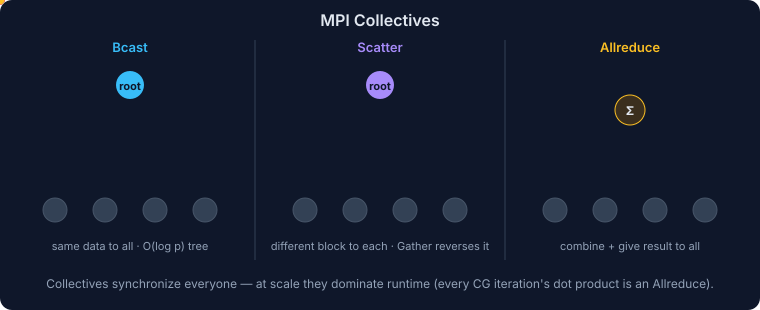

# High Performance Computing (HPC) - Ground Up Deep Dive

## Table of Contents

### Master Sections

- [What is HPC?](#what-is-hpc)
- [Why HPC Exists](#why-hpc-exists)
- [HPC vs General Distributed Systems](#hpc-vs-general-distributed-systems)
- [Core Concepts You Must Know](#core-concepts-you-must-know)
- [HPC Workload Categories](#hpc-workload-categories)
- [Anatomy of an HPC Cluster](#anatomy-of-an-hpc-cluster)
- [HPC Software Stack](#hpc-software-stack)
- [Parallel Programming Models](#parallel-programming-models)
- [Slurm Deep Dive](#slurm-deep-dive)
- [MPI Deep Dive](#mpi-deep-dive)
- [OpenMP Deep Dive](#openmp-deep-dive)
- [GPUs in HPC](#gpus-in-hpc)
- [Storage in HPC](#storage-in-hpc)
- [Networking in HPC](#networking-in-hpc)
- [Packaging and Environment Management](#packaging-and-environment-management)
- [Cluster Provisioning and Operations](#cluster-provisioning-and-operations)
- [Checkpointing](#checkpointing)
- [Cloud HPC](#cloud-hpc)
- [AWS ParallelCluster Deep Dive](#aws-parallelcluster-deep-dive)
- [Other Important HPC Tools and Technologies](#other-important-hpc-tools-and-technologies)
- [System Design for HPC](#system-design-for-hpc)
- [HPC Design Tradeoffs](#hpc-design-tradeoffs)
- [Performance Tuning Checklist](#performance-tuning-checklist)
- [Reliability and Multi-Tenancy](#reliability-and-multi-tenancy)
- [Practical Commands Cheat Sheet](#practical-commands-cheat-sheet)
- [Interview Questions and Answers](#interview-questions-and-answers)
- [30-Minute Revision Sheet](#30-minute-revision-sheet)
- [Top 50 HPC Interview Questions](#top-50-hpc-interview-questions)
- [Model Answers for the Top 50 Questions](#model-answers-for-the-top-50-questions)
- [Mock Interview Prompts](#mock-interview-prompts)
- [Slurm vs PBS vs Kubernetes vs AWS Batch](#slurm-vs-pbs-vs-kubernetes-vs-aws-batch)
- [Company-Style Interview Angles](#company-style-interview-angles)
- [STAR-Format Scenario Answers](#star-format-scenario-answers)
- [Likely Follow-Up Questions by Topic](#likely-follow-up-questions-by-topic)
- [ASCII Architecture Diagrams](#ascii-architecture-diagrams)
- [Final Mental Model](#final-mental-model)

### Focused HPC Files

- [HPC Fundamentals](./HPC-01-Fundamentals.md)
- [Slurm and MPI](./HPC-02-Slurm-MPI.md)
- [Storage, Networking, and Operations](./HPC-03-Storage-Networking-Operations.md)
- [Cloud HPC and AWS ParallelCluster](./HPC-04-Cloud-ParallelCluster.md)
- [HPC Interview Prep](./HPC-05-Interviews.md)
- [Computer Architecture for HPC](./HPC-06-Computer-Architecture.md) — pipelines, ILP, SIMD, caches, NUMA, coherence, roofline, interconnect topologies
- [Parallel Programming Models](./HPC-07-Parallel-Programming.md) — Pthreads, OpenMP deep dive, advanced MPI, CUDA/GPU, hybrid, PGAS
- [Parallel Algorithms and Performance](./HPC-08-Parallel-Algorithms-Performance.md) — PRAM, work-span, isoefficiency, canonical algorithms, load balancing, benchmarks

## What is HPC?

**High Performance Computing (HPC)** is the practice of solving compute-intensive problems by using many CPUs, GPUs, memory systems, storage systems, and networked machines together as one coordinated system.

HPC is used when a single machine is too slow, too small, or too limited for the workload.

Common examples:
- Weather simulation
- Computational fluid dynamics (CFD)
- Molecular dynamics
- Genome analysis
- Finite element analysis
- Seismic processing
- Monte Carlo simulation
- Risk modeling
- AI training and large-scale inference
- Rendering and image processing

At a high level, HPC is about:
- **Parallelism**: split work across many cores/nodes
- **Scale**: run across tens, hundreds, or thousands of machines
- **Efficiency**: maximize useful work per dollar, watt, and second
- **Coordination**: schedule jobs, share cluster resources, manage failures

---

## Why HPC Exists

### 1. Some problems are too large for one machine

Examples:
- A simulation needs 10 TB of RAM
- A training job needs 1,024 GPUs
- A weather model must finish in 30 minutes, not 3 days

### 2. Some problems are embarrassingly parallel

These can be split into many independent tasks:
- Parameter sweeps
- Batch rendering
- Monte Carlo runs
- Backtesting
- Genomics pipelines

### 3. Some problems require tightly coupled communication

These jobs need many processes exchanging data at fine granularity:
- MPI-based fluid simulation
- Distributed linear algebra
- PDE solvers
- Spectral solvers

This is where low-latency interconnects matter.

---

## HPC vs General Distributed Systems

| Dimension | HPC | General Distributed Systems |
|---|---|---|
| Primary goal | Maximum compute throughput / time-to-solution | Availability, elasticity, business transactions |
| Latency sensitivity | Often microseconds to milliseconds between ranks | Often milliseconds to seconds across services |
| Workload pattern | Batch jobs, simulations, tightly coupled tasks | Request/response, event-driven, online serving |
| Failure handling | Often restart job or checkpoint/restart | Retry, replication, graceful degradation |
| Network | RDMA / InfiniBand / EFA / high bandwidth fabrics | Ethernet is often enough |
| Storage | Parallel file systems, burst buffers, scratch | Databases, object stores, block stores |
| Scheduling | Queue-based fair sharing | Autoscaling, service orchestration |
| Consistency model | Numerical correctness and deterministic execution matter | Business correctness and durability matter |

Key point:
- A microservices architect optimizes for **availability and independent deployability**
- An HPC architect optimizes for **parallel efficiency and deterministic resource usage**

---

## Core Concepts You Must Know

## 1. Node

A **node** is one machine in the cluster.

Types:
- Login node
- Head node / scheduler node
- Compute node
- GPU node
- Storage node
- Visualization node

## 2. Core, CPU, Socket, NUMA

- **Core**: execution unit
- **CPU/socket**: physical processor package
- **Thread**: hardware thread, often via SMT/Hyper-Threading
- **NUMA**: non-uniform memory access; memory is physically closer to some CPU sockets than others

NUMA matters because poor memory locality can destroy performance.

### Quick NUMA example

If a dual-socket node has:
- Socket 0 with local memory bank A
- Socket 1 with local memory bank B

and a process is scheduled on cores from socket 0 but reads memory allocated near socket 1, it pays a remote memory penalty. On modern nodes this can be a major source of hidden slowdown.

## 3. Rank

In MPI, a **rank** is a process in a communicator.

Example:
- 128 MPI ranks spread over 8 nodes
- 16 ranks per node

## 4. Thread

Within a process, a thread enables shared-memory parallelism.

Examples:
- OpenMP threads
- pthreads
- Intel TBB threads

## 5. Job

A **job** is a unit submitted to the scheduler, asking for resources:
- number of nodes
- CPU cores
- GPUs
- memory
- wall-clock time
- queue/partition

Jobs can be:
- batch jobs
- interactive jobs
- array jobs
- reservation-backed jobs
- preemptible jobs

## 6. Queue / Partition

A logical pool of resources with policies:
- short jobs
- long jobs
- GPU jobs
- debug jobs
- large-memory jobs

## 7. Strong Scaling vs Weak Scaling

### Strong scaling
Same total problem size, more processors.

Goal:
- finish faster

Challenge:
- communication overhead eventually dominates

### Weak scaling
Problem size grows with processor count.

Goal:
- keep runtime roughly constant as cluster grows

This is common for PDE and simulation workloads.

## 8. Speedup and Efficiency

### Speedup

```text
Speedup = T1 / Tp
```

- `T1`: runtime on 1 processor
- `Tp`: runtime on p processors

### Parallel efficiency

```text
Efficiency = Speedup / p
```

Example:
- 1 core runtime = 1000s
- 100 cores runtime = 20s
- speedup = 50x
- efficiency = 50 / 100 = 50%

## 9. Amdahl's Law



If part of a program is serial, that limits parallel speedup.

```text
Speedup <= 1 / (S + (1-S)/N)
```

- `S`: serial fraction
- `N`: number of processors

Example:
- if 10% is serial, max speedup is about 10x even with infinite processors

Meaning:
- eliminate serial bottlenecks first

## 10. Gustafson's Law

Instead of fixing problem size, grow the problem as processors increase.

Meaning:
- parallel systems are useful because we solve bigger problems, not only faster ones

## 11. Throughput vs Time-to-Solution

Two HPC teams can optimize for different outcomes:

- **Time-to-solution**: finish one big job as fast as possible
- **Throughput**: finish the most total work per hour/day

Examples:
- weather forecast before a deadline is time-to-solution
- nightly Monte Carlo batch is throughput

This distinction affects architecture:
- time-to-solution pushes toward premium network/storage
- throughput pushes toward lower-cost capacity and high utilization

---

## HPC Workload Categories

## 1. Embarrassingly Parallel

Minimal communication between tasks.

Examples:
- Monte Carlo trials
- parameter sweeps
- image rendering
- independent ETL chunks

Best tools:
- Slurm job arrays
- AWS Batch
- Kubernetes batch
- Ray/Dask for some cases

## 2. Tightly Coupled

Tasks communicate frequently.

Examples:
- CFD
- climate models
- molecular dynamics
- linear algebra solvers

Best tools:
- MPI
- high-speed interconnect
- parallel file system

## 3. Hybrid

MPI across nodes + threads/GPUs within nodes.

Examples:
- MPI + OpenMP
- MPI + CUDA
- MPI + NCCL

This is the most common modern HPC pattern.

---

## Anatomy of an HPC Cluster

<details>
<summary>Click to view code</summary>

```text
Users
  |
  v
Login Nodes
  |
  v
Head / Control Plane
  |- Scheduler (Slurm)
  |- Accounting
  |- Monitoring
  |- Image/config management
  |
  v
High-Speed Network Fabric
  |
  +--> CPU Compute Nodes
  +--> GPU Compute Nodes
  +--> Large-memory Nodes
  +--> Storage Nodes
  |
  v
Shared Storage
  |- Home
  |- Scratch
  |- Project
  |- Archive/Object Store
```

</details>

## Components

### 1. Login nodes

Users SSH here to:
- edit code
- compile binaries
- submit jobs
- inspect results

Do not run heavy compute on login nodes.

### 2. Head node / control plane

Runs cluster management services:
- scheduler controller
- accounting database
- configuration services
- monitoring
- identity integration

This is critical infrastructure and must be protected carefully.

### 3. Compute nodes

Where jobs actually run.

Types:
- standard CPU nodes
- GPU nodes
- memory-optimized nodes
- high-frequency nodes

### 4. Network fabric

Critical for distributed jobs.

Options:
- Ethernet
- 10/25/40/100/200/400 Gbps Ethernet
- InfiniBand
- AWS EFA (Elastic Fabric Adapter)

Important metrics:
- latency
- bandwidth
- message rate
- RDMA support

### 5. Storage

Usually split by usage:
- **Home**: user directories, smaller, backed up
- **Scratch**: high-performance temporary working area
- **Project**: team-shared persistent data
- **Archive**: low-cost cold storage

Options:
- NFS
- Lustre
- BeeGFS
- GPFS / IBM Spectrum Scale
- FSx for Lustre
- object storage like S3

### 6. Management and identity plane

Most real clusters also need:
- LDAP/AD/SSO integration
- centralized SSH key management
- IAM or cloud-role integration
- audit logging
- quota enforcement
- image/version management

Without this, the cluster may run jobs but it does not operate cleanly as a shared platform.

### 7. Scheduler database and accounting plane

A production HPC cluster usually tracks:
- who ran what
- how many core-hours/GPU-hours were consumed
- job exit codes
- node allocations
- historical queue delays

This is needed for:
- fairness
- cost chargeback
- capacity planning
- debugging usage disputes

---

## HPC Software Stack

## Layered View

| Layer | Typical Tools |
|---|---|
| Application | GROMACS, OpenFOAM, VASP, WRF, LAMMPS, TensorFlow, PyTorch |
| Libraries | BLAS, LAPACK, ScaLAPACK, FFTW, PETSc, HDF5, NCCL |
| Parallel runtime | MPI, OpenMP, CUDA, ROCm |
| Scheduler | Slurm, PBS Pro, LSF, Grid Engine |
| Packaging / env | Spack, EasyBuild, Environment Modules, Conda |
| Containers | Apptainer/Singularity, Docker in limited cases |
| OS / provisioning | Rocky Linux, Ubuntu, custom AMIs, image builders |
| Infra | bare metal, cloud VMs, high-speed fabric, file systems |

## Compilers and Math Libraries

In HPC, the compiler and library stack can materially change runtime.

### Common compilers

- GCC
- Clang/LLVM
- Intel oneAPI compilers
- NVIDIA HPC SDK compilers
- AMD AOCC in some environments

### Why compilers matter

- vectorization quality
- OpenMP implementation quality
- architecture-specific code generation
- ABI compatibility with MPI and math libraries

### Common math libraries

- OpenBLAS
- Intel MKL
- BLIS
- LAPACK / ScaLAPACK
- FFTW
- cuBLAS / cuFFT

### Interview-level rule

If the application is math-heavy, do not assume the default compiler and default BLAS are acceptable. Tuned libraries often produce large performance differences with zero algorithmic changes.

---

## Parallel Programming Models

## 1. Shared Memory Parallelism

Multiple threads access the same memory in one node.

Tools:
- OpenMP
- pthreads
- TBB

Pros:
- easier communication
- low overhead inside one machine

Cons:
- limited to one node's memory space
- NUMA effects matter

## 2. Distributed Memory Parallelism

Each process has its own address space; communication happens via messages.

Tool:
- MPI

Pros:
- scales across many nodes
- explicit and predictable

Cons:
- harder programming model
- communication overhead is visible and real

## 3. Accelerator Programming

Use GPUs or other accelerators.

Tools:
- CUDA
- ROCm/HIP
- OpenACC
- SYCL
- NCCL for multi-GPU collective communication

## 4. Hybrid Programming

Most modern HPC codes mix models:
- MPI between nodes
- OpenMP threads within node
- CUDA on GPUs

Example:
- 8 nodes
- 4 GPUs/node
- 1 MPI rank per GPU
- NCCL for all-reduce
- OpenMP for CPU-side preprocessing

---

## Slurm Deep Dive

**Slurm** = Simple Linux Utility for Resource Management.

It is one of the most common job schedulers in HPC.

Slurm does two big jobs:
- **resource manager**: knows which nodes/resources exist
- **job scheduler**: decides when/where jobs run

## Main Slurm Components

| Component | Role |
|---|---|
| `slurmctld` | Central controller / scheduler |
| `slurmd` | Agent on each compute node |
| `slurmdbd` | Accounting database daemon |
| `sacct` | Job accounting query tool |
| `sinfo` | Cluster/partition status |
| `squeue` | View queued/running jobs |
| `sbatch` | Submit batch jobs |
| `srun` | Launch parallel tasks |
| `scancel` | Cancel jobs |
| `scontrol` | Inspect/control jobs and nodes |

## How Slurm Works

### Job lifecycle



1. User writes a job script
2. User submits with `sbatch`
3. Slurm validates request
4. Job enters pending queue
5. Scheduler finds eligible nodes
6. Resources are allocated
7. `slurmd` on target nodes launches tasks
8. Job runs
9. Accounting and logs are recorded
10. Resources are released

### Example Slurm job script

```bash
#!/bin/bash
#SBATCH --job-name=mpi-test
#SBATCH --nodes=4
#SBATCH --ntasks-per-node=32
#SBATCH --time=01:00:00
#SBATCH --partition=compute
#SBATCH --output=logs/%x-%j.out

module load openmpi

srun ./my_mpi_app input.dat
```

### Important Slurm concepts

#### Partition

A logical queue or node group.

Examples:
- `debug`
- `cpu`
- `gpu`
- `long`
- `highmem`

#### QoS (Quality of Service)

Policy layer controlling:
- priorities
- maximum wall time
- preemption
- job size limits

#### Fairshare

Prevents one team/user from monopolizing cluster resources.

Common policy:
- users with recent heavy usage get lower priority
- users with low recent usage get boosted

#### Backfilling

Scheduler lets short jobs run in holes before large reserved jobs start.

This increases utilization significantly.

#### Job arrays

For many similar tasks:

```bash
#!/bin/bash
#SBATCH --array=1-1000
#SBATCH --time=00:10:00

python simulate.py --seed ${SLURM_ARRAY_TASK_ID}
```

Best for:
- parameter sweeps
- Monte Carlo
- rendering batches

#### Node features and constraints

Match jobs to hardware:
- `--constraint=gpu`
- `--constraint=avx512`
- `--gres=gpu:4`

#### GRES

**Generic RESources** like:
- GPUs
- local SSDs
- licenses

#### Reservations

Used for:
- maintenance windows
- reserved workshops/classes
- priority project windows
- guaranteed time for deadlines

#### Accounting associations

Slurm can map usage to:
- user
- account/project
- cluster
- partition

This is important for internal billing and fairshare policy.

## Common Slurm Job States

| State | Meaning |
|---|---|
| `PENDING` | waiting for resources or policy eligibility |
| `RUNNING` | currently executing |
| `COMPLETED` | finished successfully |
| `FAILED` | exited with failure |
| `CANCELLED` | manually/system cancelled |
| `TIMEOUT` | exceeded wall time |
| `NODE_FAIL` | node failure interrupted the job |
| `PREEMPTED` | higher-priority policy interrupted the job |

When debugging user complaints, job state history matters as much as the live queue.

## Why Jobs Stay Pending

Common reasons:
- not enough free nodes
- fairshare priority too low
- partition/QoS limits
- reservation blocking
- requested features do not exist together
- memory/GPU request too large for available nodes
- job asks for more nodes than current fragmentation allows

Typical inspection commands:

```bash
squeue -j <jobid>
scontrol show job <jobid>
sprio -j <jobid>
```

## Interactive vs Batch in Slurm

### Interactive

Useful for:
- debugging
- exploratory testing
- short validation runs

Example:

```bash
srun --pty -N 1 -n 4 --time=00:30:00 bash
```

### Batch

Preferred for:
- repeatability
- long jobs
- production runs
- auditable workflows

## Slurm Scheduling Design Tradeoffs

| Design choice | Benefit | Cost |
|---|---|---|
| Aggressive backfill | Higher utilization | More scheduler complexity |
| Strict fairshare | Better fairness | Large jobs may wait longer |
| Many partitions | Better policy isolation | Admin complexity |
| Preemption | Urgent jobs start quickly | Checkpointing and disruption needed |
| Long wall times | Supports large simulations | Lowers scheduler flexibility |

## Slurm Failure Modes

- Controller failure
- Node drains due to health checks
- Jobs request impossible resources
- Users overestimate wall time
- Shared filesystem bottlenecks slow startup
- MPI jobs fail due to one bad node

## Slurm Best Practices

- Separate `debug`, `prod`, `gpu`, and `long` partitions
- Enable accounting and fairshare
- Use node health checks
- Encourage realistic wall times
- Use job arrays for independent workloads
- Avoid huge scheduler bursts from millions of tiny jobs
- Use prolog/epilog scripts carefully

---

## MPI Deep Dive

**MPI** = Message Passing Interface.

MPI is the dominant programming model for tightly coupled distributed-memory HPC applications.

Important distinction:
- MPI is a **standard/API**
- implementations include **Open MPI**, **MPICH**, **Intel MPI**, **MVAPICH**

## Why MPI Exists

Multiple nodes do not share memory. If process A on node 1 needs data from process B on node 2, it must send/receive messages.

MPI gives explicit control over this.

## MPI Core Concepts

### 1. Rank

Each process has a unique ID inside a communicator.

### 2. Communicator

A communication group, commonly `MPI_COMM_WORLD`.

### 3. Point-to-point communication

- `MPI_Send`
- `MPI_Recv`
- non-blocking: `MPI_Isend`, `MPI_Irecv`

### 4. Collective communication



Operations involving groups:
- `MPI_Bcast`
- `MPI_Reduce`
- `MPI_Allreduce`
- `MPI_Scatter`
- `MPI_Gather`
- `MPI_Barrier`

### 5. Synchronization

Important because communication can block and ordering matters.

### 6. Decomposition

How you split the problem:
- domain decomposition
- data decomposition
- functional decomposition

## Minimal MPI example

```c
#include <mpi.h>
#include <stdio.h>

int main(int argc, char** argv) {
    MPI_Init(&argc, &argv);

    int rank, size;
    MPI_Comm_rank(MPI_COMM_WORLD, &rank);
    MPI_Comm_size(MPI_COMM_WORLD, &size);

    printf("Hello from rank %d of %d\n", rank, size);

    MPI_Finalize();
    return 0;
}
```

Run:

```bash
mpicc hello.c -o hello
mpirun -np 8 ./hello
```

## Blocking vs Non-blocking

### Blocking

Simpler but can stall.

### Non-blocking

Allows overlap of communication and computation:

```c
MPI_Isend(..., &req1);
MPI_Irecv(..., &req2);
do_local_compute();
MPI_Wait(&req1, MPI_STATUS_IGNORE);
MPI_Wait(&req2, MPI_STATUS_IGNORE);
```

This is a major optimization technique.

## MPI Communication Patterns

### Halo exchange


Common in grid/mesh simulations:
- each rank exchanges boundary cells with neighbors

### Reduction

Common for:
- summing residuals
- computing norms
- loss aggregation

### Broadcast

Used to distribute:
- input parameters
- model weights
- configuration

### All-to-all

Very expensive but sometimes needed:
- FFT transposes
- repartitioning

## MPI Performance Factors

### 1. Latency

Time to send a small message.

Important for:
- many tiny messages
- synchronization-heavy algorithms

### 2. Bandwidth

Rate of large data transfer.

Important for:
- large tensor or matrix transfers
- checkpoint distribution

### 3. Message size

Many tiny messages are often worse than fewer larger messages.

### 4. Load balance

If one rank is slow, others wait.

### 5. Topology awareness

Mapping ranks to sockets/nodes matters.

### 6. Memory locality

NUMA misplacement can slow ranks drastically.

### 7. Process placement and binding

Performance often depends on:
- rank-to-core mapping
- rank-to-socket mapping
- rank-to-GPU mapping
- thread affinity

If placement is wrong:
- ranks may fight for the same cores
- GPU jobs may use the wrong PCIe path
- remote memory access increases
- collectives become imbalanced

## MPI Placement Mental Model

For a node with:
- 2 CPU sockets
- 64 cores total
- 4 GPUs

A common design is:
- 4 MPI ranks per node
- 1 rank per GPU
- each rank bound to CPU cores closest to that GPU

This reduces PCIe/NVLink cross-traffic and improves locality.

## MPI Collectives Matter More Than Many Engineers Expect

At scale, collectives like `MPI_Allreduce` can dominate runtime.

This matters for:
- iterative solvers
- distributed training
- convergence checks
- global statistics

System design implication:
- selecting a good network fabric and MPI implementation is not an optimization detail; it can determine whether the workload scales at all.

## MPI Common Problems

### Deadlock

Example:
- rank 0 waits to receive from rank 1
- rank 1 waits to receive from rank 0

Fix:
- use matching send/recv ordering
- use non-blocking calls
- use `MPI_Sendrecv`

### Load imbalance

One rank gets more work.

Fix:
- better domain decomposition
- dynamic work distribution when possible

### Communication overhead

Too much time spent messaging.

Fix:
- aggregate messages
- reduce synchronization
- overlap compute and communication

### Poor process placement

Ranks placed badly across sockets/nodes.

Fix:
- CPU binding
- topology-aware placement
- one rank per NUMA domain when appropriate

## MPI and Slurm Together

Typical launch pattern:

```bash
srun --mpi=pmix ./my_mpi_app
```

or

```bash
mpirun ./my_mpi_app
```

In managed clusters, `srun` integration is often preferred because Slurm already owns the allocation.

## When to Use MPI

Use MPI when:
- tasks need frequent communication
- workload spans many nodes
- performance matters more than development simplicity
- deterministic control is required

Do not default to MPI when:
- tasks are independent
- a workflow engine or job array is enough
- communication is loose and coarse-grained

---

## OpenMP Deep Dive

**OpenMP** is a directive-based shared-memory parallel programming model.

Example:

```c
#pragma omp parallel for
for (int i = 0; i < n; i++) {
    a[i] = b[i] + c[i];
}
```

Use OpenMP when:
- work fits on one node
- you want simpler shared-memory parallelism
- you want to complement MPI

Typical pattern:
- MPI across nodes
- OpenMP within node

Benefits:
- fewer MPI ranks
- better memory sharing within node
- less inter-node communication

Risks:
- oversubscription
- false sharing
- thread imbalance
- NUMA issues

## OpenMP Environment Variables Worth Knowing

```bash
export OMP_NUM_THREADS=16
export OMP_PROC_BIND=close
export OMP_PLACES=cores
```

These influence:
- thread count
- binding behavior
- locality

Poor defaults can produce noisy or misleading benchmark results.

---

## GPUs in HPC

GPUs massively increase throughput for parallel workloads.

Best for:
- matrix operations
- stencil operations
- deep learning
- molecular dynamics
- CFD kernels

Not always best for:
- branchy code
- tiny workloads
- memory-latency dominated irregular tasks

## GPU HPC Stack

| Layer | Tools |
|---|---|
| Programming | CUDA, HIP, SYCL, OpenACC |
| Multi-GPU | NCCL |
| Distributed training | MPI + NCCL, Horovod, PyTorch DDP |
| Schedulers | Slurm with GRES |
| Monitoring | `nvidia-smi`, DCGM |

## GPU Scheduling Example with Slurm

```bash
#!/bin/bash
#SBATCH --nodes=2
#SBATCH --gres=gpu:8
#SBATCH --ntasks-per-node=8
#SBATCH --cpus-per-task=8
#SBATCH --time=04:00:00

module load cuda openmpi

srun ./gpu_mpi_app
```

## GPU Design Considerations

- PCIe vs NVLink
- GPU memory capacity
- GPU-to-GPU topology
- data transfer overhead
- one process per GPU vs multi-threaded process
- storage throughput for data feeding

## GPU Cluster Anti-Patterns

- putting data-intensive training on weak shared storage
- requesting GPUs without enough CPUs per GPU
- ignoring GPU locality and NUMA affinity
- mixing debug jobs with expensive production GPU partitions
- checkpointing all ranks simultaneously to the same storage target

---

## Storage in HPC

Storage is often the hidden bottleneck.

## Storage Types

### 1. Home storage

- persistent
- smaller
- backed up
- not designed for large scratch I/O

### 2. Scratch storage

- fast
- temporary
- high-throughput
- frequently purged

### 3. Parallel file system

Used when many nodes read/write together.

Examples:
- Lustre
- BeeGFS
- GPFS

### 4. Object storage

Examples:
- S3

Great for:
- datasets
- archives
- checkpoints at coarse granularity
- workflow staging

Not ideal for:
- POSIX-heavy metadata-intensive random access

## Storage Performance Metrics

- throughput
- IOPS
- metadata ops/sec
- file create/delete rate
- small-file performance
- read/write concurrency

## Common HPC Storage Anti-Patterns

- millions of tiny files in one directory
- checkpointing every rank independently to shared metadata server
- using home directory for large scratch data
- staging huge jobs directly from object storage without caching

## I/O Patterns You Should Recognize

### Large sequential reads/writes

Common in:
- checkpoint files
- large simulation dumps
- model shard writes

Needs:
- high throughput

### Metadata-heavy workloads

Common in:
- millions of tiny file creates
- workflow engines with many task artifacts
- genomics pipelines with file-per-step patterns

Needs:
- strong metadata performance

### Mixed random access

Common in:
- analytics and preprocessing
- sparse scientific datasets

Needs:
- careful file format and caching choices

## Storage Best Practices

- use scratch for temporary active data
- aggregate small outputs into larger files
- use HDF5/NetCDF/Parquet where appropriate
- stagger checkpoints
- separate metadata-heavy and throughput-heavy workloads

---

## Networking in HPC

Network fabric is often the difference between "works" and "scales".

## Important Metrics

- latency
- bandwidth
- bisection bandwidth
- packet rate
- jitter
- collectives performance
- RDMA support

## Common Fabrics

### Ethernet

Good enough for:
- loosely coupled workloads
- storage-heavy pipelines
- job arrays

### InfiniBand

Best for:
- low-latency tightly coupled MPI
- high message rate
- RDMA

### AWS EFA

Cloud network interface designed for HPC and ML workloads.

Benefits:
- lower latency than standard ENA
- OS-bypass style capabilities
- better MPI/NCCL performance in AWS

## Network Design Principles

- keep tightly coupled jobs within the same placement group / fabric domain
- minimize cross-rack penalties where possible
- match communication pattern to topology
- use topology-aware scheduler placement when available

## RDMA in Plain Language

**RDMA** allows one machine to access memory on another machine with much lower CPU overhead than traditional TCP-based networking.

Why it matters:
- lower latency
- reduced CPU overhead
- better bandwidth utilization
- improved MPI and collective performance

For interview answers, the important point is not protocol detail. It is that HPC networks try to minimize the software overhead of communication because communication is often on the critical path.

---

## Packaging and Environment Management

HPC environments become unmanageable quickly without standards.

## Common tools

### Environment Modules

Users load compiler/library stacks:

```bash
module load gcc/13 openmpi/4.1 hdf5/1.14
```

### Spack

Package manager for HPC software stacks.

Benefits:
- compiler variants
- dependency trees
- reproducible builds
- multiple toolchains

### EasyBuild

Another common HPC software build and deployment framework.

### Conda

Useful in data science environments, but can conflict with optimized MPI/compiler stacks if used carelessly.

## Containers

### Apptainer / Singularity

Most common HPC container solution.

Why not Docker directly on multi-user HPC?
- privilege model concerns
- admin/security issues

Benefits of Apptainer:
- reproducible environments
- easier user-space packaging
- works better in multi-user shared clusters

Use cases:
- package research code + dependencies
- portable software stack across clusters
- isolate Python/R environments

## Reproducible Build Strategy

A mature HPC platform usually standardizes one of these:

### Option 1: Modules + central builds

Best for:
- shared institutional clusters
- curated production software stacks

### Option 2: Spack environments

Best for:
- reproducible compiler/library combinations
- advanced scientific software trees

### Option 3: Apptainer containers

Best for:
- user portability
- dependency isolation
- mixed language stacks

In practice, large platforms often use all three:
- modules to expose tools
- Spack to build them
- Apptainer for application portability

---

## Cluster Provisioning and Operations

Provisioning includes:
- node image creation
- OS configuration
- scheduler install
- network tuning
- storage mounts
- user identity integration
- monitoring/alerting

## Operational Concerns

### 1. Health checks

Drain nodes automatically for:
- bad GPUs
- failed NICs
- filesystem issues
- ECC errors

### 2. Observability

Track:
- CPU utilization
- memory usage
- GPU utilization
- job wait time
- queue depth
- filesystem throughput
- node failure rate
- scheduler latency

Typical tools:
- Prometheus
- Grafana
- CloudWatch
- DCGM
- Slurm accounting

### 3. Capacity planning

Questions:
- Are jobs waiting on CPUs or GPUs?
- Is storage saturated?
- Is queue delay due to policy or lack of nodes?
- Are large jobs starved by fragmentation?

### 4. Security

Must cover:
- SSH access
- least privilege
- user isolation
- secrets management
- software provenance
- data governance

### 5. Change management

Clusters break easily when:
- images drift
- drivers change without validation
- MPI/compiler ABI mismatches appear
- bootstrap scripts are edited ad hoc

Good practice:
- maintain staging and production clusters
- certify software stacks before promotion
- version control infrastructure and bootstrap code
- test representative workloads after changes

### 6. User support and documentation

Operationally successful HPC platforms usually include:
- example job scripts
- queue selection guidance
- software stack documentation
- quota and storage documentation
- onboarding for MPI/GPU best practices

Many perceived infrastructure issues are actually poor user enablement.

---

## Checkpointing

Long-running HPC jobs fail eventually.

Checkpointing saves application state so a job can resume later.

## Why checkpoint?

- node failure
- scheduler wall-time limits
- spot/preemptible interruption
- software updates
- cost optimization

## Checkpoint tradeoff

Checkpoint too often:
- waste I/O bandwidth

Checkpoint too rarely:
- lose too much work on failure

## Common strategies

- application-level checkpoints
- framework-level checkpoints
- coordinated checkpoints
- asynchronous checkpoints

For large GPU/ML jobs, checkpoint design is often a first-class architecture decision.

---

## Cloud HPC

Cloud HPC lets you build clusters on demand rather than owning a static supercomputer.

Benefits:
- elasticity
- faster experimentation
- access to GPU/CPU variants
- global regions
- no hardware procurement lead time

Tradeoffs:
- network may be weaker than elite on-prem supercomputers
- costs can explode without controls
- filesystem and data movement need careful design
- bare-metal tuning options may be limited

## When Cloud HPC Works Well

- bursty workloads
- parameter sweeps
- project-based simulation
- training jobs with fluctuating demand
- teams without dedicated HPC ops staff

## When On-Prem May Win

- stable high utilization 24/7
- ultra-low-latency tightly coupled workloads
- strict data locality/regulatory needs
- already-optimized large capital infrastructure

---

## AWS ParallelCluster Deep Dive

**AWS ParallelCluster** is an AWS-supported open source cluster orchestration tool for deploying and managing HPC clusters on AWS.

It automates:
- cluster creation
- Slurm integration
- networking setup
- shared storage integration
- compute fleet scaling
- custom AMIs/bootstrap hooks

Think of it as:
- infrastructure automation for AWS HPC
- opinionated cluster deployment tooling

## Typical AWS ParallelCluster Architecture

<details>
<summary>Click to view code</summary>

```text
Users
  |
  v
Login Node / Remote Desktop
  |
  v
Head Node
  |- Slurm controller
  |- Cluster config
  |- Shared mounts
  |
  v
Compute Fleet
  |- CPU queues
  |- GPU queues
  |- Spot queues
  |- On-demand queues
  |
  v
Storage
  |- FSx for Lustre
  |- EBS
  |- EFS
  |- S3
  |
  v
Network
  |- VPC
  |- Subnets
  |- Security Groups
  |- Placement groups
  |- EFA
```

</details>

## Key ParallelCluster Components

### 1. Head node

Runs:
- Slurm controller
- shared config
- cluster management hooks

### 2. Compute fleet

Can scale dynamically based on queued jobs.

Options:
- on-demand
- spot
- multiple instance types
- multiple queues

### 3. Shared storage integrations

Common patterns:
- FSx for Lustre for high-performance POSIX workloads
- EFS for lighter shared home directories
- EBS for node-local or head-node storage
- S3 for input/output staging and archive

### 4. Networking

Often uses:
- placement groups for cluster locality
- EFA for low-latency MPI/NCCL

## Why Use ParallelCluster

- faster HPC cluster deployment
- standard AWS integration
- supports Slurm
- good for reproducible cloud HPC environments
- easier than manually stitching together EC2, EFA, FSx, IAM, and Slurm

## AWS ParallelCluster Design Decisions

### Storage mapping

| Need | AWS choice |
|---|---|
| Shared high-throughput scratch | FSx for Lustre |
| Cheap persistent datasets | S3 |
| Shared home directories | EFS or small FSx/EBS-backed design |
| Node-local temporary work | NVMe instance store / local SSD |

### Capacity mapping

| Need | AWS choice |
|---|---|
| Tightly coupled MPI | EFA-enabled instances + placement groups |
| Cheap burst capacity | Spot instances for fault-tolerant jobs |
| Stable production jobs | On-demand or reservations |
| GPU training | P/G family GPU instances depending on generation |

### Scheduling mapping

Common queue split:
- `cpu-ondemand`
- `cpu-spot`
- `gpu-ondemand`
- `gpu-spot`
- `debug`

## ParallelCluster Example Design by Workload

### Pattern A: Tightly coupled MPI simulation

Choose:
- EFA-enabled instance types
- placement groups
- FSx for Lustre scratch
- on-demand capacity first
- Slurm queue with larger node counts

Avoid:
- fragmented heterogeneous instance types in the same queue
- spot unless checkpoint/restart is solid

### Pattern B: Embarrassingly parallel batch

Choose:
- mixed instance types
- spot-heavy fleet
- S3 for durable storage
- smaller per-job local scratch

Avoid:
- paying for EFA or premium network without measured benefit

### Pattern C: GPU training cluster

Choose:
- homogeneous GPU generation per queue
- topology-aware placement
- dataset staging close to nodes
- checkpoint export to S3

Avoid:
- mixing incompatible GPU memory sizes in the same production queue
- relying on weak shared storage for hot datasets

## ParallelCluster Example Configuration Shape

High-level concepts in config:
- region
- image / AMI
- head node instance type
- scheduler = Slurm
- one or more Slurm queues
- networking
- shared storage mounts
- custom actions / bootstrap scripts

### Example concepts in config

```yaml
Region: us-east-1
Image:
  Os: ubuntu2204
HeadNode:
  InstanceType: c7i.2xlarge
Scheduling:
  Scheduler: slurm
  SlurmQueues:
    - Name: cpu
      ComputeResources:
        - Name: cputier
          InstanceType: c7i.8xlarge
          MinCount: 0
          MaxCount: 100
    - Name: gpu
      Networking:
        Efa:
          Enabled: true
      ComputeResources:
        - Name: gputier
          InstanceType: p5.48xlarge
          MinCount: 0
          MaxCount: 16
SharedStorage:
  - Name: scratch
    StorageType: FsxLustre
```

The exact schema evolves by version, but the architectural idea is stable:
- define head node
- define scheduler
- define one or more Slurm queues
- attach storage
- enable EFA only where justified

## ParallelCluster Operational Risks

- head node becomes single point of control-plane failure
- FSx throughput undersized for checkpoint bursts
- spot interruptions break tightly coupled jobs
- wrong subnet/placement setup hurts EFA performance
- user bootstrap scripts create non-reproducible node state

## Best Practices for ParallelCluster

- isolate queues by workload and pricing model
- use EFA only where workload benefits
- stage large static datasets to S3 + cache into FSx
- use FSx for Lustre for scratch, not as infinite archive
- checkpoint jobs if using spot
- version-control ParallelCluster config
- test AMIs/bootstrap logic separately before production rollout

---

## Other Important HPC Tools and Technologies

## 1. PBS Pro / Torque / LSF / Grid Engine

Alternatives to Slurm.

Use cases:
- legacy clusters
- enterprise licensing preferences
- existing admin expertise

## 2. Lustre

Parallel distributed file system, common in HPC.

Best for:
- high-throughput parallel I/O
- large shared scratch workloads

## 3. BeeGFS

Another common parallel file system.

Known for operational flexibility and good performance.

## 4. GPFS / IBM Spectrum Scale

Enterprise-grade parallel file system with strong data management features.

## 5. NCCL

NVIDIA collective communication library for multi-GPU and multi-node GPU communication.

Critical for:
- distributed deep learning
- all-reduce
- tensor synchronization

## 6. HDF5 / NetCDF

Data formats/libraries for scientific structured data.

Useful for:
- simulation output
- portable scientific datasets
- metadata-rich arrays

## 7. Spack

Almost mandatory in serious multi-user HPC software management.

## 8. Apptainer

Critical for reproducibility and packaging in multi-user clusters.

## 9. Ray / Dask / Spark

Not traditional MPI-style HPC tools, but useful for:
- Python parallelism
- distributed analytics
- ML preprocessing
- task graphs

Use them when the workload is coarse-grained and developer productivity matters more than ultra-low-level communication control.

## 10. Workflow Engines

Real platforms often need orchestration above the scheduler.

Examples:
- Nextflow
- Snakemake
- Airflow in some batch pipelines
- CWL/WDL tools in genomics

Why they matter:
- chain multi-step pipelines
- manage dependencies
- capture provenance
- restart from failed stages

This is important because many "HPC applications" are really end-to-end workflows, not one monolithic binary.

---

## System Design for HPC

This is the section interviewers usually want: not only "what is MPI?" but "how would you design an HPC platform?"

## System Design Goals

Before designing, define:
- workload type
- scale
- SLA / time-to-solution
- budget
- data size
- coupling pattern
- reproducibility needs
- security/compliance constraints

## Design Pattern 1: Research University Shared Cluster

### Requirements

- 2,000 researchers
- mixed CPU and GPU jobs
- fair sharing across labs
- on-prem budget
- persistent team storage
- moderate ops team

### Architecture

- 2 login nodes behind load balancer/DNS rotation
- 2 Slurm controllers in HA design if possible
- compute partitions:
  - `debug`
  - `cpu`
  - `gpu`
  - `highmem`
- shared storage:
  - home on backed-up NAS/EFS-like equivalent
  - scratch on Lustre/BeeGFS
  - archive on object/tape
- environment via modules + Spack
- containers via Apptainer
- accounting + fairshare by lab/project
- monitoring with Prometheus/Grafana

### Design rationale

- login nodes separated from control plane
- scratch separated from home to protect metadata performance
- GPU isolation avoids CPU jobs clogging expensive nodes
- fairshare prevents one lab from taking entire cluster

## Design Pattern 2: Cloud Burst HPC for CFD

### Requirements

- normally 200 cores
- occasionally 20,000 cores for urgent runs
- solver uses tightly coupled MPI
- outputs go to S3 archive

### Architecture

- base on-prem or small cloud cluster
- AWS ParallelCluster for burst capacity
- Slurm scheduler
- EFA-enabled compute nodes
- placement groups
- FSx for Lustre as scratch
- S3 for input datasets and final outputs
- checkpointing enabled

### Key tradeoffs

- EFA cost is worth it because MPI is tightly coupled
- spot may be unsafe unless solver checkpoint/restart is solid
- FSx used for working set, S3 for durable storage

## Design Pattern 3: Monte Carlo Risk Platform

### Requirements

- millions of independent simulations nightly
- minimal cross-task communication
- cost sensitive
- finish by market open

### Architecture

- Slurm or cloud batch scheduler
- job arrays
- CPU spot instances acceptable
- object storage for inputs/outputs
- no need for premium network fabric
- aggregate results in distributed storage/database

### Rationale

This is HPC from a throughput perspective, but not tightly coupled HPC. Do not overengineer with InfiniBand or MPI if independence dominates.

## Design Pattern 4: Multi-Node GPU Training Platform

### Requirements

- 256 to 1024 GPUs
- large model training
- distributed all-reduce
- expensive datasets
- checkpoint-heavy

### Architecture

- GPU partition with topology-aware placement
- Slurm scheduling
- EFA or equivalent fast interconnect
- NCCL + PyTorch DDP
- high-throughput shared scratch
- staged datasets close to compute
- checkpoint pipeline to durable object storage
- quota and priority controls

### Important choices

- one process per GPU
- local NVMe for shard caching
- separate checkpoint and training I/O paths if possible
- preemption only if checkpoint cadence supports it

---

## HPC Design Tradeoffs

## 1. On-Prem vs Cloud

| Choice | Pros | Cons |
|---|---|---|
| On-prem | predictable cost at high utilization, full control, best tuning | capital expense, slower procurement, fixed capacity |
| Cloud | elastic, fast provisioning, many instance choices | variable cost, data movement cost, cloud-specific tuning |

## 2. Slurm vs Kubernetes

| Choice | Pros | Cons |
|---|---|---|
| Slurm | built for batch/HPC, mature resource model, MPI-friendly | less cloud-native app ecosystem |
| Kubernetes | container-native, rich platform tooling | weaker fit for tightly coupled HPC unless heavily adapted |

General guidance:
- for traditional HPC, choose Slurm
- for service-oriented ML platforms, Kubernetes may coexist beside HPC systems

## 3. MPI vs Job Arrays

| Choice | Best for | Wrong for |
|---|---|---|
| MPI | tightly coupled multi-node jobs | independent tasks |
| Job arrays | embarrassingly parallel workloads | fine-grained tightly coupled communication |

## 4. Parallel File System vs Object Storage

| Choice | Best for | Weakness |
|---|---|---|
| Parallel file system | POSIX shared scratch, parallel I/O | cost, metadata scaling, ops complexity |
| Object storage | cheap durable large datasets | not POSIX, poor small random file semantics |

## 5. Spot vs On-Demand

| Choice | Pros | Cons |
|---|---|---|
| Spot | cheaper | interruptions |
| On-demand | stable | more expensive |

Use spot for:
- checkpointable
- fault-tolerant
- independent workloads

Avoid spot for:
- long tightly coupled jobs without restart support

---

## Performance Tuning Checklist

When an HPC job is slow, check these in order:

1. Is the algorithm scaling poorly?
2. Is the workload load-balanced?
3. Is communication dominating runtime?
4. Are ranks/threads placed well?
5. Is NUMA locality poor?
6. Is storage throttling startup/checkpoint/output?
7. Is the network topology/fabric insufficient?
8. Are compiler flags and math libraries optimized?
9. Are you oversubscribing cores or GPUs?
10. Are you measuring with profiling tools rather than guessing?

## Benchmarking Basics

When comparing systems, measure with discipline.

### Things to record

- node type
- CPU/GPU generation
- compiler version
- MPI implementation
- library versions
- problem size
- rank/thread count
- binding settings
- filesystem used
- network type

### Common benchmark mistakes

- comparing different problem sizes by accident
- including one-time cache warmup effects
- ignoring placement and affinity
- benchmarking on noisy shared nodes
- not separating compute time from I/O time

### Good benchmark questions

- Does runtime improve?
- Does efficiency improve?
- Is cost per solved problem lower?
- Is time-to-solution acceptable?
- Does scaling flatten at a predictable point?

## Common Profiling Tools

- `perf`
- Intel VTune
- NVIDIA Nsight
- mpiP
- TAU
- Arm MAP
- application-specific profilers

---

## Reliability and Multi-Tenancy

Shared HPC clusters must balance:
- utilization
- fairness
- reproducibility
- security
- fault isolation

## Multi-tenant controls

- per-project quotas
- fairshare
- partition/QoS isolation
- filesystem quotas
- software module governance
- node health-based draining

## Cost Governance in Cloud HPC

For cloud environments, also add:
- queue-level spending limits
- tagging by project and owner
- budget alarms
- idle resource cleanup
- image sprawl control
- spot vs on-demand policy by workload class

Without governance, cloud HPC often fails for financial rather than technical reasons.

## Reproducibility controls

- versioned modules
- pinned Spack environments
- containerized runs
- immutable cluster configs
- archived job scripts and environment metadata

---

## Practical Commands Cheat Sheet

## Slurm

```bash
sinfo
squeue
sbatch job.sh
srun --nodes=2 --ntasks-per-node=32 ./app
sacct -j 12345
scancel 12345
scontrol show job 12345
```

## MPI

```bash
mpicc app.c -o app
mpirun -np 64 ./app
```

## Modules

```bash
module avail
module load gcc openmpi
module list
module purge
```

## Basic sanity checks

```bash
lscpu
numactl --hardware
nvidia-smi
df -h
free -h
```

---

## Interview Questions and Answers

## 1. What is HPC and when do you need it?

**Answer:**
HPC is the use of parallel compute resources to solve problems too large or too time-sensitive for a single machine. You need it when your workload requires massive CPU/GPU throughput, very large memory, or multi-node parallelism. Typical examples are weather models, CFD, molecular simulations, large-scale AI training, and high-volume Monte Carlo simulation.

The key distinction is that HPC optimizes for **time-to-solution and parallel efficiency**, not primarily for always-on request serving like web systems.

## 2. What is the difference between HPC and distributed systems?

**Answer:**
Both use many machines, but they optimize for different things. Distributed systems usually prioritize availability, fault tolerance, and serving online requests. HPC prioritizes high throughput, low-latency inter-process communication, and deterministic execution of large batch jobs.

For example:
- a payment service uses retries, replicas, and stateless scaling
- an MPI simulation uses synchronized ranks, specialized fabrics, and checkpoint/restart

## 3. What is Slurm?

**Answer:**
Slurm is a cluster resource manager and job scheduler. It tracks available nodes and resources, accepts job submissions, queues them according to policy, allocates resources, launches tasks, and records accounting data.

It is effectively the operating system for a shared HPC cluster from a scheduling perspective.

## 4. How does Slurm schedule jobs fairly?

**Answer:**
Usually through a combination of:
- partitions
- priorities
- fairshare
- QoS policies
- job size and age factors
- backfilling

Fairshare reduces the priority of users or projects that recently consumed large amounts of cluster time, so that others can get access. Backfilling increases utilization by fitting short jobs into gaps without delaying larger reserved jobs.

## 5. What is MPI and why is it important?

**Answer:**
MPI is the standard interface for distributed-memory parallel programming. It lets processes on different nodes exchange data using explicit messages. It is important because multi-node systems do not share memory, so tightly coupled jobs need structured communication primitives like send/receive and collectives.

MPI remains essential for simulation and scientific computing because it gives precise control over communication and maps well to high-performance interconnects.

## 6. When would you use MPI instead of a job array?

**Answer:**
Use MPI when tasks must communicate frequently during execution, such as in domain-decomposed simulations. Use a job array when tasks are independent, such as running 10,000 Monte Carlo trials with different seeds.

If tasks do not need to exchange data during runtime, MPI usually adds complexity without benefit.

## 7. Explain strong scaling vs weak scaling.

**Answer:**
Strong scaling keeps total problem size fixed and measures whether adding processors reduces runtime. Weak scaling increases problem size proportionally with processor count and measures whether runtime stays flat.

Strong scaling is limited heavily by communication and serial fractions. Weak scaling is often more realistic for scientific workloads because users want to solve bigger problems as systems grow.

## 8. Why does network matter so much in HPC?

**Answer:**
In tightly coupled applications, ranks exchange data constantly. If network latency is high or bandwidth is low, processors sit idle waiting for messages. As job size grows, communication cost can dominate runtime.

That is why technologies like InfiniBand and EFA matter. They reduce communication overhead and improve collective operation performance.

## 9. What are the main components of an HPC cluster?

**Answer:**
- login nodes for user access
- head/control nodes for scheduling and management
- compute nodes for execution
- storage systems for home, scratch, and archive
- network fabric for node-to-node communication
- software stack including scheduler, compilers, MPI, libraries, and environment tools

## 10. What is AWS ParallelCluster and when would you use it?

**Answer:**
AWS ParallelCluster is a deployment and management tool for running HPC clusters on AWS. It automates cluster creation around Slurm, compute fleets, storage integration, and networking.

Use it when you want AWS-based HPC without building all cluster infrastructure manually from raw EC2, FSx, IAM, and networking components.

It is especially good for burst workloads, project-based compute, and teams needing reproducible cloud HPC clusters.

## 11. How would you design an HPC platform for tightly coupled CFD jobs on AWS?

**Answer:**
I would use:
- AWS ParallelCluster with Slurm
- EFA-enabled instance types
- cluster placement groups
- FSx for Lustre for shared scratch
- S3 for durable input/output archive
- separate queues for debug, on-demand production, and possibly spot if checkpointing is mature

The key decision is to optimize communication and I/O. For tightly coupled MPI, standard Ethernet-only placement is usually not enough at scale.

## 12. How would you design a cost-efficient HPC platform for Monte Carlo workloads?

**Answer:**
I would not default to MPI or premium interconnects. I would use independent jobs or job arrays, cheap CPU capacity, aggressive autoscaling, object storage for inputs/outputs, and maybe spot instances because tasks are independent and restartable.

This is a common interview trap: not every HPC workload needs tightly coupled cluster design.

## 13. What storage would you choose for HPC and why?

**Answer:**
It depends on access pattern:
- home data: persistent and backed up shared storage
- working scratch: high-performance parallel filesystem
- archival data: object storage
- node-local temporary data: NVMe/local SSD

For HPC, storage is chosen by I/O pattern, not by one-size-fits-all simplicity.

## 14. What are common HPC bottlenecks?

**Answer:**
- poor parallel decomposition
- communication overhead
- load imbalance
- NUMA/locality issues
- slow or metadata-heavy storage
- bad rank placement
- oversubscription
- checkpoint storms
- underestimating scheduler/policy effects

## 15. What is checkpointing and why is it important?

**Answer:**
Checkpointing saves application state periodically so jobs can resume after interruption or failure. It is critical for long-running jobs, cloud spot usage, and clusters with wall-time limits.

Without checkpointing, one failure near the end of a multi-day run can waste enormous compute time.

## 16. What is the difference between OpenMP and MPI?

**Answer:**
OpenMP is shared-memory parallelism inside a node. MPI is distributed-memory parallelism across processes, often across nodes.

OpenMP is easier but limited to one shared-memory system. MPI is more complex but scales across many machines. Many applications use both.

## 17. Why is NUMA important?

**Answer:**
In NUMA systems, memory is physically closer to some CPUs than others. If a thread frequently accesses remote memory, latency rises and bandwidth drops. This can materially hurt performance even when CPU utilization looks high.

Proper thread pinning, process placement, and memory locality are essential in HPC tuning.

## 18. How would you improve cluster utilization?

**Answer:**
- enable backfilling
- separate partitions by workload class
- encourage realistic wall times
- use job arrays for many small tasks
- monitor queue fragmentation
- use fairshare
- right-size node shapes
- reduce scheduler overload from tiny jobs

Utilization is a policy, scheduling, and workload-shaping problem, not only a hardware problem.

## 19. What is a parallel filesystem and why not just use NFS everywhere?

**Answer:**
A parallel filesystem distributes metadata and data paths to support high-throughput concurrent access from many nodes. NFS can work for light shared storage, especially home directories, but usually becomes a bottleneck for large-scale parallel reads/writes and metadata-heavy HPC workloads.

## 20. How would you compare Slurm and Kubernetes for HPC?

**Answer:**
Slurm is purpose-built for HPC batch scheduling, MPI integration, fairshare, and cluster resource allocation. Kubernetes is stronger for containerized services and cloud-native app ecosystems.

For classic simulation workloads, Slurm is usually the better scheduler. Kubernetes can complement HPC for surrounding services, portals, notebooks, and some ML pipelines.

## 21. What would you monitor in an HPC platform?

**Answer:**
- queue wait time
- job throughput
- job failure rate
- node health
- CPU/GPU utilization
- memory pressure
- filesystem throughput and metadata rates
- network errors and congestion
- scheduler latency
- fairness and quota consumption

## 22. A user says their MPI job scales from 8 to 64 ranks but gets slower from 64 to 512. What do you check?

**Answer:**
I would check:
- communication/computation ratio
- load balance
- collectives overhead
- halo exchange frequency
- rank placement
- NUMA pinning
- network fabric saturation
- small message overhead
- algorithmic scaling limits from Amdahl's Law

I would profile before changing architecture because this is often a communication pattern problem, not only an infrastructure problem.

## 23. When would you use spot instances in cloud HPC?

**Answer:**
When workloads are:
- restartable
- checkpointed
- embarrassingly parallel
- cost-sensitive

I would avoid spot for long tightly coupled jobs unless interruption handling is proven and operationally safe.

## 24. How do you make HPC environments reproducible?

**Answer:**
- version-controlled infrastructure config
- modules or Spack environments with pinned versions
- containerized applications with Apptainer
- archived job scripts
- recorded runtime metadata
- stable input datasets and config management

In research and regulated environments, reproducibility is a platform feature, not a user afterthought.

## 25. Design an interview-ready answer for "build a shared HPC platform for AI + simulations."

**Answer:**
I would split workloads into at least two resource classes:
- tightly coupled CPU/GPU simulation jobs
- ML training/inference jobs

I would use Slurm for scheduling, separate GPU and CPU partitions, EFA/fast interconnect for distributed jobs, high-performance scratch storage, object storage for durable datasets and checkpoints, modules/containers for reproducibility, and accounting/fairshare for multi-tenant governance.

I would also explicitly separate:
- login/control plane
- compute plane
- home vs scratch vs archive storage
- debug vs production queues

The main tradeoff is balancing utilization and fairness while protecting expensive GPU and network resources from noisy or mismatched workloads.

## 26. What is the difference between `srun`, `sbatch`, and `mpirun`?

**Answer:**
`sbatch` submits a batch job to Slurm. `srun` launches tasks, often within an existing Slurm allocation, and can also be used for interactive jobs. `mpirun` is an MPI launcher provided by the MPI implementation.

In a Slurm-managed cluster, `srun` is often preferred for launching MPI tasks because it integrates directly with the scheduler's allocation and process management.

## 27. Why do HPC platforms separate home, scratch, and archive storage?

**Answer:**
Because the access patterns and cost models differ. Home storage should be persistent and often backed up. Scratch should be fast and disposable. Archive should be cheap and durable.

If you merge them into one system, you usually end up paying too much, performing poorly, or both.

## 28. What is job backfilling and why is it useful?

**Answer:**
Backfilling lets the scheduler run smaller jobs in currently free slots as long as doing so does not delay higher-priority reserved jobs. It improves utilization and reduces wasted idle windows.

This is one of the most important scheduler techniques for shared clusters with mixed job sizes.

## 29. How do you choose between EFA/InfiniBand and standard Ethernet?

**Answer:**
I start from the communication pattern. If the application is tightly coupled, synchronization-heavy, and sensitive to collective performance, I choose EFA or InfiniBand. If tasks are mostly independent or coarse-grained, standard Ethernet is often enough.

The mistake is buying premium network for embarrassingly parallel jobs or, conversely, trying to scale MPI on commodity networking without measuring the consequences.

## 30. What is the role of containers in HPC if modules already exist?

**Answer:**
Modules solve environment selection at the cluster level. Containers solve application portability and dependency isolation. They are complementary.

In mature environments:
- modules expose compilers, MPI, and site-standard tooling
- containers package user applications and language ecosystems

## 31. How would you debug a long queue wait time complaint?

**Answer:**
I would check:
- requested resources
- partition and QoS
- priority/fairshare
- current fragmentation
- reservation conflicts
- historical queue occupancy

I would not assume "the cluster is full" until I inspect scheduler state. Many long waits are policy or request-shape issues.

## 32. A team wants one platform for genomics pipelines and tightly coupled CFD. Would you use one cluster?

**Answer:**
Possibly one administrative platform, but not one undifferentiated resource pool. I would separate workload classes through partitions, node types, storage policy, and likely queue-specific operational guidance.

Genomics often cares about workflows, metadata-heavy I/O, and throughput. CFD cares about MPI scaling, network fabric, and tightly coupled runtime behavior. Forcing both into the same tuning and policy envelope usually hurts one of them.

## 33. What makes an HPC design answer strong in an interview?

**Answer:**
Three things:
- classify the workload correctly
- map the workload to the right compute, network, storage, and scheduler policy
- explain tradeoffs in cost, utilization, and operational risk

Interviewers usually care less about memorizing tool names than about whether you can choose the right architecture for the workload.

---

## What Interviewers Usually Want to Hear

If an interviewer asks about HPC system design, they usually want to hear that you understand:

- not all parallel workloads are the same
- tightly coupled and embarrassingly parallel systems should be designed differently
- scheduler policy is part of architecture
- storage and network are first-class design choices
- cloud HPC is viable but requires explicit tradeoffs
- reproducibility, observability, and checkpointing matter as much as raw CPU count

---

## 30-Minute Revision Sheet

Use this section the night before or 30 minutes before an interview.

## 1. One-line definitions

- **HPC**: using many compute resources together to solve large or time-sensitive problems efficiently
- **Slurm**: resource manager and batch scheduler for shared clusters
- **MPI**: distributed-memory message passing model for tightly coupled parallel jobs
- **OpenMP**: shared-memory threading model inside a node
- **NUMA**: memory locality model where some memory is closer to some CPUs
- **Parallel filesystem**: shared storage built for concurrent high-throughput access from many nodes
- **Checkpointing**: saving job state so work can resume after failure/preemption
- **AWS ParallelCluster**: AWS tooling to deploy/manage HPC clusters, commonly around Slurm

## 2. Fast classification framework

When someone gives you an HPC problem, classify it first:

### A. Is it embarrassingly parallel?

If yes:
- job arrays
- cheaper networking
- spot often acceptable
- object storage often enough

### B. Is it tightly coupled?

If yes:
- MPI
- premium network fabric
- placement matters
- shared scratch matters
- spot is risky unless checkpointing is strong

### C. Is it GPU-heavy?

If yes:
- GPU queue separation
- CPU/GPU ratio matters
- topology and data pipeline matter
- checkpoint and dataset throughput matter

## 3. The 5-layer answer structure

For almost any design question, answer in this order:

1. workload shape
2. execution model
3. scheduler and policy
4. infrastructure
5. operations and reliability

## 4. What to say about Slurm

- Slurm decides who gets which resources and when
- key concepts: partitions, QoS, fairshare, backfilling, GRES
- `sbatch` submits
- `srun` launches tasks
- `squeue` shows live queue
- `sacct` shows accounting/history

## 5. What to say about MPI

- MPI is for tightly coupled distributed-memory jobs
- ranks exchange data explicitly
- collectives and communication cost matter
- scaling usually fails because of communication, imbalance, or placement

## 6. What to say about storage

- home = persistent
- scratch = fast and temporary
- archive = cheap and durable
- do not use one storage tier for everything

## 7. What to say about networking

- tightly coupled jobs need low latency and high bandwidth
- independent tasks usually do not need premium fabric
- EFA/InfiniBand decisions should come from communication pattern

## 8. Common interview traps

- using MPI for independent jobs
- recommending expensive network for Monte Carlo
- ignoring storage in simulation/training design
- not discussing fairshare and multi-tenancy
- assuming cloud is always cheaper
- forgetting checkpointing

## 9. The shortest strong answer to "design an HPC platform"

Classify the workload first, then choose the execution model, then design compute, scheduler policy, storage, and network around that workload. Separate login, control, and compute planes. Split storage into home, scratch, and archive. Add observability, quotas, and checkpointing. Use premium networking only when the communication pattern justifies it.

## 10. Red flags in your own answer

- too much tool-name listing without architecture
- no workload classification
- no storage discussion
- no failure/restart strategy
- no cost or fairness discussion

---

## Top 50 HPC Interview Questions

Short answers are intentionally omitted here because many are already answered above. Use this as a practice bank.

1. What is HPC?
2. How is HPC different from general distributed systems?
3. What kinds of workloads are embarrassingly parallel?
4. What kinds of workloads are tightly coupled?
5. What is the difference between strong scaling and weak scaling?
6. What is Amdahl's Law and why does it matter?
7. What is Gustafson's Law?
8. What is Slurm?
9. What are the key Slurm daemons and client commands?
10. What is the difference between `sbatch`, `srun`, and `scancel`?
11. What does fairshare mean in Slurm?
12. What is backfilling?
13. Why do jobs remain pending in Slurm?
14. What is a Slurm partition?
15. What is QoS in Slurm?
16. What is GRES in Slurm?
17. What is MPI?
18. What is a rank in MPI?
19. What is a communicator?
20. What is the difference between point-to-point and collective communication?
21. When do you use non-blocking communication?
22. What are common MPI scaling bottlenecks?
23. What is halo exchange?
24. Why do collectives become expensive at scale?
25. What is NUMA and why does it matter?
26. What is process/thread affinity?
27. What is OpenMP and when should you use it?
28. When would you choose MPI + OpenMP together?
29. What makes GPU clusters different from CPU-only clusters?
30. What is NCCL and why is it important?
31. What is RDMA in practical terms?
32. Why are InfiniBand or EFA useful?
33. What is a parallel filesystem?
34. Why is NFS often insufficient for large HPC scratch workloads?
35. Why should home, scratch, and archive be separated?
36. What are common HPC storage bottlenecks?
37. What is checkpointing?
38. How do you decide checkpoint frequency?
39. When should you use spot instances in cloud HPC?
40. When is cloud HPC a bad fit?
41. What is AWS ParallelCluster?
42. How would you design an AWS HPC cluster for MPI-based CFD?
43. How would you design a cost-efficient Monte Carlo platform?
44. How would you design a multi-tenant university HPC cluster?
45. How do you make HPC environments reproducible?
46. What should you monitor in an HPC platform?
47. How do you benchmark HPC systems correctly?
48. What is the role of workflow engines in HPC?
49. How would you compare Slurm and Kubernetes for HPC workloads?
50. What makes an HPC design answer strong in an interview?

---

## Model Answers for the Top 50 Questions

These are compact interview-ready answers. Expand them with workload-specific details when answering live.

## 1. What is HPC?

HPC is the use of many compute resources together to solve problems that are too large or too time-sensitive for one machine. It focuses on parallelism, scalability, and time-to-solution.

## 2. How is HPC different from general distributed systems?

HPC usually optimizes for throughput, parallel efficiency, and low-latency communication across jobs like simulations or training. General distributed systems usually optimize for availability, elasticity, and serving online traffic.

## 3. What kinds of workloads are embarrassingly parallel?

Workloads where tasks are independent and do not need runtime communication, such as Monte Carlo trials, parameter sweeps, batch rendering, and many genomics pipeline stages.

## 4. What kinds of workloads are tightly coupled?

Workloads where processes exchange data frequently during execution, such as CFD, climate modeling, molecular dynamics, and distributed linear algebra.

## 5. What is the difference between strong scaling and weak scaling?

Strong scaling keeps problem size fixed and asks whether runtime drops as resources increase. Weak scaling increases problem size with resource count and asks whether runtime stays roughly constant.

## 6. What is Amdahl's Law and why does it matter?

Amdahl's Law says the serial fraction of a program limits total speedup. It matters because adding more nodes cannot fix a fundamentally serial bottleneck.

## 7. What is Gustafson's Law?

Gustafson's Law says larger systems are valuable because they let us solve larger problems in similar time, not only because they speed up fixed-size problems.

## 8. What is Slurm?

Slurm is an HPC resource manager and batch scheduler. It tracks resources, queues jobs, allocates nodes, launches tasks, and records accounting data.

## 9. What are the key Slurm daemons and client commands?

Key daemons are `slurmctld`, `slurmd`, and often `slurmdbd`. Key commands are `sbatch`, `srun`, `squeue`, `sinfo`, `sacct`, `scancel`, and `scontrol`.

## 10. What is the difference between `sbatch`, `srun`, and `scancel`?

`sbatch` submits a batch script, `srun` launches tasks inside an allocation or creates an interactive allocation, and `scancel` stops jobs.

## 11. What does fairshare mean in Slurm?

Fairshare is a policy mechanism that reduces priority for users or projects that recently consumed more cluster resources, helping prevent monopolization.

## 12. What is backfilling?

Backfilling allows smaller jobs to run in currently free slots as long as they do not delay higher-priority reserved jobs. It improves utilization.

## 13. Why do jobs remain pending in Slurm?

Usually because of resource shortages, policy limits, fairshare, reservations, fragmentation, or impossible requests such as incompatible constraints.

## 14. What is a Slurm partition?

A partition is a logical grouping of nodes and policies, similar to a queue. Clusters often separate partitions for CPU, GPU, debug, long-running, or high-memory jobs.

## 15. What is QoS in Slurm?

QoS is a policy layer that controls priority, runtime limits, preemption behavior, and sometimes usage limits.

## 16. What is GRES in Slurm?

GRES means generic resources, such as GPUs, local SSDs, or licensed software tokens that must be scheduled explicitly.

## 17. What is MPI?

MPI is the standard programming interface for distributed-memory message passing across processes, often across many nodes.

## 18. What is a rank in MPI?

A rank is a process identity inside an MPI communicator. Communication patterns are often described in terms of rank IDs.

## 19. What is a communicator?

A communicator is a communication group in MPI, such as `MPI_COMM_WORLD`, defining which ranks can talk together in a given context.

## 20. What is the difference between point-to-point and collective communication?

Point-to-point communication happens between specific ranks, such as send/receive. Collective communication involves a group, such as broadcast, reduce, or all-reduce.

## 21. When do you use non-blocking communication?

When you want to overlap communication with computation, reduce idle waiting, or avoid deadlock-prone blocking communication sequences.

## 22. What are common MPI scaling bottlenecks?

Communication overhead, too many collectives, load imbalance, poor rank placement, small-message overhead, and weak memory locality.

## 23. What is halo exchange?

Halo exchange is a communication pattern where neighboring subdomains exchange boundary data, common in stencil and mesh-based simulations.

## 24. Why do collectives become expensive at scale?

Because they involve coordinated communication across many ranks. As rank count grows, latency, synchronization, and topology effects become increasingly significant.

## 25. What is NUMA and why does it matter?

NUMA means memory access cost depends on which CPU socket owns the memory. Poor locality increases latency and lowers bandwidth, hurting performance.

## 26. What is process/thread affinity?

Affinity controls where processes and threads run. Good affinity improves locality and predictability; bad affinity causes contention and remote memory access.

## 27. What is OpenMP and when should you use it?

OpenMP is a shared-memory threading model. Use it for intra-node parallelism or together with MPI in hybrid jobs.

## 28. When would you choose MPI + OpenMP together?

When you want MPI across nodes and threads within each node to reduce inter-node communication, improve memory sharing, or better match NUMA topology.

## 29. What makes GPU clusters different from CPU-only clusters?

They require explicit GPU scheduling, CPU-to-GPU balance, topology awareness, fast data pipelines, and checkpoint/dataset strategies tuned for accelerator workloads.

## 30. What is NCCL and why is it important?

NCCL is NVIDIA's collective communication library for GPUs. It is critical for multi-GPU and multi-node training because it accelerates collective operations like all-reduce.

## 31. What is RDMA in practical terms?

It is a low-overhead communication model that reduces CPU involvement in data transfer, improving latency and throughput for communication-heavy workloads.

## 32. Why are InfiniBand or EFA useful?

They provide lower-latency, higher-performance networking than standard Ethernet for tightly coupled MPI and distributed GPU jobs.

## 33. What is a parallel filesystem?

A shared storage system designed for many nodes reading and writing concurrently at high throughput, often with distributed metadata and data services.

## 34. Why is NFS often insufficient for large HPC scratch workloads?

Because metadata and throughput limits usually appear under large-scale concurrent access, especially with many small files or heavy checkpoint traffic.

## 35. Why should home, scratch, and archive be separated?

Because they serve different cost, performance, and durability needs. One storage tier usually cannot satisfy all three efficiently.

## 36. What are common HPC storage bottlenecks?

Metadata storms, too many small files, simultaneous checkpoints, poor file formats, networked storage saturation, and using the wrong tier for the workload.

## 37. What is checkpointing?

Checkpointing is periodically saving job state so computation can resume after failure, preemption, or wall-time expiration.

## 38. How do you decide checkpoint frequency?

Balance failure risk against I/O overhead. Checkpoint too often and you waste storage bandwidth; too rarely and you lose too much work on failure.

## 39. When should you use spot instances in cloud HPC?

For independent or checkpointable jobs where interruption is acceptable and cost savings matter more than continuous execution.

## 40. When is cloud HPC a bad fit?

When workloads require very stable ultra-low-latency performance, data gravity is extremely high, costs are predictable at high utilization, or regulation strongly favors on-prem.

## 41. What is AWS ParallelCluster?

It is AWS-supported tooling for deploying and managing HPC clusters, typically with Slurm, compute fleets, storage integration, and cloud networking.

## 42. How would you design an AWS HPC cluster for MPI-based CFD?

Use ParallelCluster, Slurm, homogeneous EFA-enabled nodes, placement groups, FSx for Lustre scratch, and S3 for durable storage. Optimize for communication and checkpoint efficiency.

## 43. How would you design a cost-efficient Monte Carlo platform?

Use job arrays or a task scheduler, cheaper CPU capacity, object storage, autoscaling, and spot instances if jobs are restartable. Do not pay for premium fabrics unnecessarily.

## 44. How would you design a multi-tenant university HPC cluster?

Separate login, control, and compute planes; provide CPU/GPU/high-memory partitions; use fairshare, quotas, accounting, shared scratch, and reproducible software stacks.

## 45. How do you make HPC environments reproducible?

Version infrastructure, pin software stacks, use modules or Spack, package apps in Apptainer where appropriate, and record job scripts and runtime metadata.

## 46. What should you monitor in an HPC platform?

Queue delay, utilization, job failures, node health, storage throughput and metadata rates, network errors, scheduler latency, and quota/fairshare usage.

## 47. How do you benchmark HPC systems correctly?

Control the environment, record node types and software versions, use representative problem sizes, fix affinity and placement, separate compute from I/O time, and repeat runs for consistency.

## 48. What is the role of workflow engines in HPC?

They orchestrate multi-step pipelines, track dependencies, improve restartability, and capture provenance beyond what a raw scheduler provides.

## 49. How would you compare Slurm and Kubernetes for HPC workloads?

Slurm is better aligned with classic HPC scheduling, MPI, batch queues, and fairshare. Kubernetes is stronger for container-native services and some ML/data platforms. For traditional HPC, Slurm is usually the better fit.

## 50. What makes an HPC design answer strong in an interview?

Correct workload classification, correct mapping to compute/network/storage/scheduler choices, explicit tradeoffs, and clear reasoning about failure, cost, and operations.

---

## Mock Interview Prompts

Use these for practice. Each one is phrased the way an interviewer might actually ask it.

## Prompt 1: CFD Cluster

"Design an HPC platform for a team running multi-node CFD simulations that must complete within fixed deadlines."

What a strong answer should cover:
- tightly coupled workload
- MPI
- network fabric
- FSx/Lustre or equivalent scratch
- checkpointing
- on-demand vs spot tradeoff
- scheduler partitions and queue policy

## Prompt 2: University Research Cluster

"We have 1,500 researchers across engineering, chemistry, and genomics. Design a shared HPC cluster."

What a strong answer should cover:
- multi-tenancy
- CPU/GPU/high-memory partitions
- fairshare and accounting
- storage tier separation
- user software environment strategy
- operations and support

## Prompt 3: Monte Carlo at Scale

"We need to run 20 million independent risk simulations every night before the market opens. What would you build?"

What a strong answer should cover:
- embarrassingly parallel classification
- job arrays or batch scheduler
- no unnecessary premium network
- object storage / aggregation flow
- autoscaling and cost control

## Prompt 4: Multi-Node GPU Training

"Design a platform for large distributed AI training jobs using hundreds of GPUs."

What a strong answer should cover:
- GPU partitions
- topology and locality
- NCCL and network
- checkpointing
- hot dataset path
- quotas and expensive resource protection

## Prompt 5: Hybrid On-Prem + Cloud Burst

"We already have an on-prem cluster, but sometimes need 10x more capacity for two weeks. How would you extend it?"

What a strong answer should cover:
- baseline vs burst separation
- what workloads can burst cleanly
- data movement
- consistent scheduler or federation model
- cloud cost governance

## Prompt 6: Storage Bottleneck

"Our users complain the cluster is slow, but CPU usage looks fine. What do you investigate?"

What a strong answer should cover:
- filesystem throughput
- metadata bottlenecks
- checkpoint storms
- small-file patterns
- network to storage path
- application I/O behavior

## Prompt 7: Queue Delay Problem

"Users say the cluster is unusable because wait times are too high. What do you do?"

What a strong answer should cover:
- inspect fairshare and partitioning
- fragmentation
- oversized wall-time requests
- backfilling
- queue design
- whether the issue is policy or capacity

## Prompt 8: Slurm vs Kubernetes

"Should we run our scientific workloads on Kubernetes instead of Slurm?"

What a strong answer should cover:
- workload types
- MPI fit
- batch fairness
- ecosystem differences
- possibility of coexistence

## Prompt 9: Reproducibility

"Two researchers got different answers from supposedly the same job. How would you design against this?"

What a strong answer should cover:
- software stack pinning
- module/container governance
- input/version capture
- job script archival
- environment and compiler reproducibility

## Prompt 10: Spot Adoption

"Can we cut cloud cost by moving everything to spot instances?"

What a strong answer should cover:
- workload classification first
- checkpointing maturity
- tightly coupled job risk
- queue-by-queue policy
- expected savings vs interruption cost

---

## Slurm vs PBS vs Kubernetes vs AWS Batch

This comparison is intentionally practical rather than theoretical.

| Platform | Best for | Strengths | Weaknesses |
|---|---|---|---|
| Slurm | Traditional HPC, MPI, shared clusters | Mature HPC scheduler, fairshare, partitions, strong MPI integration | Less cloud-native app tooling than Kubernetes |
| PBS Pro / Torque | Legacy or enterprise HPC sites | Familiar in older HPC environments, strong batch semantics | Smaller mindshare than Slurm in many newer HPC deployments |
| Kubernetes | Container-native platforms, services, ML infrastructure | Rich ecosystem, strong service orchestration, standard cloud-native patterns | Not a natural fit for classic tightly coupled HPC without extra work |
| AWS Batch | Cloud batch/task execution | Managed batch service, easy cloud scaling, good for independent jobs | Not the first choice for tightly coupled MPI-centric HPC at scale |

## When to choose each

### Choose Slurm when:

- you run MPI jobs
- you need fairshare and classic HPC queueing
- you operate a research or simulation cluster
- users expect batch scripts and partitions

### Choose PBS when:

- you inherit an existing PBS-based environment
- staff and tooling already depend on it
- migration cost outweighs benefits

### Choose Kubernetes when:

- workloads are container-native
- service + platform ecosystem matters
- you are building ML platforms, notebooks, inference, or mixed data systems

### Choose AWS Batch when:

- jobs are coarse-grained and independent
- managed cloud batch matters more than HPC scheduler semantics
- you want a simpler cloud batch service instead of full cluster operations

## Interview shortcut answer

For classic HPC, Slurm is usually the right default. For cloud-native services, Kubernetes is the default. For independent cloud batch jobs, AWS Batch is often enough. PBS is often chosen because of legacy investments rather than because it is architecturally superior for a new greenfield design.

---

## Company-Style Interview Angles

Different companies ask HPC questions with different emphasis. The core concepts stay the same, but the framing changes.

## 1. Amazon / AWS-style HPC interview

Typical emphasis:
- cloud architecture
- cost-awareness
- scaling and elasticity
- operational excellence
- customer-driven tradeoffs

Likely question style:
- "Design a cloud HPC platform for burst simulation workloads."
- "When would you use ParallelCluster vs Batch?"
- "How would you reduce cost without hurting deadline-based jobs?"

What to emphasize:
- workload classification before choosing AWS services
- on-demand vs spot policy by workload class
- FSx for Lustre vs S3 roles
- EFA only where communication patterns justify it
- tagging, budgets, chargeback, and observability

Weak answer pattern:
- listing AWS services without showing why each is selected

## 2. NVIDIA-style interview

Typical emphasis:
- GPU utilization
- distributed training
- NCCL and collective performance
- topology awareness
- data pipeline bottlenecks

Likely question style:
- "Why does this 512-GPU job scale poorly?"
- "How would you design a GPU cluster for model training and simulation?"
- "What are the bottlenecks beyond raw GPU count?"

What to emphasize:
- one rank per GPU vs other mapping choices
- NVLink/PCIe/topology awareness
- NCCL collectives
- hot data path and checkpointing
- CPU-to-GPU balance and storage throughput

Weak answer pattern:
- assuming GPU count is the main scaling variable

## 3. Microsoft / Azure-style interview

Typical emphasis:
- platform reliability
- enterprise multi-tenancy
- security/governance
- hybrid cloud integration
- reproducibility and operational maturity

Likely question style:
- "Design a shared HPC platform for multiple business units."
- "How would you secure and govern a cloud HPC environment?"
- "How would you support hybrid on-prem and cloud workflows?"

What to emphasize:
- policy and identity integration
- quotas, fairness, chargeback
- environment reproducibility
- hybrid storage and data movement
- platform SRE concerns

Weak answer pattern:
- focusing only on compute nodes and ignoring governance

## 4. Startup-style interview

Typical emphasis:
- pragmatism
- cost and speed of delivery
- small-team operability
- choosing the simplest thing that works

Likely question style:
- "We need massive compute next quarter but have a small team. What do we build?"
- "Should we build a cluster or use managed cloud components?"
- "How do we avoid overengineering?"

What to emphasize:
- start from workload shape
- avoid premium infrastructure unless justified by measurements
- managed components when possible
- clear path from MVP to scale
- operational simplicity and documentation

Weak answer pattern:
- designing a supercomputer-grade platform for a simple batch workload

## 5. Research-lab / scientific-computing interview

Typical emphasis:
- scientific correctness
- reproducibility
- scheduler behavior
- scaling characteristics
- user enablement

Likely question style:
- "How would you support many researchers with different software stacks?"
- "Why do we need modules, containers, and reproducibility controls?"
- "How do you debug poor scaling of a simulation?"

What to emphasize:
- software environment management
- job scheduling policy
- storage separation
- performance analysis
- support model for users

Weak answer pattern:
- treating the cluster like generic cloud compute without research workflow considerations

---

## STAR-Format Scenario Answers

These are useful when the interviewer asks behavioral-system-design hybrids such as "Tell me about a time you improved cluster efficiency" or "How would you approach a scaling issue?"

## Scenario 1: Reducing queue time

### Situation

A shared cluster had rising user complaints because queue times were increasing even though total node count had recently been expanded.

### Task

Improve user-perceived wait time and overall cluster utilization without immediately adding more hardware.

### Action

- analyzed queue history, partition usage, and job size distribution
- found that many users were over-requesting wall times and large-node allocations
- enabled or tuned backfilling
- created a small `debug` partition for short validation jobs
- updated documentation with right-sized job examples
- used accounting data to identify policy and fragmentation issues rather than assuming raw capacity shortage

### Result

Queue wait times for short jobs dropped significantly, utilization improved, and the cluster served more daily jobs without new hardware.

### What this demonstrates

- policy matters as much as hardware
- diagnosis should be data-driven
- user education can be an architecture lever

## Scenario 2: Poor MPI scaling

### Situation

A simulation scaled well to moderate node counts but stalled beyond that, making larger cluster allocations wasteful.

### Task

Determine whether the problem was infrastructure, job placement, or application communication behavior.

### Action

- profiled runtime and identified collective-heavy phases
- verified rank placement and NUMA binding
- compared network placement scenarios
- reduced unnecessary synchronization points
- tuned process mapping to improve locality
- separated communication overhead from storage overhead during analysis

### Result

The team identified the real bottleneck as communication and placement rather than raw compute shortage, restoring useful scaling at higher node counts.

### What this demonstrates

- scaling problems are often not solved by "more nodes"
- observability and profiling beat assumptions

## Scenario 3: Migrating burst workloads to cloud

### Situation

An on-prem cluster handled normal demand but could not absorb periodic spikes for urgent simulations.

### Task

Extend capacity in a way that preserved user workflow while controlling cloud cost.

### Action

- separated steady-state and burst workload classes
- chose AWS ParallelCluster for the burst cluster
- mapped tightly coupled jobs to EFA-enabled queues
- used FSx for Lustre as scratch and S3 as durable storage
- enforced tagging and spending visibility
- kept checkpointing as a requirement before enabling spot for any workload class

### Result

The organization gained elastic capacity for peak periods without redesigning the entire platform around cloud-only assumptions.

### What this demonstrates

- hybrid design
- cost-aware architecture
- cloud adoption as targeted augmentation rather than ideology

## Scenario 4: Reproducibility incident

### Situation

Researchers reported inconsistent results from runs that were expected to be identical.

### Task

Make the platform more reproducible and diagnosable.

### Action

- standardized module versions and environment capture
- encouraged or required containerized application packaging where appropriate
- archived job scripts and runtime metadata
- documented supported compiler/MPI combinations
- introduced clearer promotion flow for software changes

### Result

It became much easier to trace differences to specific environment or input changes, reducing time lost to non-scientific debugging.

### What this demonstrates

- reproducibility is a platform feature
- operational discipline protects scientific correctness

## Scenario 5: GPU underutilization

### Situation

A GPU cluster was expensive but average GPU utilization remained low.

### Task

Improve effective GPU usage without simply pushing users to run more jobs.

### Action

- inspected job shapes and CPU-to-GPU ratios
- identified data loading and storage bottlenecks
- separated debug and production GPU queues
- improved dataset staging and cache locality
- added guidance for one-rank-per-GPU launches and affinity settings

### Result

The platform converted more of the paid GPU time into actual training or compute throughput.

### What this demonstrates

- utilization problems often come from data and placement, not only scheduler capacity

---

## Likely Follow-Up Questions by Topic

Interviewers often ask one primary question and then probe one layer deeper. These are the follow-ups you should expect.

## HPC fundamentals follow-ups

- How do you know whether a workload is tightly coupled?
- What metrics would prove strong scaling is failing?
- When is adding more nodes counterproductive?
- How do you distinguish throughput optimization from time-to-solution optimization?

## Slurm follow-ups

- Why is the job pending?
- How would you structure partitions for mixed CPU and GPU workloads?
- When would you allow preemption?
- How would you prevent one team from monopolizing the cluster?
- What data would you use for chargeback?

## MPI follow-ups

- How do you debug deadlock?
- What if collectives dominate runtime?
- How would you map ranks to sockets or GPUs?
- When is non-blocking communication worth the complexity?
- What changes when you go from 32 ranks to 2048 ranks?

## GPU platform follow-ups

- Why is the training job not scaling linearly?
- How do you pick the right CPU/GPU ratio?
- How do you protect expensive GPU partitions from waste?
- What storage pattern do you use for checkpoints?
- How do you handle mixed GPU generations?

## Storage follow-ups

- Why not put everything on object storage?
- Why not use one shared NFS appliance?
- What causes metadata storms?
- How do you design storage for both genomics and CFD?
- What file formats help reduce small-file problems?

## Networking follow-ups

- When is EFA/InfiniBand worth the cost?
- What does RDMA buy you in practice?
- How do you verify the network is the bottleneck?
- How does job placement affect communication?

## Cloud HPC follow-ups

- When is cloud cheaper and when is it not?
- What workloads should never go to spot?
- How do you move large datasets efficiently?
- How do you prevent cloud spend from drifting upward?
- When would you choose ParallelCluster vs a simpler batch service?

## Operations and reproducibility follow-ups

- How do you stage platform changes safely?
- How do you capture enough metadata to reproduce a job?
- What metrics indicate scheduler pain before users complain?
- How do you support users with conflicting software needs?
- How do you decide whether the problem is user behavior or infrastructure?

---

## ASCII Architecture Diagrams

These are simplified interview-ready diagrams.

## 1. Shared University HPC Cluster

<details>
<summary>Click to view code</summary>

```text
Researchers
   |
   v
[Login Nodes]
   |
   v
[Control Plane]
   |- Slurm Controller
   |- Slurm DB / Accounting
   |- Monitoring
   |- Identity / Auth
   |
   +-----------------------------+
   |                             |
   v                             v
[CPU Partition]             [GPU Partition]
[Compute Nodes]             [GPU Nodes]
   |                             |
   +-------------+---------------+
                 |
                 v
          [Shared Storage]
          |- Home
          |- Scratch
          |- Project
          |- Archive
```

</details>

## 2. Tightly Coupled CFD on AWS

<details>
<summary>Click to view code</summary>

```text
Users
  |
  v
[Login / Access Node]
  |
  v
[AWS ParallelCluster Head Node]
  |- Slurm Controller
  |- Cluster Config
  |
  v
[Placement Group + EFA Fabric]
  |
  +--> [MPI Compute Nodes]
  +--> [MPI Compute Nodes]
  +--> [MPI Compute Nodes]
  |
  v
[FSx for Lustre]
  |
  v
[S3 Archive / Inputs / Outputs]
```

</details>

## 3. Monte Carlo Batch Platform

<details>
<summary>Click to view code</summary>

```text
Input Scenarios
      |
      v
[Object Storage]
      |
      v
[Scheduler / Job Arrays]
      |
      +--> [Worker 1]
      +--> [Worker 2]
      +--> [Worker 3]
      +--> [Worker N]
      |
      v
[Aggregation Stage]
      |
      v
[Results Store / Reports]
```

</details>

## 4. Multi-Node GPU Training Platform

<details>
<summary>Click to view code</summary>

```text
Users / Pipelines
      |
      v
[Login / Submission Layer]
      |
      v
[Slurm Control Plane]
      |
      v
[GPU Queue]
      |
      +--> [Node 1: 8 GPUs]
      +--> [Node 2: 8 GPUs]
      +--> [Node 3: 8 GPUs]
      +--> [Node N: 8 GPUs]
      |
      v
[Fast Network: EFA / IB]
      |
      v
[Shared Scratch / Dataset Cache]
      |
      +--> Checkpoints -> [Object Storage]
      +--> Final Model  -> [Registry / Archive]
```

</details>

## 5. Hybrid On-Prem + Cloud Burst Architecture

<details>
<summary>Click to view code</summary>

```text
Users
  |
  v
[Primary Scheduler / Federation Layer]
  |                    |
  |                    v
  |               [Cloud Burst Cluster]
  |               |- ParallelCluster
  |               |- Elastic Compute Fleet
  |               |- Cloud Scratch
  v
[On-Prem Cluster]
  |- Base Capacity
  |- Shared Storage
  |- Core Research Queues
```

</details>

## 6. Workflow-Driven HPC Platform

<details>
<summary>Click to view code</summary>

```text
Scientists
   |
   v
[Workflow Engine]
   |- Nextflow / Snakemake
   |
   v
[Scheduler]
   |- Slurm Arrays
   |- MPI Jobs
   |- GPU Jobs
   |
   v
[Compute Fleet]
   |
   v
[Storage Tiers]
   |- Inputs
   |- Scratch
   |- Outputs
   |- Archive
```

</details>

---

## Final Mental Model

Think about HPC as five connected layers:

1. **Workload shape**
   independent tasks, MPI simulation, GPU training, hybrid jobs

2. **Execution model**
   job arrays, MPI, OpenMP, CUDA, NCCL, hybrid

3. **Scheduling and policy**
   Slurm partitions, fairshare, QoS, backfill, quotas

4. **Infrastructure**
   CPU/GPU nodes, network fabric, storage tiers, provisioning

5. **Operations**
   monitoring, checkpointing, health checks, reproducibility, cost control

If you can reason clearly across those five layers, you can answer most HPC interview and design questions well.

---

## Short Revision Summary

- HPC solves compute-heavy problems through parallelism and scale
- Slurm schedules and manages shared cluster resources
- MPI is the core model for tightly coupled distributed-memory workloads
- OpenMP handles shared-memory parallelism within a node
- GPUs, NCCL, and fast interconnects dominate modern ML/HPC systems
- Storage and network design often decide whether scaling succeeds
- AWS ParallelCluster is a practical way to deploy Slurm-based HPC on AWS
- Good HPC design starts from workload shape, not from tool popularity
