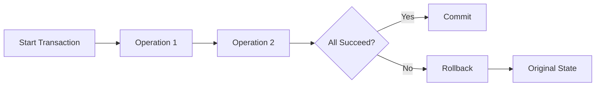
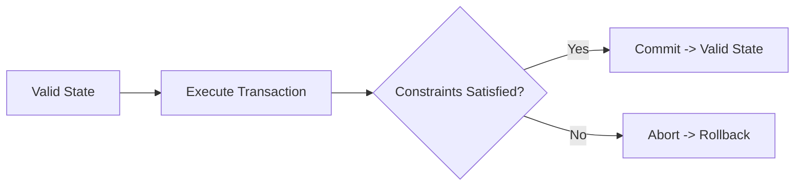
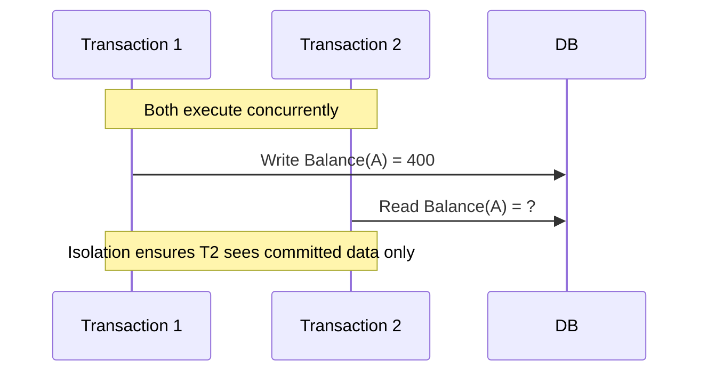
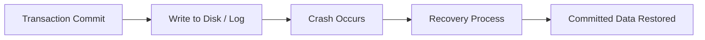

# 📘 ACID Properties in Databases — Explained with Examples & Diagrams

> 🎥 Inspired by: [ACID is NOT for DBs! | Goldman Sachs Online Assessment](https://www.youtube.com/watch?v=o60GzEywHgE)

---

## 🧠 Overview

In databases, a **transaction** represents a single logical unit of work — a sequence of operations that must either **all succeed** or **all fail** together.

To ensure reliability and predictability, every transaction in a relational database follows the **ACID** properties:

> **A** — Atomicity
> **C** — Consistency
> **I** — Isolation
> **D** — Durability

These properties ensure **data integrity**, **fault tolerance**, and **concurrent safety** in both traditional RDBMS and distributed systems.

---

## ⚙️ 1. Atomicity — “All or Nothing”

### 📝 Definition

Atomicity ensures that a transaction is treated as a single indivisible unit — **either all operations are executed successfully, or none are executed**.

If a system crash or error occurs, the DBMS **rolls back** all partial changes to maintain integrity.

### 💡 Example

Bank transfer of $100:

* Step 1: Debit $100 from Account A
* Step 2: Credit $100 to Account B
  If Step 2 fails, Step 1 must be **rolled back** — no partial state is allowed.

### 🧩 Diagram

### 🔍 Implementation Details

* Managed via **Write-Ahead Logs (WAL)** or **undo logs**
* Ensured by **transaction rollback** and **crash recovery** mechanisms

---

## ✅ 2. Consistency — “Valid State to Valid State”

### 📝 Definition

Consistency guarantees that a transaction **takes the database from one valid state to another**, maintaining **integrity constraints** and **business rules**.

If a transaction violates constraints, it’s aborted.

### 💡 Example

* Invariant: `A + B = 100`
  If a transaction modifies A and B such that `A + B ≠ 100`, consistency is broken.

### 🧩 Diagram

### 🔍 Key Points

* Enforced via **constraints**, **foreign keys**, and **triggers**
* Ensures referential and semantic integrity
* If DB starts consistent, it **must end consistent**

---

## 🤝 3. Isolation — “Transactions Don’t Interfere”

### 📝 Definition

Isolation ensures that concurrently executing transactions **don’t affect each other’s intermediate states**.
The result is equivalent to transactions being executed **serially**.

### 💡 Example

Two transactions:

* `T1`: Transfers $100 from A→B
* `T2`: Reads balance of A
  If `T2` reads A **before** `T1` commits, isolation is broken.

### 🧩 Diagram

### 🔍 Isolation Levels

| Level            | Allowed Phenomena    | Description                   |
| ---------------- | -------------------- | ----------------------------- |
| Read Uncommitted | Dirty Reads          | Reads uncommitted data        |
| Read Committed   | Non-Repeatable Reads | Only committed data visible   |
| Repeatable Read  | Phantom Reads        | Ensures same result per query |
| Serializable     | None                 | Fully isolated (most strict)  |

### ⚙️ Implementation

* **Locks (2PL)**, **MVCC (Multi-Version Concurrency Control)**
* Snapshot isolation in PostgreSQL, Oracle, MySQL InnoDB

---

## 🔒 4. Durability — “Once Committed, Always Saved”

### 📝 Definition

Durability guarantees that once a transaction is **committed**, its effects are **permanent**, even if the system crashes immediately after.

### 💡 Example

After a user pays online and sees *“Payment Successful”*, the database must persist that transaction — even if the power goes off.

### 🧩 Diagram

### 🔍 Mechanisms

* **Write-Ahead Logging (WAL)** — changes written to log before applying
* **Journaling** and **Checkpoints**
* **Replication** in distributed DBs (acknowledged commit)

---

## 🧱 Unified View

| Property        | Ensures                           | Mechanism             | Failure Example                 |
| --------------- | --------------------------------- | --------------------- | ------------------------------- |
| **Atomicity**   | All-or-nothing execution          | Rollback logs         | Money deducted but not credited |
| **Consistency** | Integrity rules preserved         | Constraints, triggers | Negative account balance        |
| **Isolation**   | No cross-transaction interference | Locks, MVCC           | Two users overwriting balance   |
| **Durability**  | Permanent commit                  | WAL, Journaling       | Crash deletes committed data    |

---

## 🧮 Real-World Analogy

| Step                    | Action      | ACID Equivalent             |
| ----------------------- | ----------- | --------------------------- |
| 🛒 Add item to cart     | Atomicity   | Either item is added or not |
| 💰 Deduct balance       | Consistency | Never overdraft             |
| 🚫 Lock during checkout | Isolation   | Prevents duplicate purchase |
| 📦 Order confirmation   | Durability  | Once confirmed, never lost  |

---

## 💬 Common Interview Questions

1. **What happens if a transaction violates Atomicity?**
   → Partial updates remain, leading to inconsistent data.

2. **How is Consistency different from Isolation?**
   → Consistency is about *rules*, Isolation is about *concurrency*.

3. **Which ACID property is hardest to maintain in distributed systems?**
   → Durability & Consistency (trade-off with CAP theorem).

4. **What are Isolation anomalies?**
   → Dirty Read, Non-Repeatable Read, Phantom Read.

5. **How does PostgreSQL ensure ACID?**
   → WAL for durability, MVCC for isolation, transactions for atomicity.

---

## ⚖️ ACID vs BASE (NoSQL Perspective)

| Concept     | ACID               | BASE                 |
| ----------- | ------------------ | -------------------- |
| Reliability | Strong consistency | Eventual consistency |
| Latency     | Higher             | Lower                |
| Use Cases   | Banking, Payments  | Web-scale apps       |
| Example     | PostgreSQL, MySQL  | Cassandra, DynamoDB  |

---

## 🧩 Visual Summary

Each property works together to ensure **data correctness** even under:

* System crashes 💥
* Concurrent transactions ⚙️
* Network partitions 🌐

---

## 🏗️ Bonus: Distributed System Insight

In **distributed databases**, full ACID compliance is challenging due to **CAP theorem** constraints.
Many systems use:

* **2-Phase Commit (2PC)** for atomicity
* **Consensus (Raft/Paxos)** for durability
* **Eventual Consistency** to trade strict ACID for availability (BASE model)

---

## 📘 References

* [ACID — Wikipedia](https://en.wikipedia.org/wiki/ACID)
* [GeeksforGeeks: ACID Properties in DBMS](https://www.geeksforgeeks.org/dbms-acid-properties-in-dbms/)
* [ByteByteGo System Design Guide](https://bytebytego.com)
* [YouTube Video](https://www.youtube.com/watch?v=o60GzEywHgE)
